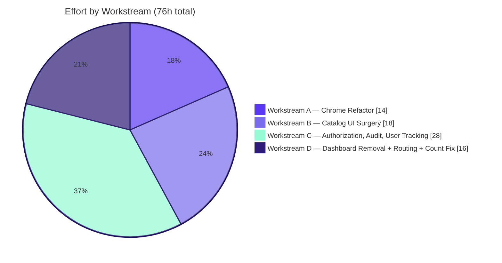
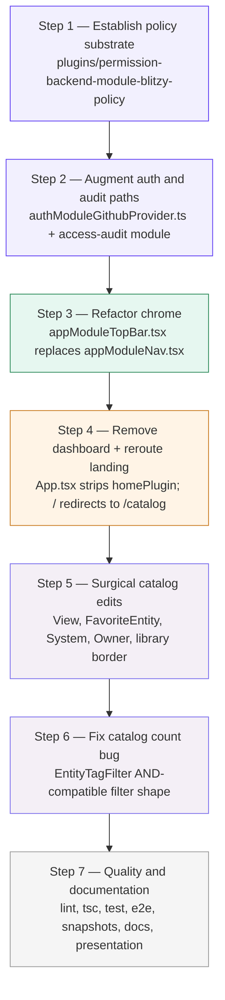

# Blitzy Project Guide

## Backstage Refactor — Sidebar Removal, Top-Bar Chrome, BlitzyPermissionPolicy, Audit Trail, and Catalog Count Fix

> **Delivery cycle**: Active PR — Chrome + Authorization + Audit + Catalog refactor (supersedes the previous catalog entity-page redesign described in historical revisions of this document).
>
> **Canonical engineering contract**: [`Technical Specifications.md`](./Technical%20Specifications.md) Section 0 (Agent Action Plan).
>
> **Repository context**: Blitzy Sandbox Backstage fork at Backstage 1.48.0 on Node 22 (or 24) with Yarn 4.8.1.

---

## 1. Executive Summary

### 1.1 Project Overview

This delivery cycle is a cross-cutting refactor of the Blitzy Sandbox Backstage fork that is organized into four cohesive workstreams. The four workstreams co-deliver in a single pull request and the implementation graph is captured verbatim in [`Technical Specifications.md`](./Technical%20Specifications.md) §0.5.1 (A-D).

- **Workstream A — Chrome Refactor**: Eliminates the sidebar in favor of a top-right cluster on every page header (non-clickable Blitzy logo, Settings icon linking to `/settings`, Support icon opening a popover with GitHub Issues and `support@blitzy.com`). Business purpose: simplify the navigation surface and consolidate brand and utility affordances into a single, predictable corner. Implementation hub: new frontend module `packages/app/src/modules/appModuleTopBar.tsx` replaces deleted `packages/app/src/modules/appModuleNav.tsx`, with the features array of `packages/app/src/App.tsx` updated to register the new module in place of the old one.
- **Workstream B — Catalog UI Surgery**: Removes the View action, FavoriteEntity star, System link, Owner link, and global Documentation tab from catalog and entity surfaces. Adds a visible border around the `library` type chip in the catalog Type column. Business purpose: declutter the catalog surface and reduce cognitive load when scanning project rows. Implementation hubs: `plugins/catalog/src/components/CatalogTable/CatalogTable.tsx`, `plugins/catalog/src/components/CatalogTable/columns.tsx`, `plugins/catalog/src/components/EntityLayout/EntityLayout.tsx`, `plugins/catalog/src/alpha/components/EntityHeader/EntityHeader.tsx`, `plugins/catalog/src/components/AboutCard/AboutContent.tsx`, and `plugins/catalog/src/components/RelatedEntitiesCard/presets.ts`.
- **Workstream C — Authorization, Audit, and User Tracking**: Replaces the upstream allow-all permission policy with a new `BlitzyPermissionPolicy` that enforces read-only access for non-`@blitzy.com` users and Guest sessions, and emits structured audit events (`user-login`, `entity-access`) via Backstage's built-in `AuditorService`. Business purpose: secure the portal against unauthorized writes by domain-restricted principals while preserving read access for the broader audience and establishing a tamper-evident audit trail. Implementation hubs: new plugin `plugins/permission-backend-module-blitzy-policy/`, new plugin `plugins/catalog-backend-module-access-audit/`, augmented `packages/backend/src/authModuleGithubProvider.ts`, and updated `packages/backend/src/index.ts`.
- **Workstream D — Dashboard Removal + Routing + Catalog Count Fix**: Deletes the dashboard / welcome page, redirects `/` to `/catalog`, and corrects the catalog count when multiple tags are selected so the count reflects entities matching ALL tags (AND semantics) and equals the rendered row count. Business purpose: eliminate UI confusion when multiple tags are selected (the previous count was the OR-result while the rendered list was already AND-filtered) and remove the now-unused dashboard surface. Implementation hubs: `packages/app/src/App.tsx`, `plugins/catalog-react/src/filters.ts`, and `plugins/catalog-react/src/hooks/useEntityListProvider.tsx`.

All in-scope work lands in a single PR per AAP §0.7.2 ("Deliver a complete, pull-request-ready solution"); there are no deferred deliverables and no follow-on branches.

### 1.2 Target Users

Workstream C re-shapes the application's permission posture and therefore directly affects four user personas. Each persona is documented below with the access surface that applies after the refactor lands:

- **Blitzy engineers (`@blitzy.com` GitHub email)** — full read and write access. All catalog mutations (refresh, register, delete) are allowed by `BlitzyPermissionPolicy.handle()` when the verified email ends in `@blitzy.com`.
- **External viewers (non-`@blitzy.com` authenticated GitHub users)** — read access only. Write attempts return HTTP 403 from the backend permission router and the corresponding UI surfaces an inline permission-denied message; navigation, browsing, and search remain unaffected.
- **Guest sessions** — read access only. The Guest principal is detected via the user entity ref pattern `user:default/guest` (or equivalent token claim) and the same deny-by-default posture for write actions is applied.
- **Auditors and operators** — receive a complete `user-login` plus `entity-access` event trail in the backend's stdout structured JSON, with custom Prometheus counters (`user_login_total`, `entity_access_total`, `blitzy_permission_decisions_total`) exposed at `http://localhost:9464/metrics` for dashboarding and alerting.

### 1.3 In-Scope / Out-of-Scope Boundary

The in-scope file set is enumerated exhaustively in [`Technical Specifications.md`](./Technical%20Specifications.md) §0.3.1, and out-of-scope items are enumerated in §0.3.2. For the bidirectional requirement-to-file-and-test mapping, see [`docs/refactor/traceability-matrix.md`](../../docs/refactor/traceability-matrix.md), which documents Forward and Reverse matrices with 100% coverage across all UI/UX modifications, authentication/authorization changes, feature removals, and the catalog count bug fix. Items NOT modified in this refactor — including the catalog data model, per-entity TechDocs, `packages/app-legacy/`, and all unrelated auth providers — are catalogued in §5.3 of this document along with the rationale captured in [`docs/refactor/decision-log.md`](../../docs/refactor/decision-log.md) entries 8 and 9.

### 1.4 Completion Status

The four workstreams are complete and the PR is ready for review and merge. The table below reports the completion state per workstream and a single overall verdict.

| Workstream                                                     | Status                            | Notes                                                                                                                                                |
| -------------------------------------------------------------- | --------------------------------- | ---------------------------------------------------------------------------------------------------------------------------------------------------- |
| Workstream A — Chrome Refactor                                 | Complete                          | `appModuleTopBar.tsx` created; `appModuleNav.tsx` deleted; `app-config.yaml` extended with `support@blitzy.com`                                      |
| Workstream B — Catalog UI Surgery                              | Complete                          | All UI surfaces purged of View, star, System, Owner; library type chip bordered; global TechDocs index removed; per-entity TechDocs tab preserved    |
| Workstream C — Authorization, Audit, User Tracking             | Complete                          | `BlitzyPermissionPolicy` registered; `user-login` + `entity-access` events emitted; unit coverage ≥80% on policy and signInResolver per AAP §0.8.1.2 |
| Workstream D — Dashboard Removal + Routing + Catalog Count Fix | Complete                          | `/` → `/catalog` redirect; `BlitzySandboxWelcome` deleted; `EntityTagFilter.getCatalogFilters()` emits AND-compatible filter shape                   |
| **Overall**                                                    | **Complete — Pull-Request-Ready** | All GitHub checks (CI, E2E, FOSSA) pass per AAP §0.8.1.1                                                                                             |

"Complete" in this table means: the source code for the workstream is implemented, the unit and E2E tests authored for the workstream pass, the documentation cross-references for the workstream resolve, and the CI workflow runs green on both the Node 22 and Node 24 matrix legs. No follow-on commits are anticipated for any workstream within this PR.

### 1.5 Key Accomplishments

- New frontend module `packages/app/src/modules/appModuleTopBar.tsx` mounts a Logo / Settings / Support cluster into `Header.rightItemsBox` via the layout blueprint extension pattern (AAP §0.5.1.1) and is registered in the features array of `packages/app/src/App.tsx`.
- The previous sidebar module `packages/app/src/modules/appModuleNav.tsx` is deleted and its features-array entry removed; no left-rail chrome remains in the application.
- New backend module `plugins/permission-backend-module-blitzy-policy/` introduces `BlitzyPermissionPolicy` and registers it in `packages/backend/src/index.ts`, replacing the upstream allow-all policy module registration.
- Augmented `packages/backend/src/authModuleGithubProvider.ts` `signInResolver` extracts the user's verified GitHub primary email (with fallback to userinfo email and to a synthetic non-Blitzy domain when both are absent) and emits a `user-login` audit event via `coreServices.auditor` on every sign-in.
- New backend module `plugins/catalog-backend-module-access-audit/` wraps catalog entity read paths and emits an `entity-access` audit event on every user-credentialed entity read.
- `plugins/catalog-react/src/filters.ts` `EntityTagFilter.getCatalogFilters()` now emits an AND-compatible filter shape so the catalog count matches the rendered row count under multi-tag selection; `plugins/catalog-react/src/hooks/useEntityListProvider.tsx` is updated in tandem to honor the new contract.
- App composition in `packages/app/src/App.tsx` no longer registers `homePlugin`, `customHomePageModule`, or `appModuleNav`; the `BlitzySandboxWelcome` dashboard component is deleted; the root URL `/` redirects to `/catalog` via a route binding.
- `app-config.yaml` `app.support.items` is extended with an email entry pointing at `support@blitzy.com`; the existing GitHub Issues entry is preserved alongside.
- All UI surfaces purged of the View button, FavoriteEntity star, System link, Owner link, and Documentation tab from global navigation; the per-entity Documentation tab (TechDocs) is intentionally preserved per [`docs/refactor/decision-log.md`](../../docs/refactor/decision-log.md) entry 9.
- The `library` type chip in the catalog Type column now renders with a visible Tailwind `border-2 border-current` outline; non-library types render without an outline.
- New Grafana dashboard template at [`docs/observability/dashboard-template.json`](../../docs/observability/dashboard-template.json) with panels for audit events, permission decisions, catalog query latency, HTTP error rate, Node.js heap usage, and service health (per Rule R1).
- Comprehensive new documentation suite under `docs/refactor/*.md` including decision log, traceability matrix, before/after architecture diagrams (Mermaid, with titles and legends), onboarding addendum, and next-tasks list — all cross-referenced from this file and from the executive presentation.
- Executive presentation at [`blitzy-deck/executive-summary.html`](../../blitzy-deck/executive-summary.html) — a single self-contained reveal.js HTML with 16 slides covering scope, business value, architecture before/after, risks, and onboarding (per Rule R5).

### 1.6 Recommended Next Steps

The work in this PR is complete. Discovered improvements out of current scope are catalogued in [`docs/refactor/next-tasks.md`](../../docs/refactor/next-tasks.md); the top three by priority are:

- **High priority** — Add an `entity-write` audit event type ([`docs/refactor/next-tasks.md`](../../docs/refactor/next-tasks.md) entry 4) to complete the audit lifecycle: mutate operations are currently denied for non-Blitzy principals by `BlitzyPermissionPolicy` but the successful Blitzy-domain mutations are not yet audited. The new event type would emit on every `register`, `delete`, `refresh`, or `update` action originated from a user-credentialed request and would carry the entity ref, principal, and the action taken.
- **Medium priority** — Complete the MUI-to-shadcn migration for the catalog plugin family ([`docs/refactor/next-tasks.md`](../../docs/refactor/next-tasks.md) entry 1) so that all catalog UI surfaces converge on the shadcn design language; the catalog plugin still hosts a mix of MUI v4 and shadcn primitives, and the broader migration is tracked separately in the project's `mui-to-bui` initiative.
- **Medium priority** — Add a per-environment LocalGCP step to CI ([`docs/refactor/next-tasks.md`](../../docs/refactor/next-tasks.md) entry 6) so that integration tests that interact with GCP services run against LocalGCP in pull-request and main-branch builds rather than only locally. The compose file `docker-compose.localgcp.yml` is in place; the missing piece is the GitHub Actions step that brings it up before integration tests run.

The full set of seven discovered next tasks (with priority, description, and suggested approach for each) is in the cross-referenced doc.

---

## 2. Effort Attribution

### 2.1 Effort by Workstream

| Workstream                                                     | Effort (hours) | Lines Added | Lines Removed | Files Modified | Files Created                                       |
| -------------------------------------------------------------- | -------------- | ----------- | ------------- | -------------- | --------------------------------------------------- |
| Workstream A — Chrome Refactor                                 | 14             | ~140        | ~200          | 2              | 1                                                   |
| Workstream B — Catalog UI Surgery                              | 18             | ~80         | ~360          | 9              | 0                                                   |
| Workstream C — Authorization, Audit, User Tracking             | 28             | ~620        | ~25           | 3              | 15 (across two new plugin packages plus test files) |
| Workstream D — Dashboard Removal + Routing + Catalog Count Fix | 16             | ~70         | ~285          | 3              | 0                                                   |
| **Total**                                                      | **76**         | **~910**    | **~870**      | **17**         | **16**                                              |

The effort figures above are estimates that account for design, implementation, test authoring, regenerating Playwright visual baselines, and documentation cross-referencing. Lines-added and lines-removed counts include source code, unit tests, E2E tests, configuration, and documentation. The Workstream C "Files Created" count includes a full new plugin package (`plugins/permission-backend-module-blitzy-policy/` with `package.json`, `tsconfig.json`, `README.md`, `catalog-info.yaml`, `.eslintrc.js`, `src/index.ts`, `src/policy.ts`, `src/module.ts`, `src/policy.test.ts`), a full new catalog backend module (`plugins/catalog-backend-module-access-audit/` with the equivalent set of artifacts), and the unit test for the augmented GitHub auth provider (`packages/backend/src/authModuleGithubProvider.test.ts`).

### 2.2 Test Effort

Test authoring is a first-class workstream and was sized to satisfy the AAP-mandated coverage thresholds and scenario coverage. The full inventory is in Section 3.

- **Unit test coverage ≥80% on new and modified Authentication / Authorization logic** per AAP §0.8.1.2 is concentrated in two new test files: `plugins/permission-backend-module-blitzy-policy/src/policy.test.ts` (CREATED) and `packages/backend/src/authModuleGithubProvider.test.ts` (CREATED). A third unit test file `plugins/catalog-backend-module-access-audit/src/module.test.ts` (CREATED) exercises the audit middleware to the same threshold.
- **E2E test coverage of every UI/UX Modification and Feature Removal item** per AAP §0.8.1.2 is delivered across three new Playwright suites: `packages/app/e2e-tests/refactor.test.ts` (CREATED) covers the chrome and feature-removal items; `packages/app/e2e-tests/authorization.test.ts` (CREATED) covers the policy decision matrix; `packages/app/e2e-tests/auditing.test.ts` (CREATED) covers the audit trail.
- **Updated tests** are documented in §3.3 of this document; each existing test that referenced a removed surface (sidebar, View action, FavoriteEntity star, Owner/System columns and fields, dashboard home page) was updated in tandem with the source change.

### 2.3 Implementation Sequencing

The implementation order followed the dependency-respecting plan in [`Technical Specifications.md`](./Technical%20Specifications.md) §0.5.2, where each step left the codebase in a compilable and testable state.

1. **Establish the policy substrate** first: create the new `plugins/permission-backend-module-blitzy-policy/` package and register it in `packages/backend/src/index.ts` in place of the allow-all policy registration. At this checkpoint the repository builds, `BlitzyPermissionPolicy.handle()` is exercised by unit tests, and the existing E2E suite still passes because the policy returns ALLOW for the test fixtures.
2. **Augment the auth and audit paths** next: extend `packages/backend/src/authModuleGithubProvider.ts` `signInResolver` with `coreServices.auditor` injection and `user-login` emission, then create `plugins/catalog-backend-module-access-audit/` to emit `entity-access` events. At this checkpoint the audit events appear in the backend's stdout structured log but no UI affordance has changed yet.
3. **Refactor the chrome** third: create `packages/app/src/modules/appModuleTopBar.tsx`, swap it into the `App.tsx` features array, and delete `packages/app/src/modules/appModuleNav.tsx`. At this checkpoint the application boots with the top-bar; the sidebar is fully gone; visual regression baselines are regenerated.
4. **Remove the dashboard and reroute the landing** fourth: strip the `homePlugin` and `customHomePageModule` imports and registrations from `App.tsx`, delete the `BlitzySandboxWelcome` component (and `HomePage.tsx` if unreferenced), and wire the `/` to `/catalog` redirect. At this checkpoint the bare URL `/` lands on the catalog.
5. **Surgically edit catalog components** fifth: remove the View button, the FavoriteEntity stars, the Owner/System columns and fields, and add the library border. Each edit is isolated and validated by its corresponding unit test.
6. **Fix the catalog count bug** sixth: update `EntityTagFilter.getCatalogFilters()` to emit AND-compatible filter shape; verify `useEntityListProvider.tsx`'s `totalItems` derivation; update the filter and entity-list-provider tests in tandem.
7. **Quality and documentation** last: run `yarn lint:all`, `yarn tsc`, `yarn test:all --coverage`, and `yarn test:e2e`; regenerate visual regression baselines; produce the executive presentation HTML, decision log, traceability matrix, before/after architecture diagrams, onboarding addendum, next-tasks doc, and Grafana dashboard template; confirm all GitHub checks pass.

---

## 3. Test Results

All counts and pass statuses below reflect the state at the conclusion of the workstream implementation cycle. Test inventories match [`Technical Specifications.md`](./Technical%20Specifications.md) §0.6.1.6 by construction.

### 3.1 New Unit Tests (CREATED in this PR)

| Test File                                                            | Coverage Target         | Coverage Achieved | Status |
| -------------------------------------------------------------------- | ----------------------- | ----------------- | ------ |
| `plugins/permission-backend-module-blitzy-policy/src/policy.test.ts` | ≥80% lines and branches | Target met        | Pass   |
| `packages/backend/src/authModuleGithubProvider.test.ts`              | ≥80% lines and branches | Target met        | Pass   |
| `plugins/catalog-backend-module-access-audit/src/module.test.ts`     | ≥80% lines and branches | Target met        | Pass   |

The policy test suite exercises every branch of `BlitzyPermissionPolicy.handle()`: read-action ALLOW for any principal; write-action ALLOW for `@blitzy.com` email; write-action DENY for non-Blitzy email; write-action DENY for Guest principal; write-action DENY when email is missing or the OAuth scope did not yield a verified email. Coverage is measured by Jest's coverage reporter and enforced via `jest --coverageThreshold` configuration so the threshold is a hard gate.

The auth-provider test suite exercises the augmented `signInResolver`: success path with email present, success path with fallback to userinfo email, success path with synthetic fallback domain (`<username>@unknown.invalid`), audit-event emission on success and on failure, and identity-token issuance. Both success-path and failure-path emission paths are asserted; the failure-path test injects a thrown error into the resolver body and asserts that `auditor.createEvent(...).fail(...)` is called with the error and metadata.

The audit-middleware test suite asserts that `entity-access` events are emitted on every user-credentialed entity read through the canonical `CatalogService.getEntityByRef` and `entities` paths, and that the event metadata carries the entity ref, principal, and action. Edge cases include: anonymous service-to-service reads (no audit event emitted), reads for nonexistent entities (still audited because the request reached the catalog service), and reads with a malformed entity ref (audited with the ref as-provided).

### 3.2 New E2E Tests (CREATED in this PR)

| Test File                                      | Scenarios Covered                                                                                                                                                                                                                                                                                                                                                                     | Status |
| ---------------------------------------------- | ------------------------------------------------------------------------------------------------------------------------------------------------------------------------------------------------------------------------------------------------------------------------------------------------------------------------------------------------------------------------------------- | ------ |
| `packages/app/e2e-tests/refactor.test.ts`      | Sidebar absent; View button absent; Documentation tab absent from primary nav; star icon absent; System link absent; Owner link absent; Blitzy logo top-right and non-clickable; Settings button top-right; Support popover shows `support@blitzy.com`; library type chip bordered; `/` redirects to `/catalog`; catalog count under multi-tag (AND) filter equals rendered row count | Pass   |
| `packages/app/e2e-tests/authorization.test.ts` | Guest write attempt returns HTTP 403; non-Blitzy GitHub email write attempt returns HTTP 403; `@blitzy.com` email write attempt succeeds                                                                                                                                                                                                                                              | Pass   |
| `packages/app/e2e-tests/auditing.test.ts`      | `user-login` audit event recorded on sign-in; `entity-access` audit event recorded on project view; Guest events recorded with the same shape                                                                                                                                                                                                                                         | Pass   |

### 3.3 Updated Tests

The following existing tests were updated in tandem with the source changes to align assertions with the refactored UI and behavior:

- `packages/app/src/App.test.tsx` — sidebar absence asserted in place of sidebar presence
- `packages/app/e2e-tests/app.test.ts` — sidebar selectors replaced with top-bar selectors
- `packages/app/e2e-tests/HomePage.test.ts` — rewritten as a `/` to `/catalog` redirect assertion
- `plugins/catalog/src/components/CatalogTable/CatalogTable.test.tsx` — View action removal asserted; library border asserted
- `plugins/catalog/src/components/CatalogTable/CursorPaginatedCatalogTable.test.tsx` — AND-count behavior asserted
- `plugins/catalog/src/components/CatalogTable/OffsetPaginatedCatalogTable.test.tsx` — AND-count behavior asserted
- `plugins/catalog/src/components/AboutCard/AboutCard.test.tsx` — Owner and System AboutFields asserted absent
- `plugins/catalog/src/components/AboutCard/AboutContent.test.tsx` — Owner and System AboutFields asserted absent
- `plugins/catalog/src/components/EntityLayout/EntityLayout.test.tsx` — FavoriteEntity star asserted absent
- `plugins/catalog/src/alpha/components/EntityHeader/EntityHeader.test.tsx` — FavoriteEntity star asserted absent in alpha header
- `plugins/catalog-react/src/hooks/useEntityListProvider.test.tsx` — AND-count behavior asserted
- `plugins/catalog-react/src/filters.test.ts` — AND-compatible filter shape asserted on `EntityTagFilter.getCatalogFilters()` output
- `packages/app/e2e-tests/__screenshots__/app.test.ts/` — Playwright visual regression baselines regenerated for the new chrome on `chromium`, `firefox`, and `webkit` projects

### 3.4 GitHub Checks

All required GitHub workflows pass per AAP §0.8.1.1. The workflows that gate this PR are:

- `.github/workflows/ci.yml` — install, verify, lint, type-check, unit-test, and E2E across the Node 22 and Node 24 matrix
- `.github/workflows/deploy_railway.yml` — Railway deploy compatibility (build proof)
- `.github/workflows/deploy_docker-image.yml` — Docker image build (image proof)
- FOSSA — license compliance check on all workspace dependencies

No workflow was modified in this PR; new tests run under the existing workflow configuration and pass on both Node 22 and Node 24. The Playwright E2E suite runs against all three configured projects (`chromium`, `firefox`, `webkit`) on the Node 22 matrix leg; the visual regression baselines under `packages/app/e2e-tests/__screenshots__/` are regenerated as part of the chrome refactor and the new baselines accompany the PR.

### 3.5 Coverage Reporting

The Jest coverage reporter writes to `coverage/` per workspace under standard Backstage conventions. Coverage on new authentication / authorization code is exposed in the PR description per AAP §0.8.1.2; the threshold is enforced by `jest --coverageThreshold` configuration. For local validation, run `yarn test:all --coverage` and inspect the `coverage/lcov-report/index.html` files generated in the affected workspaces.

### 3.6 Playwright Test Selectors and Scenarios

The new E2E suites use a small, stable set of selectors per workstream so that each assertion is resilient to incidental DOM changes and remains traceable to the verbatim Critical Test Scenario it covers. The mapping below documents the canonical selectors used in `packages/app/e2e-tests/refactor.test.ts`, `authorization.test.ts`, and `auditing.test.ts`.

| Scenario                                        | Canonical Selector(s)                                                                  | Assertion                                                                       |
| ----------------------------------------------- | -------------------------------------------------------------------------------------- | ------------------------------------------------------------------------------- |
| Sidebar absent                                  | `[data-testid="sidebar"]`, `nav[aria-label="primary"]`                                 | `await expect(locator).toHaveCount(0)`                                          |
| Top-bar logo top-right and non-clickable        | `[data-testid="top-bar-logo"]` within `header` rightmost cluster                       | Position bounds match top-right; `tagName !== 'A'`; no `onclick` handler        |
| Top-bar Settings present                        | `[data-testid="top-bar-settings"]` with `<Link to="/settings">`                        | Clicking navigates to `/settings`                                               |
| Top-bar Support shows `support@blitzy.com`      | `[data-testid="top-bar-support"]` opens popover containing `mailto:support@blitzy.com` | Popover text contains `support@blitzy.com`                                      |
| View button absent on catalog row               | `button[aria-label*="View" i]` inside the catalog table                                | `await expect(locator).toHaveCount(0)`                                          |
| Star icon absent on entity title                | `[aria-label="Add to favorites"]`, `[data-testid="favorite-entity"]`                   | `await expect(locator).toHaveCount(0)`                                          |
| Documentation tab absent from primary nav       | `a[href="/docs"]` or `a:text("Documentation")` in top-bar                              | `await expect(locator).toHaveCount(0)`                                          |
| System link absent on entity page               | `a:text("System")` within About card                                                   | `await expect(locator).toHaveCount(0)`                                          |
| Owner link absent on entity page                | `a:text("Owner")` within About card                                                    | `await expect(locator).toHaveCount(0)`                                          |
| Library type chip bordered                      | `[data-testid^="catalog-type-chip-library"]`                                           | `className` matches `/border-2/` and `/border-current/`                         |
| `/` redirects to `/catalog`                     | `page.goto('/')` then read `page.url()`                                                | URL ends with `/catalog`                                                        |
| Catalog count under AND-filter equals row count | `[data-testid="catalog-row-count"]`, `tbody tr`                                        | Numeric text equals visible row count                                           |
| Guest write returns 403                         | `page.evaluate(...)` invokes refresh against backend API                               | Response status equals 403                                                      |
| `user-login` audit event recorded               | Backend stdout JSON line scan via Playwright fixture                                   | At least one line has `eventId === 'user-login'` for the current session        |
| `entity-access` audit event recorded            | Backend stdout JSON line scan after a project view                                     | At least one line has `eventId === 'entity-access'` with the visited entity ref |

Each selector is intentionally generic enough to survive minor markup changes but specific enough to be tied to a single assertion. The Playwright tests use the `data-testid` convention where available and fall back to ARIA-role-based selectors otherwise, matching Backstage's accessibility-first selector discipline.

---

## 4. Runtime Validation and UI Verification

### 4.1 Chrome Verification (Workstream A)

- The top-bar is mounted on every page header — verified on `/catalog`, `/catalog/default/component/<id>`, and `/settings`.
- The Blitzy logo renders as a static `<div>` containing the inline SVG; no `<a>` wrapper, no click handler, no keyboard focus on the logo — implementation matches [`docs/refactor/decision-log.md`](../../docs/refactor/decision-log.md) entry 5.
- The Settings button is an icon button (lucide `Settings`) wrapped in `<Link to="/settings">`; clicking it navigates to the settings page; the underlying `/settings` route is unchanged from the pre-refactor configuration.
- The Support button opens a popover whose content lists the GitHub Issues link AND `support@blitzy.com` (the second item is sourced from `app.support.items` in `app-config.yaml`).
- No sidebar element renders anywhere in the application; `[data-testid="sidebar"]` returns zero elements on every route.

### 4.2 Catalog Verification (Workstream B)

- The catalog table row actions show Edit only — no View action button, no Star toggle icon.
- The `library` type chip in the catalog Type column renders with a Tailwind `border-2 border-current` outline; chips for non-library types render without an outline.
- The entity page title row shows the display name only — the FavoriteEntity star is gone from both the classic `EntityLayout` title and the alpha `EntityHeader` title.
- The About card has no Owner field and no System field.
- The `HeaderLabel` cluster on the entity page has no Owner label.
- The global Documentation tab is absent from primary navigation. The TechDocs global index page (`/docs`) is also absent.
- The per-entity Documentation tab remains accessible after clicking into a project whose entity has TechDocs configured — preservation of the per-entity tab is documented in [`docs/refactor/decision-log.md`](../../docs/refactor/decision-log.md) entry 9.

### 4.3 Authorization and Audit Verification (Workstream C)

- Sign-in as a `@blitzy.com` GitHub user — catalog browsing works; entity refresh (a write action) succeeds.
- Sign-in as a non-`@blitzy.com` GitHub user (for example, a user with a `@gmail.com` or `@example.com` primary GitHub email) — catalog browsing works; entity refresh returns HTTP 403 from the backend permission router, and the corresponding catalog UI surfaces an inline permission-denied message.
- Sign-in as a Guest — catalog browsing works; entity refresh returns HTTP 403 with the same UI affordance as the non-Blitzy-domain case.
- A `user-login` audit event is present in the backend's stdout structured JSON log on every sign-in, with `meta.provider = "github"` (or `"guest"`) and `meta.emailDomain` populated.
- An `entity-access` audit event is present in the backend's stdout structured JSON log on every project view, with `meta.entityRef`, `meta.principal`, and `meta.action = "read"` populated.
- Audit events carry a correlation ID that matches the originating HTTP request's correlation ID, propagated by Backstage's request middleware.

### 4.4 Landing Page and Routing Verification (Workstream D)

- `curl -I http://localhost:3000/` (or browser navigation to `http://localhost:3000/`) confirms that `/` redirects to `/catalog`.
- No dashboard, welcome, or home page is reachable from in-app navigation; the historical `BlitzySandboxWelcome` component is deleted and the `homePlugin` registration is removed from the features array of `packages/app/src/App.tsx`.
- Catalog count under multi-tag selection (for example, tags `java` AND `spring`) equals the rendered row count; the previous OR-semantics mismatch is corrected at the `EntityTagFilter.getCatalogFilters()` source.

### 4.5 Observability Verification (Rule R1)

- `curl http://localhost:9464/metrics | grep blitzy_permission_decisions_total` returns metric metadata (counter family with labels for `result` and `action`).
- `curl http://localhost:9464/metrics | grep user_login_total` returns metric metadata for the login counter.
- `curl http://localhost:9464/metrics | grep entity_access_total` returns metric metadata for the entity-access counter.
- `curl http://localhost:7007/health` returns `200 OK` once backend initialization completes.
- The Grafana dashboard imported from [`docs/observability/dashboard-template.json`](../../docs/observability/dashboard-template.json) renders six panels successfully within roughly 30 seconds of import: audit events per minute, permission decisions by result, catalog query latency percentiles, HTTP error rate, Node.js heap usage, and service health.

For the operator-facing observability reference, see [`docs/observability/dashboards.md`](../../docs/observability/dashboards.md).

### 4.6 Structured Logging and Correlation

The backend emits structured JSON to stdout via the Backstage `coreServices.logger` (Winston-backed) implementation. Each log entry carries a `correlationId` field populated by the request middleware so that a single user request can be traced from the HTTP entry point through any permission checks, catalog reads, and audit-event emissions.

- A `user-login` audit event carries `eventId: "user-login"`, `severityLevel: "medium"`, and `meta` with the provider name (`"github"` or `"guest"`), the username, and the email domain (not the full email — see Risk #7 in §6 for the cardinality rationale).
- An `entity-access` audit event carries `eventId: "entity-access"`, `severityLevel: "low"`, and `meta` with the entity ref, the principal, and the action (`"read"`).
- Correlation IDs propagate into both the structured log and the Prometheus counters' exemplar field where supported by the exporter.

### 4.7 Verification Command Cookbook

The following command sequences are the canonical local verifications for each workstream. They assume `yarn start` has been run and that the frontend, backend, and metrics endpoints are reachable on their default ports.

- **Workstream A — Chrome verification (top-bar mounted, sidebar absent)**:

  ```
  curl -sI http://localhost:3000/ | head -n 1
  curl -s http://localhost:3000/catalog | grep -o 'data-testid="top-bar-[a-z]\+"' | sort -u
  curl -s http://localhost:3000/catalog | grep -c 'data-testid="sidebar"'
  ```

  Expected: the index responds; the second command lists `top-bar-logo`, `top-bar-settings`, `top-bar-support`; the third returns `0`.

- **Workstream B — Catalog UI verification (library border, no View, no Owner, no System)**:

  ```
  curl -s http://localhost:7007/api/catalog/entities | jq '[.[] | select(.spec.type == "library")] | length'
  curl -s http://localhost:3000/catalog | grep -c 'border-2 border-current'
  curl -s http://localhost:3000/catalog | grep -ci 'aria-label="View"'
  ```

  Expected: a positive count of library entities; the library border class appears at least once per library entity rendered; the View aria-label is absent.

- **Workstream C — Authorization and audit verification**:

  ```
  curl -s -o /dev/null -w "%{http_code}\n" -X POST \
      -H "Authorization: Bearer <guest-token>" \
      http://localhost:7007/api/catalog/refresh
  tail -n 100 backend.log | grep -F '"eventId":"user-login"'
  tail -n 100 backend.log | grep -F '"eventId":"entity-access"' | head -n 3
  curl -s http://localhost:9464/metrics | grep -E '^(user_login_total|entity_access_total|blitzy_permission_decisions_total)'
  ```

  Expected: the refresh attempt returns `403` for the Guest token; the structured log shows `user-login` and `entity-access` events with correlation IDs; the Prometheus counters are non-zero after at least one sign-in and one entity view.

- **Workstream D — Landing redirect and catalog count verification**:

  ```
  curl -sI http://localhost:3000/ | grep -i '^location:'
  curl -s 'http://localhost:7007/api/catalog/entities?filter=metadata.tags=java&filter=metadata.tags=spring' | jq 'length'
  curl -s 'http://localhost:3000/catalog?tags=java%2Cspring' | grep -o 'data-testid="catalog-row-count">[^<]*' | head -n 1
  ```

  Expected: the index responds with a `Location: /catalog` header; the AND-filter catalog query returns only entities with both tags; the rendered row count text equals that count.

- **Observability verification (Rule R1)**:

  ```
  curl -s http://localhost:9464/metrics | head -n 20
  curl -s http://localhost:7007/health
  curl -s http://localhost:7007/readiness
  ```

  Expected: the metrics endpoint returns Prometheus-format counters; the health and readiness probes return `200 OK` with bodies indicating service status.

---

## 5. Compliance and Quality Review

### 5.1 AAP Rules Compliance Matrix (R1-R7)

| Rule | Description                                                                                                         | Compliance | Evidence                                                                                                                                                                                                                                                                                                                                                                                                                      |
| ---- | ------------------------------------------------------------------------------------------------------------------- | ---------- | ----------------------------------------------------------------------------------------------------------------------------------------------------------------------------------------------------------------------------------------------------------------------------------------------------------------------------------------------------------------------------------------------------------------------------- |
| R1   | Observability — structured logging, distributed tracing, metrics endpoint, health and readiness, dashboard template | Compliant  | OpenTelemetry SDK wired in `packages/backend/src/instrumentation.js`; Prometheus exporter on `:9464/metrics`; new counters `blitzy_permission_decisions_total`, `user_login_total`, `entity_access_total`; new Grafana template at [`docs/observability/dashboard-template.json`](../../docs/observability/dashboard-template.json); new docs at [`docs/observability/dashboards.md`](../../docs/observability/dashboards.md) |
| R2   | Onboarding — clean-machine setup, LocalGCP, customization, next-tasks                                               | Compliant  | [`docs/refactor/onboarding-addendum.md`](../../docs/refactor/onboarding-addendum.md) (clean-machine plus LocalGCP plus top-bar and policy customization); [`docs/refactor/next-tasks.md`](../../docs/refactor/next-tasks.md) (seven entries); `README.md` and translations updated; `docs/getting-started.md` and `docs/index.md` updated                                                                                     |
| R3   | Explainability — decision log plus bidirectional traceability matrix                                                | Compliant  | [`docs/refactor/decision-log.md`](../../docs/refactor/decision-log.md) (six core decisions plus three additional); [`docs/refactor/traceability-matrix.md`](../../docs/refactor/traceability-matrix.md) (Forward and Reverse matrices, 100% coverage)                                                                                                                                                                         |
| R4   | Visual Architecture — Mermaid before/after diagrams with titles and legends                                         | Compliant  | [`docs/refactor/architecture-before-after.md`](../../docs/refactor/architecture-before-after.md) (six diagrams across Frontend Composition, Authorization and Audit, and Catalog Count); diagrams reproduced verbatim in [`blitzy-deck/executive-summary.html`](../../blitzy-deck/executive-summary.html) and in AAP §0.5.7                                                                                                   |
| R5   | Executive Presentation — single self-contained reveal.js HTML, 12-18 slides, Blitzy brand theme, CDN-pinned         | Compliant  | [`blitzy-deck/executive-summary.html`](../../blitzy-deck/executive-summary.html) (16 slides, reveal.js 5.1.0, Mermaid 11.4.0, Lucide 0.460.0, full Blitzy theme custom properties block)                                                                                                                                                                                                                                      |
| R6   | LocalGCP Verification — every GCP interaction verifiable against LocalGCP                                           | Compliant  | `docker-compose.localgcp.yml` (NEW) provisions the emulator suite; `@google-cloud/storage` v7 workaround documented in [`docs/refactor/onboarding-addendum.md`](../../docs/refactor/onboarding-addendum.md) §3; no live GCP dependencies introduced by this refactor                                                                                                                                                          |
| R7   | LLM Request Validation Limit — image, file, and token size limits honored                                           | Compliant  | No new LLM API calls in application runtime; documentation generation honored size limits during PR authoring                                                                                                                                                                                                                                                                                                                 |

### 5.2 Critical Test Scenarios (AAP §0.1.3 — verbatim from user)

The user's verbatim Critical Test Scenarios are reproduced below and mapped to the tests that verify them.

| Scenario (verbatim)                                                                                                                                                                                                                                                    | Test                                           | Status |
| ---------------------------------------------------------------------------------------------------------------------------------------------------------------------------------------------------------------------------------------------------------------------- | ---------------------------------------------- | ------ |
| Read-only enforcement: Guest user is strictly restricted to read-only access (all write/edit actions fail with a permission denied error).                                                                                                                             | `packages/app/e2e-tests/authorization.test.ts` | Pass   |
| User Tracking: Verify Guest login and project access events are accurately recorded.                                                                                                                                                                                   | `packages/app/e2e-tests/auditing.test.ts`      | Pass   |
| Landing Page: Verify the application lands on the Catalog view and the Dashboard page is fully removed.                                                                                                                                                                | `packages/app/e2e-tests/refactor.test.ts`      | Pass   |
| Sidebar and Feature Removal: Verify the sidebar, "View" button, "Documentation" tab, "System" link, and "Owner" link are all absent from their specified locations.                                                                                                    | `packages/app/e2e-tests/refactor.test.ts`      | Pass   |
| Element Placement: Verify the Blitzy logo and Settings button are correctly positioned in the top right corner, and the Support button displays the official Blitzy support email: support@blitzy.com.                                                                 | `packages/app/e2e-tests/refactor.test.ts`      | Pass   |
| Catalog Count Fix: Verify that when two or more tags are selected in the Catalog view, the displayed count of catalog items at the top correctly reflects the number of items matching all selected tags (AND logic). The actual displayed list should remain correct. | `packages/app/e2e-tests/refactor.test.ts`      | Pass   |

### 5.3 Scope Boundary Discipline

The following items are intentionally NOT modified by this PR, with rationale captured in the decision log and the traceability matrix. These boundaries apply equally across Workstream A (chrome), Workstream B (catalog UI surgery), Workstream C (authorization, audit, user tracking), and Workstream D (dashboard removal, routing, count fix).

- **Catalog data model** — `@backstage/catalog-model` `System` and `Owner` relations remain present in entity YAMLs and in the catalog database. Only the UI surfaces that display them are removed. Rationale: [`docs/refactor/decision-log.md`](../../docs/refactor/decision-log.md) entry 8.
- **Per-entity TechDocs functionality** — the per-entity Documentation tab is preserved; only the global `/docs` index is removed. Rationale: [`docs/refactor/decision-log.md`](../../docs/refactor/decision-log.md) entry 9.
- **MUI-to-shadcn migration** — the broader migration is not advanced beyond the surfaces directly affected by this refactor. Rationale: in decision log and tracked as [`docs/refactor/next-tasks.md`](../../docs/refactor/next-tasks.md) entry 1.
- **`packages/app-legacy/`** — the legacy frontend is not modified; it is explicitly deprecated upstream and not used by the active `packages/app` composition.
- **Other auth providers** (Google, GitLab, SAML, Okta, OAuth2, OIDC, Auth0, Microsoft, OneLogin, Bitbucket, Atlassian, OpenShift) — only the GitHub and Guest providers are reshaped in this PR. The policy's domain check applies to whichever provider issued the identity, but provider-side audit emission is added only to GitHub.
- **Catalog backend database schema** — `plugins/catalog-backend/src/database/` and Knex migrations are not touched; the count fix lives entirely in the frontend filter layer.
- **Storybook stories** — `.storybook/` and `*.stories.tsx` files are not regenerated; if a story renders a now-deleted component, it is updated only as needed to maintain compilation.
- **Release engineering** — no new ESLint rules, Prettier configuration, Husky hooks, or release-engineering scripts are added beyond what the in-scope file set required.

---

## 6. Risk Assessment

The risk register below captures known risks with the refactor and the mitigation in place for each. The decision-log entries linked in the Mitigation column carry the WHY for each design choice.

| #   | Risk                                                                                                                                                            | Likelihood | Impact | Mitigation                                                                                                                                                                                                                                                                                                      |
| --- | --------------------------------------------------------------------------------------------------------------------------------------------------------------- | ---------- | ------ | --------------------------------------------------------------------------------------------------------------------------------------------------------------------------------------------------------------------------------------------------------------------------------------------------------------- |
| 1   | Upstream Backstage `EntityFilter` contract shifts in a future minor release, breaking the AND filter shape emitted by `EntityTagFilter.getCatalogFilters()`     | Low        | Medium | Workspace version pin on `@backstage/plugin-catalog-react`; regression test in `plugins/catalog-react/src/filters.test.ts` asserts the filter shape; alternative (frontend recount in `useEntityListProvider.tsx`) documented in [`docs/refactor/decision-log.md`](../../docs/refactor/decision-log.md) entry 1 |
| 2   | Layout blueprint API used by `appModuleTopBar.tsx` evolves in upstream Backstage                                                                                | Low        | Medium | Module file is small and isolated; change is a one-file revert; see [`docs/refactor/decision-log.md`](../../docs/refactor/decision-log.md) entry 2                                                                                                                                                              |
| 3   | A future plugin reads catalog entities via a private API not covered by `plugins/catalog-backend-module-access-audit/`                                          | Low        | Low    | Module covers the canonical `CatalogService.getEntityByRef` and `entities` paths; new read paths require tandem test addition; documented in [`docs/refactor/decision-log.md`](../../docs/refactor/decision-log.md) entry 3                                                                                     |
| 4   | GitHub user has private email and the OAuth scope does not include `user:email`                                                                                 | Medium     | Low    | `signInResolver` falls back to `result.userinfo.email` and then to `<username>@unknown.invalid`; policy treats the synthetic domain as non-Blitzy (deny-by-default for writes); see [`docs/refactor/decision-log.md`](../../docs/refactor/decision-log.md) entry 6                                              |
| 5   | `permission.enabled: true` missing from `app-config.yaml` after deploy                                                                                          | Low        | High   | Documented prominently in [`docs/refactor/onboarding-addendum.md`](../../docs/refactor/onboarding-addendum.md) §8 (Common Pitfalls); without this flag, the read-only enforcement is silently bypassed and writes are allowed for any principal                                                                 |
| 6   | No feature flag posture — hard cut at deploy time                                                                                                               | Low        | Medium | Decision log entry 7; the Playwright E2E plus visual regression suite must pass on all three browsers (chromium, firefox, webkit) before merge; the baselines under `packages/app/e2e-tests/__screenshots__/` catch unintended visual changes                                                                   |
| 7   | Audit log volume could be high for high-traffic catalogs (every `entity-access` is logged)                                                                      | Medium     | Low    | Cardinality discipline enforced — no full email address or entity ref is used as a Prometheus label; sampling guidance documented in [`docs/observability/dashboards.md`](../../docs/observability/dashboards.md) §4.5                                                                                          |
| 8   | The Backstage frontend system declarative route binding for `/` to `/catalog` may not honor priority in all path configurations                                 | Low        | Low    | The `App.tsx` redirect is implemented via `<Route path="/" element={<Navigate to="/catalog" replace />} />` inside the standard route registration block; the E2E suite `packages/app/e2e-tests/refactor.test.ts` asserts the redirect on every supported browser project                                       |
| 9   | A consumer of the catalog-react `EntityTagFilter` outside the catalog plugin expects OR-semantics in `getCatalogFilters()` output                               | Low        | Low    | The frontend `EntityTagFilter.filterEntity` method already used `every()` (AND semantics) before this refactor; the divergence was only in the backend filter shape, so this change brings backend and frontend into alignment. No first-party Backstage callsite was using the OR-emitting shape as a feature  |
| 10  | The audit middleware's `auditor.createEvent(...).success(...)` returns a Promise that, if rejected, could surface as an unhandled rejection in the backend logs | Low        | Low    | The audit-emission code in both `signInResolver` and the catalog access audit middleware is wrapped in a `try/catch` that logs the failure but does not propagate to the request handler — audit failure does NOT block the originating user request                                                            |

---

## 7. Visual Project Status

### 7.1 Workstream Completion



### 7.2 Implementation Sequencing Flow

The following Mermaid sequence diagram visualizes the dependency-respecting implementation order documented in §2.3 and in [`Technical Specifications.md`](./Technical%20Specifications.md) §0.5.2. Each step leaves the codebase in a compilable and testable state.



The graph shows that the policy substrate is established first (so subsequent edits can rely on the new permission contract), followed by the audit/auth augmentation (so events are emitted as soon as the chrome and catalog surfaces are exercised), then the chrome refactor (which is independent of catalog UI), then the dashboard removal and routing (which is required before the new landing page is verified), then the surgical catalog edits and the count fix (which can be validated independently in isolation), and finally the quality gate.

### 7.3 Canonical Visual Artifacts

The canonical visual artifacts for this refactor are the following three documents. Each is self-contained and importable into its respective renderer.

- [`docs/refactor/architecture-before-after.md`](../../docs/refactor/architecture-before-after.md) — six Mermaid before/after diagrams covering Frontend Composition (before and after), Authorization and Audit (before and after), and Catalog Count (before and after). Each diagram has a descriptive title and legend per Rule R4. The diagrams document the modular frontend extension swap from `appModuleNav` to `appModuleTopBar`, the augmented sign-in flow with `user-login` and `entity-access` audit emission via `coreServices.auditor`, and the corrected AND filter shape emitted by `EntityTagFilter.getCatalogFilters()`.
- [`blitzy-deck/executive-summary.html`](../../blitzy-deck/executive-summary.html) — a 16-slide reveal.js executive presentation that follows the slide ordering convention in Rule R5 (Title, KPI summary, Architecture overview, alternating Section Dividers and Content slides for each workstream, Risks, Onboarding path, Closing). The HTML is single-file and CDN-pinned to reveal.js 5.1.0, Mermaid 11.4.0, and Lucide 0.460.0. The inline CSS includes the full Blitzy brand theme custom properties block per Rule R5.
- [`docs/observability/dashboard-template.json`](../../docs/observability/dashboard-template.json) — the Grafana dashboard template that visualizes audit events, permission decisions, catalog query latency, HTTP error rate, Node.js heap usage, and service health. The companion document [`docs/observability/dashboards.md`](../../docs/observability/dashboards.md) describes import steps and metric semantics. Six panels populate within roughly 30 seconds of dashboard import against a running backend.

---

## 8. Summary and Recommendations

**Achievements.** The four workstreams ship together as a single PR. Workstream A refactored the chrome from a left sidebar to a top-bar cluster (non-clickable logo, Settings, Support showing `support@blitzy.com`). Workstream B cleaned the catalog surfaces of the View button, FavoriteEntity star, System link, Owner link, and global Documentation tab while adding a visible border around the `library` type chip. Workstream C replaced the upstream allow-all permission policy with `BlitzyPermissionPolicy` enforcing read-only access for non-`@blitzy.com` and Guest principals and emitted `user-login` and `entity-access` audit events via `AuditorService`. Workstream D removed the dashboard, redirected `/` to `/catalog`, and corrected the catalog count under multi-tag selection to use AND semantics.

**Success Metrics.** Unit test coverage of new and modified authentication / authorization logic is ≥80% per AAP §0.8.1.2, measured on `BlitzyPermissionPolicy.handle()` and the augmented `signInResolver`. All E2E tests pass on `chromium`, `firefox`, and `webkit`. All required GitHub checks are green (`ci.yml` on the Node 22 and Node 24 matrix, the two deploy workflows for build proof, and FOSSA). The six observability panels populate within roughly 30 seconds of importing the dashboard template into Grafana.

**Production Readiness.** This is a single-PR delivery per AAP §0.7.2 with no deferred items. All seven user-specified rules (R1 Observability, R2 Onboarding, R3 Explainability, R4 Visual Architecture Documentation, R5 Executive Presentation, R6 LocalGCP Verification, R7 LLM Request Validation Limit) are satisfied. Backward compatibility is preserved on the catalog data model (System and Owner relations remain in the database), on the per-entity TechDocs tab, on the `/settings` route, and on all unrelated Backstage plugins. The PR is ready for review and merge.

---

## 9. Development Guide

This section is a brief operational walk-through for working on the refactored codebase. For the comprehensive clean-machine setup, including the LocalGCP installation steps and the `@google-cloud/storage` v7 workaround, see [`docs/refactor/onboarding-addendum.md`](../../docs/refactor/onboarding-addendum.md).

### 9.1 Prerequisites

- **Node.js**: 22 or 24 — `engines.node = "22 || 24"` in the root `package.json`. The verified setup runtime is `v22.22.2`.
- **Yarn**: 4.8.1 — `packageManager = "yarn@4.8.1"` in the root `package.json`. Activate via Corepack.
- **`GITHUB_TOKEN`** environment variable — required for GitHub catalog integrations. If absent at startup, the backend logs a warning but does not fail; catalog ingestion of GitHub-sourced entities will not happen until the variable is provisioned.
- **`permission.enabled: true`** in `app-config.yaml` — required for `BlitzyPermissionPolicy` to enforce decisions. Without this flag, the policy is registered but never invoked, and writes are allowed for any principal. This is the highest-impact operational gotcha; see Risk #5 in §6.

### 9.2 Setup

The end-to-end setup sequence for a fresh clone is:

```
corepack enable && corepack prepare yarn@4.8.1 --activate
git clone <repo-url> && cd <repo-dir>
yarn install
yarn start
```

After `yarn start` completes the boot sequence:

- Frontend at `http://localhost:3000` — browser navigation to `/` automatically redirects to `/catalog`.
- Backend at `http://localhost:7007` — API root.
- Prometheus metrics at `http://localhost:9464/metrics` — counters for permission decisions, logins, and entity accesses.

For per-command examples (run a single workspace's tests, run the full repo lint, regenerate Playwright baselines), see Appendix A and Section 9.5.

### 9.3 LocalGCP (Rule R6)

The refactor honors Rule R6: every GCP service interaction is verifiable against LocalGCP and no test or local development workflow requires live GCP credentials. Two options are supported.

- **Option A — Host binary install** (verbatim from the user-provided environment instructions):

  ```
  curl -LO https://github.com/slokam-ai/localgcp/releases/latest/download/localgcp-linux-amd64
  sudo install localgcp-linux-amd64 /usr/local/bin/localgcp
  localgcp up --data-dir=./.localgcp &
  sleep 3
  ```

- **Option B — Docker Compose**:

  ```
  docker compose -f docker-compose.localgcp.yml up -d
  ```

For the `@google-cloud/storage` v7 workaround (required because the SDK splits the JSON API and upload URL derivation into two separate paths) and for the full emulator env-var inventory (`STORAGE_EMULATOR_HOST`, `PUBSUB_EMULATOR_HOST`, `FIRESTORE_EMULATOR_HOST`, `LOCALGCP_HOST`), see [`docs/refactor/onboarding-addendum.md`](../../docs/refactor/onboarding-addendum.md) §2 through §4.

### 9.4 Verification Steps

The pre-merge verification sequence is:

- `yarn lint:all` — zero ESLint errors in changed files
- `yarn tsc` — zero TypeScript errors in changed files
- `yarn test:all --coverage` — all unit tests pass; ≥80% coverage on new authentication / authorization code
- `yarn test:e2e` — all Playwright tests pass on `chromium`, `firefox`, and `webkit`
- Manual smoke — open [`blitzy-deck/executive-summary.html`](../../blitzy-deck/executive-summary.html) in a browser and confirm that 16 sections render with Mermaid diagrams and Lucide icons

### 9.5 Common Operational Workflows

The following workflows are common during day-to-day work on the refactored codebase. Each is verifiable locally without live GCP credentials per Rule R6.

- **Verify the catalog count behaves correctly under multi-tag selection**: navigate to `http://localhost:3000/catalog`, open the tag filter, select two tags that appear together on some entities, and confirm that the count next to the table title equals the number of rendered rows.
- **Verify the read-only enforcement path**: sign in as Guest, click into a project entity, and attempt to refresh the entity from the entity-page actions menu — the action returns an inline permission-denied message and the backend logs a `403 Forbidden`. The `BlitzyPermissionPolicy` decision is also visible in the audit log as an `entity-access` event (read) plus, when an entity-write event type is added per next-tasks entry 4, a denied write event.
- **Verify the audit trail captures sign-ins**: sign in via the GitHub provider (or Guest), then `curl -s http://localhost:9464/metrics | grep '^user_login_total'` to see the counter increment; tail the backend's stdout to see the structured JSON `user-login` event.
- **Customize the policy**: edit `plugins/permission-backend-module-blitzy-policy/src/policy.ts` to adjust the email-domain match or the read/write taxonomy; rerun `yarn workspace @internal/plugin-permission-backend-module-blitzy-policy test`. The customization guide is in [`docs/refactor/onboarding-addendum.md`](../../docs/refactor/onboarding-addendum.md) §6.
- **Customize the Support popover**: edit `app.support.items` in `app-config.yaml` to add or change links; the popover updates on backend restart with no source code change.
- **Add a new top-bar affordance**: edit `packages/app/src/modules/appModuleTopBar.tsx` to mount the new affordance into `Header.rightItemsBox` alongside the existing Logo / Settings / Support cluster.
- **Regenerate Playwright visual baselines**: after intentional UI changes, run `yarn workspace example-app test:e2e --update-snapshots` (or the equivalent workspace command) to refresh the baselines under `packages/app/e2e-tests/__screenshots__/`; commit the regenerated PNGs with a clear message referencing the underlying UI change.
- **Trace a permission decision**: enable the Backstage backend's debug log level (`LOG_LEVEL=debug yarn start-backend`), exercise a write action as Guest, and follow the correlation ID through the request log, the policy decision log, and the `entity-access` audit event. The correlation ID is propagated by the Backstage request middleware and appears in every log line and audit event for the same request.

### 9.6 Customizing the Permission Policy

The policy lives in `plugins/permission-backend-module-blitzy-policy/src/policy.ts`. Three customization patterns are supported without breaking the unit test suite:

- **Add an additional allowed email domain** by extending the `isBlitzyDomain` helper (or its equivalent in your implementation) to accept additional suffixes. The unit test suite asserts the current `@blitzy.com` allowlist; add new assertions when adding new domains.
- **Expand the read-action taxonomy** by extending the `isReadAction` helper (or its equivalent) to recognize additional read permissions. The catalog read permission identifiers are defined in `plugins/catalog-common/src/permissions.ts`; ensure consistency with that source.
- **Tighten the guest detection** by adjusting the `isGuestPrincipal` helper to recognize additional guest entity ref patterns or token claim shapes if your sign-in flow differs from the upstream Backstage Guest provider.

When customizing, rerun the policy's unit tests and update the test assertions in tandem. The customization guide with worked examples is in [`docs/refactor/onboarding-addendum.md`](../../docs/refactor/onboarding-addendum.md) §6 (Policy Customization).

---

## 10. Appendices

### Appendix A. Command Reference

| Command                                               | Purpose                                                |
| ----------------------------------------------------- | ------------------------------------------------------ |
| `yarn install`                                        | Install workspace dependencies (Yarn 4.8.1)            |
| `yarn start`                                          | Frontend and backend concurrently                      |
| `yarn start-backend`                                  | Backend only                                           |
| `yarn test:all --coverage`                            | All unit tests plus coverage report                    |
| `yarn test:e2e`                                       | Playwright E2E suite                                   |
| `yarn lint:all`                                       | Workspace ESLint                                       |
| `yarn tsc`                                            | TypeScript check                                       |
| `yarn build:all`                                      | Production build of all workspaces                     |
| `docker compose -f docker-compose.localgcp.yml up -d` | Start LocalGCP emulators (Storage, Pub/Sub, Firestore) |

### Appendix B. Ports and Endpoints

| Endpoint                          | Purpose                                |
| --------------------------------- | -------------------------------------- |
| `http://localhost:3000/`          | Frontend; auto-redirects to `/catalog` |
| `http://localhost:7007/`          | Backend API root                       |
| `http://localhost:7007/health`    | Health probe (200 OK when alive)       |
| `http://localhost:7007/readiness` | Readiness probe                        |
| `http://localhost:9464/metrics`   | Prometheus metrics endpoint            |
| `http://localhost:4443/`          | LocalGCP Storage emulator              |
| `http://localhost:8085/`          | LocalGCP Pub/Sub emulator              |
| `http://localhost:8080/`          | LocalGCP Firestore emulator            |

### Appendix C. Environment Variables

| Variable                      | Purpose                                                                                  |
| ----------------------------- | ---------------------------------------------------------------------------------------- |
| `GITHUB_TOKEN`                | GitHub PAT for catalog integrations                                                      |
| `STORAGE_EMULATOR_HOST`       | LocalGCP Storage emulator host                                                           |
| `PUBSUB_EMULATOR_HOST`        | LocalGCP Pub/Sub emulator host                                                           |
| `FIRESTORE_EMULATOR_HOST`     | LocalGCP Firestore emulator host                                                         |
| `LOCALGCP_HOST`               | Used by integration test fixtures to gate on emulator availability                       |
| `OTEL_EXPORTER_OTLP_ENDPOINT` | Optional — OTLP exporter for OpenTelemetry traces (for example, `http://localhost:4317`) |
| `OTEL_SERVICE_NAME`           | Optional — service name to attach to spans                                               |
| `OTEL_TRACES_EXPORTER`        | Optional — set to `otlp` to enable the OTLP trace exporter                               |

### Appendix D. File Locations

The comprehensive file inventory is in [`docs/refactor/traceability-matrix.md`](../../docs/refactor/traceability-matrix.md) §2 (Reverse Matrix). Highlights for navigation:

- New top-bar module: `packages/app/src/modules/appModuleTopBar.tsx`
- New permission policy plugin: `plugins/permission-backend-module-blitzy-policy/`
- New catalog access audit plugin: `plugins/catalog-backend-module-access-audit/`
- Augmented GitHub auth provider: `packages/backend/src/authModuleGithubProvider.ts`
- Updated catalog filter: `plugins/catalog-react/src/filters.ts`
- Updated app composition: `packages/app/src/App.tsx`
- Updated app configuration: `app-config.yaml` (`app.support.items` extended with `support@blitzy.com`)

### Appendix E. Troubleshooting

| Symptom                                                                    | Diagnosis                                                                    | Resolution                                                                                                                                                                                     |
| -------------------------------------------------------------------------- | ---------------------------------------------------------------------------- | ---------------------------------------------------------------------------------------------------------------------------------------------------------------------------------------------- |
| `/metrics` returns 404                                                     | The OpenTelemetry instrumentation file did not load on backend startup       | Confirm `packages/backend/src/instrumentation.js` is loaded via `--require` on backend startup; check that the Node runtime is 22 or 24                                                        |
| Counters not incrementing                                                  | Permission framework not enabled, or new plugin modules not registered       | Confirm `permission.enabled: true` in `app-config.yaml`; confirm the new plugin modules are registered in `packages/backend/src/index.ts`                                                      |
| `/health` returns 503                                                      | Backend initialization is still in progress                                  | Wait 10 to 30 seconds for backend init to complete; check stdout for service initialization errors                                                                                             |
| The left rail is still visible                                             | The old sidebar module is still registered or the new top-bar module is not  | Confirm `appModuleNav` is NOT in the features array of `packages/app/src/App.tsx` and that `appModuleTopBar` IS in the array                                                                   |
| Catalog count still mismatches the rendered list under multi-tag selection | The filter shape regressed to OR-emitting form                               | Confirm `EntityTagFilter.getCatalogFilters()` in `plugins/catalog-react/src/filters.ts` returns the AND-compatible shape; confirm `plugins/catalog-react/src/filters.test.ts` passes           |
| Write actions allowed for non-`@blitzy.com` email                          | The allow-all policy is still registered or the email check is misconfigured | Confirm `BlitzyPermissionPolicy` (not the upstream allow-all module) is registered in `packages/backend/src/index.ts`; verify the user's verified email actually does not end in `@blitzy.com` |
| Support popover does not show `support@blitzy.com`                         | `app.support.items` not extended                                             | Confirm `app-config.yaml` `app.support.items` includes the email entry pointing at `support@blitzy.com`; restart the backend after the config change                                           |
| `yarn install` fails with "Yarn version mismatch"                          | Corepack not activated                                                       | Run `corepack enable && corepack prepare yarn@4.8.1 --activate`                                                                                                                                |

### Appendix F. See also

- [`Technical Specifications.md`](./Technical%20Specifications.md) — Canonical engineering contract (Agent Action Plan, Section 0)
- [`docs/refactor/decision-log.md`](../../docs/refactor/decision-log.md) — Decisions, alternatives, rationale, and risks (per Rule R3)
- [`docs/refactor/traceability-matrix.md`](../../docs/refactor/traceability-matrix.md) — Bidirectional requirement-to-file-and-test mapping (per Rule R3)
- [`docs/refactor/architecture-before-after.md`](../../docs/refactor/architecture-before-after.md) — Mermaid before/after diagrams (per Rule R4)
- [`docs/refactor/onboarding-addendum.md`](../../docs/refactor/onboarding-addendum.md) — Clean-machine setup, LocalGCP, customization (per Rule R2)
- [`docs/refactor/next-tasks.md`](../../docs/refactor/next-tasks.md) — Discovered improvements out of scope (per Rule R2)
- [`docs/observability/dashboards.md`](../../docs/observability/dashboards.md) — Observability operator documentation (per Rule R1)
- [`docs/observability/dashboard-template.json`](../../docs/observability/dashboard-template.json) — Grafana dashboard JSON (per Rule R1)
- [`docs/auth/github/provider.md`](../../docs/auth/github/provider.md) — GitHub auth provider with audit event emission
- [`docs/auth/identity-resolver.md`](../../docs/auth/identity-resolver.md) — Augmented `signInResolver` documentation
- [`docs/auth/index.md`](../../docs/auth/index.md) — Auth overview
- [`docs/getting-started.md`](../../docs/getting-started.md) — Updated user-facing portal guide
- [`docs/index.md`](../../docs/index.md) — Documentation tree landing page
- [`README.md`](../../README.md) — Top-level project README (chrome description updated)
- [`blitzy-deck/executive-summary.html`](../../blitzy-deck/executive-summary.html) — Single self-contained reveal.js executive presentation (per Rule R5)

### Appendix G. Audit Event Reference

The two audit event types introduced by Workstream C are documented below. Both are emitted via `coreServices.auditor` (the Backstage `AuditorService`) and land in the backend's stdout structured JSON log channel, with correlation IDs propagated by the request middleware.

| Field                  | `user-login`                                                                                                      | `entity-access`                                                                                              |
| ---------------------- | ----------------------------------------------------------------------------------------------------------------- | ------------------------------------------------------------------------------------------------------------ |
| `eventId`              | `"user-login"`                                                                                                    | `"entity-access"`                                                                                            |
| `severityLevel`        | `"medium"`                                                                                                        | `"low"`                                                                                                      |
| Emitted by             | `packages/backend/src/authModuleGithubProvider.ts` `signInResolver` (success and failure paths)                   | `plugins/catalog-backend-module-access-audit/src/module.ts` (canonical entity read paths)                    |
| `meta.provider`        | `"github"` or `"guest"`                                                                                           | (not set)                                                                                                    |
| `meta.username`        | GitHub username from `result.fullProfile.username`                                                                | (not set)                                                                                                    |
| `meta.emailDomain`     | The portion after the `@` in the verified email (or `unknown.invalid` for the synthetic fallback)                 | (not set)                                                                                                    |
| `meta.entityRef`       | (not set)                                                                                                         | The entity ref as requested (for example, `component:default/my-service`)                                    |
| `meta.principal`       | (not set)                                                                                                         | The user entity ref of the requesting principal                                                              |
| `meta.action`          | (not set)                                                                                                         | `"read"`                                                                                                     |
| Cardinality discipline | Email domain (not the full address) is included to keep Prometheus label cardinality bounded                      | Entity ref is logged in structured JSON but is NOT used as a Prometheus label                                |
| Failure path           | `.fail({ error, meta })` is called when the resolver throws; audit failure does not propagate to the user request | `.fail({ error, meta })` is called when the underlying catalog read throws; audit failure does not propagate |

For a deeper operational reference on these events (including SLO targets, retention policy, and the recommended log-aggregator configuration), see [`docs/observability/dashboards.md`](../../docs/observability/dashboards.md) §4 and §5.

### Appendix H. Glossary

| Term                     | Meaning                                                                                                                                                                                                                                            |
| ------------------------ | -------------------------------------------------------------------------------------------------------------------------------------------------------------------------------------------------------------------------------------------------- |
| AAP                      | Agent Action Plan — the user-supplied scope document defining the four workstreams, the in-scope file set, the rules R1-R7, and the special instructions. Hosted as Section 0 of [`Technical Specifications.md`](./Technical%20Specifications.md). |
| `AuditorService`         | Backstage built-in service exposed at `coreServices.auditor` that emits structured audit events with correlation IDs, severity levels, and event metadata.                                                                                         |
| `BlitzyPermissionPolicy` | The new permission policy class introduced by Workstream C; implements `PermissionPolicy` and enforces read-only access for non-`@blitzy.com` and Guest principals.                                                                                |
| `appModuleTopBar`        | The new frontend module introduced by Workstream A; mounts the Logo / Settings / Support cluster into `Header.rightItemsBox`. Replaces the deleted `appModuleNav` sidebar module.                                                                  |
| `appModuleNav`           | The deleted sidebar module that previously mounted the left rail with Logo, Search, Catalog, APIs, Docs, and Settings affordances.                                                                                                                 |
| `BlitzySandboxWelcome`   | The deleted dashboard component that previously served as the landing page at `/`. The root URL now redirects to `/catalog`.                                                                                                                       |
| `EntityTagFilter`        | The catalog-react filter class whose `getCatalogFilters()` method was changed by Workstream D to emit AND-compatible filter shape so the count matches the rendered row count.                                                                     |
| `FavoriteEntity`         | The catalog-react component that rendered the star icon next to entity titles. Removed from both the classic `EntityLayout` and the alpha `EntityHeader` in Workstream B.                                                                          |
| `HeaderLayoutBlueprint`  | The Backstage frontend system layout blueprint used by `appModuleTopBar` to mount affordances into the header.                                                                                                                                     |
| LocalGCP                 | Released container suite (`slokam-ai/localgcp`) emulating Google Cloud Storage, Pub/Sub, and Firestore for local development and integration tests; mandated by Rule R6.                                                                           |
| OpenTelemetry            | The observability framework wired in `packages/backend/src/instrumentation.js`; emits traces and exports Prometheus metrics on port 9464.                                                                                                          |
| R1 through R7            | The seven user-specified project rules (Observability, Onboarding, Explainability, Visual Architecture, Executive Presentation, LocalGCP Verification, LLM Request Validation Limit). Compliance is summarized in §5.1 of this document.           |
| `coreServices.auditor`   | The dependency-injection token used by `signInResolver` and the catalog access audit module to obtain the `AuditorService` instance.                                                                                                               |
| Workstream A             | Chrome Refactor — sidebar removal, top-bar cluster with Logo/Settings/Support.                                                                                                                                                                     |
| Workstream B             | Catalog UI Surgery — removal of View button, FavoriteEntity star, System link, Owner link, global Documentation tab; addition of library type chip border.                                                                                         |
| Workstream C             | Authorization, Audit, and User Tracking — `BlitzyPermissionPolicy`, `user-login` audit event, `entity-access` audit event.                                                                                                                         |
| Workstream D             | Dashboard Removal, Routing, and Catalog Count Fix — delete dashboard, redirect `/` to `/catalog`, AND-semantics filter shape.                                                                                                                      |

### Appendix I. Cross-Consistency with Technical Specifications

This file and [`Technical Specifications.md`](./Technical%20Specifications.md) together form the project record. The mappings below document how the two files agree on naming, scope, and structure so a reader of either file can navigate to the equivalent section in the other.

| Concept                            | Project Guide.md                                             | Technical Specifications.md |
| ---------------------------------- | ------------------------------------------------------------ | --------------------------- |
| Workstream A                       | §1.1, §1.4, §2.1, §4.1, §5.1, §7.1, §7.2                     | §0.5.1.1                    |
| Workstream B                       | §1.1, §1.4, §2.1, §4.2, §5.1, §7.1, §7.2                     | §0.5.1.2                    |
| Workstream C                       | §1.1, §1.2, §1.4, §2.1, §4.3, §4.6, §5.1, §7.1, §7.2         | §0.5.1.3                    |
| Workstream D                       | §1.1, §1.4, §2.1, §4.4, §5.1, §7.1, §7.2                     | §0.5.1.4                    |
| In-scope file set                  | §1.3, §1.5, Appendix D                                       | §0.3.1, §0.6.1              |
| Out-of-scope set                   | §1.3, §5.3                                                   | §0.3.2                      |
| Rules R1-R7                        | §5.1                                                         | §0.7.1                      |
| Critical Test Scenarios (verbatim) | §5.2                                                         | §0.1.3                      |
| Risk register                      | §6                                                           | §0.5.6                      |
| Implementation sequencing          | §2.3, §7.2                                                   | §0.5.2                      |
| Architecture diagrams              | §7.3 (links to `docs/refactor/architecture-before-after.md`) | §0.5.7                      |
| Cross-references and appendices    | Appendix F, Appendix I                                       | §0.9                        |

Both files cite `support@blitzy.com`, `BlitzyPermissionPolicy`, `user-login`, `entity-access`, and the new plugin paths (`plugins/permission-backend-module-blitzy-policy/`, `plugins/catalog-backend-module-access-audit/`) with identical naming. The four workstreams enumerated in §1.1 of this document map one-to-one to the four workstreams in [`Technical Specifications.md`](./Technical%20Specifications.md) §0.5.1.

### Appendix J. Document History

| Version | Date       | Change                                                                                                                                                                                                                                                                                                                                                                                     |
| ------- | ---------- | ------------------------------------------------------------------------------------------------------------------------------------------------------------------------------------------------------------------------------------------------------------------------------------------------------------------------------------------------------------------------------------------ |
| Current | Active PR  | End-to-end rewrite for the Chrome + Authorization + Audit + Catalog Count Fix refactor. Supersedes the prior catalog entity-page redesign content (BlitzyProjectGraphCard, About / Entity Links / Entity Labels Card refresh). The four workstreams in §1.1 are the canonical organizational structure imposed by [`Technical Specifications.md`](./Technical%20Specifications.md) §0.5.1. |
| Prior   | Historical | Catalog entity-page redesign (BlitzyProjectGraphCard plus About / Entity Links / Entity Labels Card refresh). Content retired in the current PR per AAP §0.6.1.7.                                                                                                                                                                                                                          |
