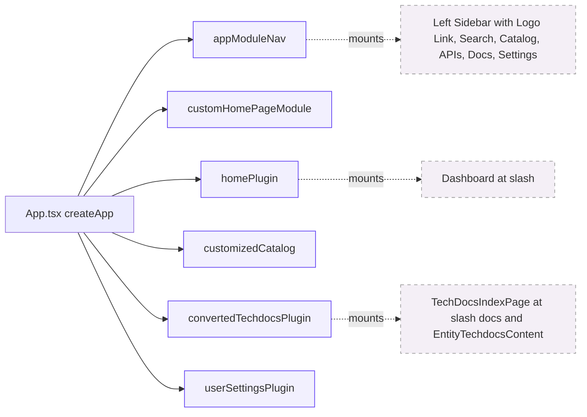
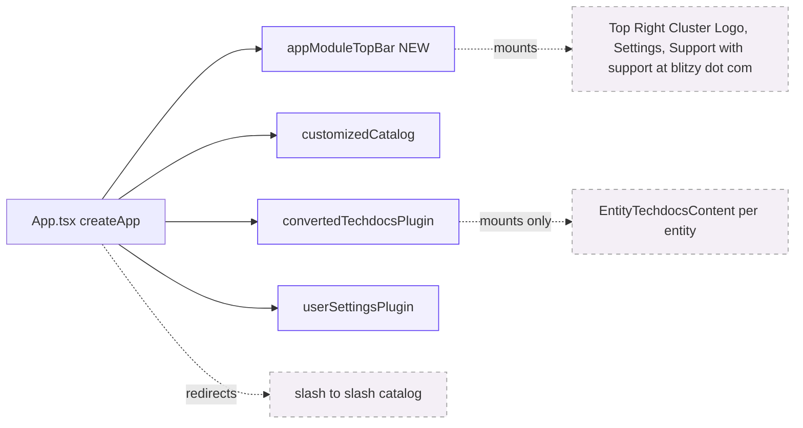
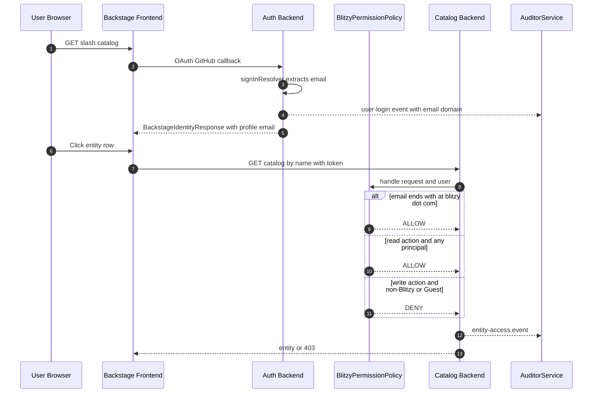

# Technical Specification

# 0. Agent Action Plan

## 0.1 Intent Clarification

### 0.1.1 Core Objective

Based on the provided requirements, the Blitzy platform understands that the objective is to deliver a pull-request-ready refactor of the Blitzy Sandbox Backstage fork (Backstage 1.48.0, Node 22/24, Yarn 4.8.1) that simultaneously (a) reshapes the global chrome by removing the sidebar and relocating the Logo, Settings, and Support controls into the top-right of every page header; (b) prunes redundant catalog affordances (View action, star icon, Documentation tab, Dashboard landing, System link, Owner link); (c) tightens authorization so that any GitHub user whose verified email domain is not `@blitzy.com` and every Guest session is constrained to read-only access enforced by the backend permission layer; (d) captures an immutable audit trail of every GitHub sign-in and every project (catalog entity) access via Backstage's built-in `AuditorService`; (e) corrects the catalog header count so that when N tags are selected the count reflects entities matching **all N** tags (AND semantics) and exactly equals the rendered row count; and (f) applies a single visual treatment — a border around the word "library" — inside the type column of the catalog table.

The refactor must satisfy six implicit prerequisites that the user did not state explicitly but that follow inevitably from the requirements:

- **Routing redirect**: Making Catalog "the new landing page" requires that the React Router root path `/` redirect to `/catalog` (the `homePlugin` currently registers `/home` as a page path [plugins/home/src/alpha.tsx:L67], so simply removing the dashboard component is not enough — the empty path must be re-anchored).
- **Sidebar replacement, not just deletion**: Backstage mounts navigation through a `NavContentBlueprint` extension [packages/app/src/modules/appModuleNav.tsx:L168-L196]; removing the sidebar without providing a replacement leaves the page Header's `rightItemsBox` empty and orphans Search, Settings, Support, and Logo. The replacement is a Header-mounted top-bar layout.
- **TechDocs tab preserved on entity pages**: The user asks to remove the "Documentation" tab from the sidebar but to keep TechDocs accessible after the user clicks into a project. The entity-page TechDocs content extension (`convertLegacyEntityContentExtension(EntityTechdocsContent)` at [packages/app/src/App.tsx:L111]) must therefore stay registered. Only the global `/docs` index navigation is removed.
- **System/Owner deletion is monorepo-wide**: "Perform a full removal of this functionality across the application" extends beyond the project view to every CatalogTable, AboutCard, EntityHeader, RelatedEntitiesCard preset, and any rule, filter, or column factory that surfaces System or Owner data.
- **Read-only enforcement requires a real permission policy**: The portal currently registers `AllowAllPermissionPolicy` [plugins/permission-backend-module-policy-allow-all/src/policy.ts:L27-L33] which unconditionally returns `ALLOW`. A new `BlitzyPermissionPolicy` (in a new backend module) is required, replacing the allow-all module in `packages/backend/src/index.ts`.
- **Catalog count fix must preserve pagination correctness**: The bug originates because `useEntityListProvider.tsx` returns `response.totalItems` directly from `catalogApi.queryEntities` when pagination is enabled [plugins/catalog-react/src/hooks/useEntityListProvider.tsx:L271-L281,L307-L317]. The fix must either correct the count downstream (apply frontend `entityFilter` and use `entities.length`) or rewrite the backend tag filter to honor AND semantics. The user's note "the actual catalog items displayed are correct; only the count displayed at the top is wrong" disambiguates: the displayed list already uses AND because the frontend `EntityTagFilter.filterEntity` uses `every()` [plugins/catalog-react/src/filters.ts:L86-L88]; the fix must therefore correct the count.

### 0.1.2 Task Categorization

| Dimension | Classification |
|---|---|
| Primary task type | Mixed — UI/UX refactor + Bug fix + Feature removal + Security enhancement |
| Secondary aspects | Authentication tracking (audit), Authorization policy implementation, Test authoring (Unit + E2E), Documentation |
| Scope classification | Cross-cutting change — affects frontend chrome (`packages/app`), catalog plugin UI (`plugins/catalog`, `plugins/catalog-react`), backend auth (`packages/backend`, new permission module), app configuration (`app-config.yaml`), and Playwright e2e tests |
| Surface breadth | Approximately 35 source files modified or created across two workspaces (`packages/`, `plugins/`), plus 8 new rule-mandated artifacts (decision log, traceability matrix, executive presentation HTML, observability dashboard template, onboarding addendum, etc.) |

### 0.1.3 Special Instructions and Constraints

The user's prompt encodes the following non-negotiable directives that the Blitzy platform will preserve verbatim during implementation:

- **CRITICAL**: "When a user is viewing a project, remove the ability to click on or access the 'System' link/element. **Perform a full removal of this functionality across the application.**" — Interpreted as monorepo-wide deletion of System surfaces, not just hiding on the entity page.
- **CRITICAL**: "When a user is viewing a project, remove the ability to click on or access the 'Owner' link/element. **Perform a full removal of this functionality across the application.**" — Same monorepo-wide interpretation.
- **CRITICAL**: "Note that the actual catalog items displayed are correct; only the count displayed at the top is wrong." — Disambiguates the bug to count derivation, not list filtering.
- **CRITICAL**: "any user logging in with a domain other than <@blitzy.com> or as a Guest must be strictly assigned read-only access." — The word "strictly" mandates a deny-by-default posture for all non-read permissions for these users; read still allowed.
- **Methodological constraint**: "Deliver a complete, pull-request-ready solution." — All work product (code, tests, docs, presentation, decision log) is part of one PR; nothing left as a follow-up.
- **Methodological constraint** (from Testing Requirements): "Unit Test Coverage: >80% for any new or modified Authentication/Authorization logic." — Applies specifically to the new `BlitzyPermissionPolicy` module, the augmented `authModuleGithubProvider.ts`, and any audit-event helper functions.
- **Methodological constraint**: "E2E/UI Tests: Must cover all UI/UX Modifications and Feature Removal items." — Each of the eight UI/UX bullets and three Feature Removal bullets requires at least one Playwright assertion.
- **Methodological constraint**: "GitHub Checks: The final Pull Request MUST pass all GitHub checks (CI, E2E, FOSSA, etc.)." — All workflows under `.github/workflows/` must pass; no exemptions.

The Critical Test Scenarios in the user's prompt are preserved verbatim as the acceptance criteria for the test suite:

> **User-Provided Critical Test Scenarios:**
>
> Authentication & Authorization:
> - Read-only enforcement: Guest user is strictly restricted to read-only access (all write/edit actions fail with a permission denied error).
> - User Tracking: Verify Guest login and project access events are accurately recorded.
>
> UI/UX & Navigation:
> - Landing Page: Verify the application lands on the Catalog view and the Dashboard page is fully removed.
> - Sidebar and Feature Removal: Verify the sidebar, "View" button, "Documentation" tab, "System" link, and "Owner" link are all absent from their specified locations.
> - Element Placement: Verify the Blitzy logo and Settings button are correctly positioned in the top right corner, and the Support button displays the official Blitzy support email: support@blitzy.com.
> - Catalog Count Fix: Verify that when two or more tags are selected in the Catalog view, the displayed count of catalog items at the top correctly reflects the number of items matching *all* selected tags (AND logic). The actual displayed list should remain correct.

### 0.1.4 Technical Interpretation

These requirements translate to the following technical implementation strategy. Every requirement maps to one or more concrete file actions:

| Requirement | Technical Action |
|---|---|
| Remove sidebar | Delete `packages/app/src/modules/appModuleNav.tsx` and remove its `appModuleNav` entry from the `features` array in `packages/app/src/App.tsx`; create new `packages/app/src/modules/appModuleTopBar.tsx` that mounts Logo, Settings, Support, and a SignInAvatar into `Header.rightItemsBox` via a `NavContentBlueprint`-compatible layout |
| Remove View button in Catalog | Delete the first action in `defaultActions` of `plugins/catalog/src/components/CatalogTable/CatalogTable.tsx` [L130-L140] that reads `ANNOTATION_VIEW_URL`; remove the `ANNOTATION_VIEW_URL` and `ExternalLink` imports if unused elsewhere |
| Remove Documentation tab | Delete the `SidebarItem` for `/docs` from the navigation (already implicitly removed when sidebar is deleted); additionally remove the global `TechDocsIndexPage` registration in `packages/app/src/App.tsx` [L103-L106] while keeping the per-entity `EntityTechdocsContent` extension; ensure no other navigation extension surfaces `/docs` as a top-level link |
| Remove star icon from project title | Remove `<FavoriteEntity entity={entity} />` at `plugins/catalog/src/components/EntityLayout/EntityLayout.tsx:L96` and at `plugins/catalog/src/alpha/components/EntityHeader/EntityHeader.tsx:L106`; simplify `EntityLayoutTitle` and `EntityHeaderTitle` to render only the entity display name |
| Relocate Blitzy logo to top right, non-clickable | Render the Blitzy SVG (extracted from current `SidebarLogo` in `appModuleNav.tsx`) inside the new `appModuleTopBar.tsx` as a plain `<div>` with no anchor and no `to=` prop (currently wrapped in `<Link to="/">` at `appModuleNav.tsx:L57-L67`) |
| Move Settings button to top right | Mount a settings affordance (icon button linking to `/settings`) inside the new `appModuleTopBar.tsx` in the same top-right cluster; the page-level Settings route remains registered |
| Support button displays support@blitzy.com | Update `app-config.yaml` `app.support` block to include a new item with `icon: email` and a link `{ url: 'mailto:support@blitzy.com', title: 'support@blitzy.com' }`; mount `<SupportButton>` from `@backstage/core-components` inside the top-right cluster |
| Border around "library" in type column | Modify `createSpecTypeColumn` in `plugins/catalog/src/components/CatalogTable/columns.tsx` [L165-L184] so that when `type === 'library'` the rendered `<Badge>` receives an additional `className="border-2 border-current"` (or equivalent Tailwind class providing a visible border); the `typeBadgeVariant` helper remains; only the className composition changes |
| Track GitHub logins and project access | Augment `signInResolver` in `packages/backend/src/authModuleGithubProvider.ts` to obtain `auditor: coreServices.auditor` via the dependency injection container and call `auditor.createEvent({ eventId: 'user-login', severityLevel: 'low', meta: { provider: 'github', userEntityRef, email } })` then `.success()` after token issuance; create a new `plugins/catalog-backend-module-access-audit/` plugin OR add a Backstage `CatalogPermissionRule` / middleware that fires `auditor.createEvent({ eventId: 'entity-access', meta: { entityRef, userEntityRef } })` whenever a single-entity GET (`/catalog/entities/by-name/...`) is served |
| Read-only for non-@blitzy.com and Guests | Create new `plugins/permission-backend-module-blitzy-policy/` with class `BlitzyPermissionPolicy implements PermissionPolicy`; `handle()` inspects `user.identity.userEntityRef`, decodes the GitHub email annotation, and returns `ALLOW` for `attributes.action === 'read'` regardless of user; returns `DENY` for `create | update | delete` actions when the user's email domain ≠ `@blitzy.com` or `principal === 'guest'`; register the new module via `backend.add(import('@backstage/plugin-permission-backend-module-blitzy-policy'))` in `packages/backend/src/index.ts`, replacing the existing `allow-all-policy` import |
| Remove Dashboard, set Catalog as landing | Remove the `customHomePageModule` and `BlitzySandboxWelcome` from `packages/app/src/App.tsx` (lines 122-380) and remove `homePlugin` from the `features` array; add a redirect route or default-route configuration so that `/` resolves to `/catalog` (Backstage frontend system supports `defaultRoute: '/catalog'` on `createApp` configuration in `app-config.yaml` `app.routes.bindings` or via a redirect extension) |
| Remove System link/element | Delete `createSystemColumn` from `plugins/catalog/src/components/CatalogTable/columns.tsx` [L98-L121] and remove all usages; delete the System `AboutField` block at `plugins/catalog/src/components/AboutCard/AboutContent.tsx:L184-L198`; delete System chip rendering from `EntityHeaderSubtitle` if present |
| Remove Owner link/element | Delete `createOwnerColumn` from `plugins/catalog/src/components/CatalogTable/columns.tsx` [L122-L132]; remove all 4 usages of `EntityTable.columns.createOwnerColumn()` from `plugins/catalog/src/components/RelatedEntitiesCard/presets.ts` [L28,L40,L52,L62]; delete the Owner `AboutField` block at `plugins/catalog/src/components/AboutCard/AboutContent.tsx:L154-L164`; delete the `ownedByRelations` `HeaderLabel` block from `EntityLabels` at `plugins/catalog/src/components/EntityLayout/EntityLayout.tsx:L131-L143` |
| Catalog count error (multiple tags) | Modify `plugins/catalog-react/src/hooks/useEntityListProvider.tsx` so that when `paginationMode !== 'none'` and at least one frontend-only filter is active (notably `EntityTagFilter` with `values.length > 1`), the hook computes `totalItems = response.items.filter(entityFilter).length` after fetching the unfiltered (or `metadata.tags`-OR-filtered) page; alternatively, prefer changing `EntityTagFilter.getCatalogFilters()` [plugins/catalog-react/src/filters.ts:L90-L92] to emit a key per tag value (e.g., `{ 'metadata.tags.0': 'java', 'metadata.tags.1': 'spring' }`) that the backend `EntitiesSearchFilter` evaluates as AND. Final fix decision is captured in the decision log; the user-observable contract is that the count number in the table title equals the row count for any tag combination |

---

## 0.2 Repository Scope Discovery

### 0.2.1 Comprehensive File Analysis

The repository was exhaustively traversed across the two primary workspaces (`packages/`, `plugins/`) and the cross-cutting roots (`app-config*.yaml`, `.github/workflows/`, `docs/`, `blitzy/`, `playwright.config.ts`). The following table groups discovered files by the user requirement they implement or test against. Every entry has been verified to exist on disk (the file path is taken from a direct `read_file` or `grep` result), so this list contains no speculative paths.

#### 0.2.1.1 Frontend App Composition (Sidebar, Dashboard, Routing)

| File | Relevance |
|---|---|
| `packages/app/src/App.tsx` [L17-L113, L122-L380, L380-L406] | Composes the entire frontend: imports `homePlugin`, `appModuleNav`, `customHomePageModule`, `convertedTechdocsPlugin`; registers them in the `features` array; defines the `BlitzySandboxWelcome` dashboard component |
| `packages/app/src/modules/appModuleNav.tsx` [L1-L198] | Defines the sidebar via `NavContentBlueprint.make({ params: { component: ... } })`; embeds the Blitzy logo as a clickable `<Link to="/">` wrapping an inline SVG |
| `packages/app/src/HomePage.tsx` | Home page entry — referenced by the home plugin registration |
| `packages/app/src/GuestSignInPage.tsx` | Guest sign-in module — referenced when verifying Guest identity propagation to permission policy |
| `packages/app/src/examples/notFoundErrorPageExtension.tsx` | Not directly impacted; verified out-of-scope |
| `packages/app/src/index.tsx` | Entrypoint — confirmed out-of-scope (no chrome wiring here) |
| `packages/app/package.json` | Frontend workspace manifest; no dependency change required |

#### 0.2.1.2 Catalog Plugin UI Surfaces

| File | Relevance |
|---|---|
| `plugins/catalog/src/components/CatalogTable/CatalogTable.tsx` [L17-L18, L37, L130-L170, L175, L188] | Defines `defaultActions` array (View, Edit, Star); composes `currentCount`/`title`; sets `actionsColumnIndex: -1` |
| `plugins/catalog/src/components/CatalogTable/columns.tsx` [L51-L62, L97-L132, L165-L184] | `typeBadgeVariant` helper, `createSystemColumn`, `createOwnerColumn`, `createSpecTypeColumn` — all directly modified |
| `plugins/catalog/src/components/CatalogTable/defaultCatalogTableColumnsFunc.tsx` | Composes the default column set; verified not to currently include System/Owner — no change required here but read for completeness |
| `plugins/catalog/src/components/CatalogTable/types.ts` | `CatalogTableColumnsFunc`, `CatalogTableRow` — types only, unchanged |
| `plugins/catalog/src/components/CatalogTable/index.ts` | Public exports — verify after column factory removals (re-export surface) |
| `plugins/catalog/src/components/CatalogTable/CatalogTable.test.tsx` [L135, L158, L161, L190] | Tests assert `View` and `Edit` titles — must be updated for View removal |
| `plugins/catalog/src/components/CatalogTable/CursorPaginatedCatalogTable.tsx`, `OffsetPaginatedCatalogTable.tsx` | Render the count footer — verify no second source of truth for count |
| `plugins/catalog/src/components/EntityLayout/EntityLayout.tsx` [L52, L86-L97, L131-L160, L314] | `FavoriteEntity` star at L96 inside `EntityLayoutTitle`; `EntityLabels` HeaderLabel for Owner/Lifecycle |
| `plugins/catalog/src/alpha/components/EntityHeader/EntityHeader.tsx` [L49, L97-L107, L111-L141, L249, L252] | Alternative entity header (alpha) that ALSO renders the FavoriteEntity star and System breadcrumb subtitle |
| `plugins/catalog/src/components/AboutCard/AboutContent.tsx` [L92, L101, L154-L165, L184-L198] | Owner field, System field — both deleted |
| `plugins/catalog/src/components/RelatedEntitiesCard/presets.ts` [L28, L40, L52, L62] | Four invocations of `EntityTable.columns.createOwnerColumn()` — all removed |
| `plugins/catalog/src/alpha/translation.ts` [L48, L56] | Translation keys `aboutCard.ownerField` and `aboutCard.systemField` — entries kept but no longer referenced; safe to leave or delete |
| `plugins/catalog/src/components/CatalogPage/CatalogPage.tsx`, `DefaultCatalogPage.tsx` | Page-level catalog wrappers — verify they read `currentCount` only via `CatalogTable` |

#### 0.2.1.3 Catalog Filter and Pagination Layer (Bug Fix)

| File | Relevance |
|---|---|
| `plugins/catalog-react/src/filters.ts` [L79-L98] | `EntityTagFilter` — `filterEntity` uses AND (`every()`); `getCatalogFilters` emits a single `metadata.tags: values[]` key (which backend evaluates as OR) — primary fix candidate |
| `plugins/catalog-react/src/hooks/useEntityListProvider.tsx` [L124, L152, L266-L320, L340-L370, L482] | `totalItems` is sourced from `response.totalItems` (backend) for paginated modes and from `entities.length` (post-filter) for non-paginated mode — secondary fix candidate |
| `plugins/catalog-react/src/hooks/useEntityListProvider.test.tsx` [L85-L88, L266-L391] | Tests asserting `totalItems` — must be updated to reflect AND semantics |
| `plugins/catalog-react/src/filters.test.ts` | Tests for `EntityTagFilter` |
| `plugins/catalog-react/src/components/EntityTagPicker/EntityTagPicker.tsx`, `EntityTagPicker.test.tsx` | Consumer of `EntityTagFilter` — no direct change but tests verify integration |
| `plugins/catalog-react/src/components/UserListPicker/useStarredEntitiesCount.tsx`, `useAllEntitiesCount.tsx`, `useOwnedEntitiesCount.tsx` | Additional count derivations — verify no parallel bug |

#### 0.2.1.4 Authentication, Authorization, and Audit Backend

| File | Relevance |
|---|---|
| `packages/backend/src/authModuleGithubProvider.ts` [L29-L65] | GitHub `signInResolver` — augmented to fire AuditorService `user-login` event and to surface user email for permission policy |
| `packages/backend/src/index.ts` [L42, L55-L57] | Imports `@backstage/plugin-permission-backend-module-allow-all-policy` — replaced with new `@backstage/plugin-permission-backend-module-blitzy-policy` import |
| `plugins/permission-backend-module-policy-allow-all/src/policy.ts` [L27-L33], `src/module.ts` [L25-L36] | Existing `AllowAllPermissionPolicy` — left in place but no longer registered |
| `plugins/permission-backend/src/...` | Permission backend host — unchanged, consumes whichever policy module is registered |
| `plugins/permission-node/src/...` | `PolicyExtensionPoint`, `PolicyQuery`, `PolicyQueryUser` types — consumed by new policy implementation |
| `plugins/permission-common/src/...` | `AuthorizeResult`, `PolicyDecision`, `PermissionAttributes` — consumed |
| `plugins/catalog-common/src/permissions.ts` [L47-L88] | `catalogEntityReadPermission`, `catalogEntityCreatePermission`, `catalogEntityDeletePermission`, `catalogEntityRefreshPermission` — permission identifiers referenced by the new policy's deny rules |
| `packages/backend-plugin-api/src/services/definitions/AuditorService.ts` [L20-L75] | `AuditorService` interface; consumed by `signInResolver` and by new project-access hook |
| `packages/backend-defaults/src/entrypoints/auditor/WinstonRootAuditorService.ts`, `DefaultAuditorService.ts` | Default `AuditorService` implementation — used as-is |
| `packages/backend/src/catalogModuleConfigLocations.ts` | Custom catalog backend module — referenced when wiring the project-access audit module |

#### 0.2.1.5 Frontend Header / Chrome Replacement

| File | Relevance |
|---|---|
| `packages/core-components/src/layout/Header/Header.tsx` [L195-L240] | `<Header>` with `leftItemsBox` and `rightItemsBox`; the right side is where the new top-bar mounts Logo, Settings, Support |
| `packages/core-components/src/components/SupportButton/SupportButton.tsx` [L99-L140] | `SupportButton` component already exists; consumes `app.support` config; mounted into the new top-bar |
| `packages/core-components/src/hooks/useSupportConfig.ts` | Reads `app.support` block from config; consumes the new email link automatically |
| `plugins/user-settings/src/components/Settings.tsx` [L17-L42] | Settings `SidebarItem` — adapted to a generic `<Link to="/settings">` icon button mounted in the new top-bar (no API change to the underlying `/settings` route) |
| `plugins/user-settings/src/components/UserSettingsSignInAvatar.tsx` | Sign-in avatar — relocated alongside Settings if desired (visual decision documented) |
| `packages/core-components/src/layout/Sidebar/*.tsx` | Sidebar component family — verified not imported after `appModuleNav` deletion; no further action |

#### 0.2.1.6 Application Configuration

| File | Relevance |
|---|---|
| `app-config.yaml` [L16-L23] | `app.support` block — adds `support@blitzy.com` link |
| `app-config.production.yaml` | Verify no override of `app.support`; no change required |
| `app-config.docker.yaml`, `app-config.legacy.yaml`, `app-config.railway.yaml` | Verified no support overrides |
| `packages/backend/prometheus.yml` | Existing Prometheus scrape config — referenced for observability dashboard alignment |
| `playwright.config.ts` | E2E configuration — no change; webServer reuses existing startup |

#### 0.2.1.7 Test Files

| File | Relevance |
|---|---|
| `packages/app/src/App.test.tsx` | Top-level app smoke — verify sidebar absence assertion |
| `packages/app/e2e-tests/app.test.ts` [L36-L101+] | Existing Playwright tests assert sidebar links present (`Catalog`, `APIs`); must be replaced with top-bar assertions |
| `packages/app/e2e-tests/HomePage.test.ts` | Tests `/home` navigation — replaced with `/` → `/catalog` redirect assertion |
| `packages/app/e2e-tests/SearchPage.test.ts` | Search page interactions — verify search affordance still mounts |
| `packages/app/e2e-tests/__screenshots__/app.test.ts/` | Visual regression baselines — regenerated after the chrome refactor |
| `plugins/catalog/src/components/CatalogTable/CatalogTable.test.tsx` | Update assertions for View button removal |
| `plugins/catalog/src/components/CatalogTable/CursorPaginatedCatalogTable.test.tsx`, `OffsetPaginatedCatalogTable.test.tsx` | Validate `totalItems` propagation after the bug fix |
| `plugins/catalog/src/components/AboutCard/AboutCard.test.tsx`, `AboutContent.test.tsx` | Update for Owner/System removal |
| `plugins/catalog/src/components/EntityLayout/EntityLayout.test.tsx` | Update for FavoriteEntity star removal |
| `plugins/catalog/src/alpha/components/EntityHeader/EntityHeader.test.tsx` | Update for alpha header changes |
| `plugins/catalog-react/src/hooks/useEntityListProvider.test.tsx` | Update for AND-count behavior |
| `plugins/catalog-react/src/filters.test.ts` | Update for `EntityTagFilter.getCatalogFilters` change (if chosen path) |
| **New** `plugins/permission-backend-module-blitzy-policy/src/policy.test.ts` | New unit tests for read-only enforcement; >80% coverage |
| **New** `packages/backend/src/authModuleGithubProvider.test.ts` | New unit tests for audit-event emission and email-domain extraction |
| **New** `packages/app/e2e-tests/refactor.test.ts` (or expansion of `app.test.ts`) | Covers each UI/UX Modification, Feature Removal item, and Critical Test Scenario |

#### 0.2.1.8 Documentation

| File | Relevance |
|---|---|
| `README.md`, `README-fr_FR.md`, `README-ko_kr.md`, `README-zh_Hans.md` | Mention sidebar; update to reflect top-bar chrome |
| `docs/index.md` | Architectural overview; update navigation description |
| `docs/getting-started.md` | Onboarding flow references the sidebar — update |
| `docs/permissions/writing-a-policy.md`, `docs/permissions/getting-started.md` | Reference patterns for the new `BlitzyPermissionPolicy` |
| `docs/auth/index.md`, `docs/auth/identity-resolver.md` | Augmented with the new `user-login` audit event documentation |
| `blitzy/documentation/Project Guide.md`, `blitzy/documentation/Technical Specifications.md` | Project-level documentation that must reflect the refactor's scope and outcomes |
| `CONTRIBUTING.md` | No direct change unless conventions change |
| `PROJECT_GUIDE.md` | Referenced; verify no impacted instructions |

#### 0.2.1.9 CI/CD and Deployment

| File | Relevance |
|---|---|
| `.github/workflows/ci.yml` | Runs install + verify + tests on Node 22/24 matrix; no workflow change but ensures all new tests run |
| `.github/workflows/deploy_railway.yml`, `deploy_docker-image.yml` | No change required |
| `playwright.config.ts` | Reads `webServer` block; existing config compatible with new tests |
| `docker-compose.yaml`, `docker-compose.deps.yml` | Augmented to include LocalGCP service for integration tests (per rule "LocalGCP Verification") |

#### 0.2.1.10 Rule-Mandated New Artifacts

| File (CREATE) | Mandating Rule |
|---|---|
| `blitzy-deck/executive-summary.html` | Executive Presentation rule — reveal.js single self-contained HTML |
| `docs/refactor/decision-log.md` | Explainability rule — decision log table with rationale and alternatives |
| `docs/refactor/traceability-matrix.md` | Explainability rule — bidirectional matrix mapping each user requirement to source files, test cases, and verification status |
| `docs/refactor/architecture-before-after.md` | Visual Architecture Documentation rule — Mermaid before/after diagrams of the chrome and permission layers |
| `docs/refactor/onboarding-addendum.md` | Onboarding & Continued Development rule — addendum for the new chrome and permission model |
| `docs/refactor/next-tasks.md` | Onboarding rule — suggested next tasks discovered during development |
| `docs/observability/dashboard-template.json` | Observability rule — Grafana dashboard template |
| `docs/observability/dashboards.md` | Observability rule — documentation of the dashboard and metric inventory |
| `docker-compose.localgcp.yml` (or update existing `docker-compose.yaml`) | LocalGCP Verification rule — containerized LocalGCP for CI/local integration tests |

### 0.2.2 Web Search Research Conducted

Web research was scoped to verify framework behavior and best practices for the four most critical mechanisms; no external research is required to satisfy individual UI/UX edits because they are mechanical edits within already-discovered files.

- **Backstage Permission Framework patterns** — Verify the `PermissionPolicy.handle(request, user?)` contract, the structure of `PolicyQuery.permission.attributes.action`, and how to read the user identity inside a policy (`user.identity.userEntityRef`, `user.credentials`); confirmed via `docs/permissions/writing-a-policy.md` and `@backstage/plugin-permission-node` type definitions inspected in-repo.
- **Backstage AuditorService usage** — Confirm `createEvent({ eventId, severityLevel, request?, meta })` then `.success({ meta? })` / `.fail({ error, meta? })` lifecycle; confirmed via `AuditorService.ts` interface in-repo.
- **Backstage frontend system route binding** — Verify the path to redirect `/` to `/catalog` in the new declarative app system (configuration via `app.routes.bindings` in `app-config.yaml`, or via a redirect extension that mounts at the root path); confirmed via `@backstage/frontend-defaults` and `@backstage/frontend-plugin-api` types in-repo.
- **shadcn/Tailwind border styling for the library badge** — The existing `<Badge>` accepts a `className` prop and the Tailwind config already exposes `border`, `border-current`, and `border-{n}` utilities; no additional research required.
- **Reveal.js 5.1.0 single-file HTML structure** — Already constrained by the Executive Presentation rule (CDN pin, theme variables, slide ordering); no external research required because the rule supplies the canonical specification verbatim.
- **LocalGCP container orchestration** — The user-provided setup instructions supply the canonical `localgcp up --data-dir=./.localgcp` invocation, the Storage SDK v7 workaround, and the env-var inventory; no further research required.

### 0.2.3 Existing Infrastructure Assessment

The repository is a mature Backstage 1.48.0 fork with extensive observability, testing, and CI infrastructure already in place. The Blitzy platform interprets the rules as commands to **reuse what exists** and **add only the gaps**.

| Concern | Current State | Posture |
|---|---|---|
| Structured logging with correlation IDs | `winston`-backed `LoggerService` provided by `backend-defaults`; per-request correlation through `httpAuth.credentials` memoization | REUSE — no new logger; ensure new audit events carry a correlation id from `request` |
| Distributed tracing | `@opentelemetry/auto-instrumentations-node` + `@opentelemetry/sdk-node` wired in `packages/backend/src/instrumentation.js` [L1-L37] | REUSE — verify spans are emitted for the new permission policy and audit events; no SDK changes |
| Metrics endpoint | `PrometheusExporter` exposes `http://localhost:9464/metrics`; `packages/backend/prometheus.yml` defines scrape config | REUSE — add named counters for `user_login_total`, `entity_access_total`, `permission_denied_total` via OTel meters in the new modules |
| Health/readiness checks | Backstage `backend-defaults` provides `/healthcheck` and the Fly.io `fly.toml` invokes it | REUSE — no new endpoints |
| Dashboard template | None present | ADD — `docs/observability/dashboard-template.json` (Grafana JSON) covering the three new metric families and existing CPU/memory baselines |
| LocalGCP container orchestration | `docker-compose.yaml`, `docker-compose.deps.yml` present; no LocalGCP service | ADD — `docker-compose.localgcp.yml` (or augment `docker-compose.yaml`) exposing the LocalGCP binary container; integration tests opt-in via `process.env.LOCALGCP_HOST` |
| Backstage AuditorService | Interface and Winston-backed default implementation present | REUSE — invoke from `signInResolver` and new entity-access middleware; no override |
| Permission framework | Wired with `AllowAllPermissionPolicy` | REPLACE — register `BlitzyPermissionPolicy` instead |
| Playwright E2E | `playwright.config.ts`, `packages/app/e2e-tests/*.test.ts`, screenshot snapshots | EXTEND — add new tests covering each requirement; regenerate snapshots after chrome refactor |
| Unit testing | Jest via `backstage-cli package test`; `--watchAll=false --ci` in CI | EXTEND — add unit suites for new permission policy and audit augmentation |
| Documentation | `docs/` with `architecture-decisions/`, `permissions/`, `auth/`, `getting-started/`, etc. | EXTEND — add `docs/refactor/*` and `docs/observability/*` subtrees |
| Decision logs / ADRs | `docs/architecture-decisions/adr0XX-*.md` present (existing ADR pattern) | ADD — `docs/refactor/decision-log.md` (new format per Explainability rule, distinct from upstream ADRs) |
| CI workflows | `.github/workflows/ci.yml` runs install + verify + test on Node 22/24; FOSSA via OSSF Scorecard config | REUSE — no workflow edits; new tests run automatically |

---

## 0.3 Scope Boundaries

### 0.3.1 Exhaustively In Scope

The following file patterns and individual files are in scope for this delivery. Each row is grounded in the user requirements above; rows marked with a rule code (R1–R7) are mandated by user-specified rules even though they are not explicitly enumerated in the feature list. Patterns use globs; exact files are listed where the impact is surgical.

#### 0.3.1.1 Source code

- `packages/app/src/App.tsx` — remove dashboard, home plugin, sidebar module, redirect `/` → `/catalog`
- `packages/app/src/modules/appModuleNav.tsx` — DELETE (sidebar removal)
- `packages/app/src/modules/appModuleTopBar.tsx` — CREATE (new top-bar layout module)
- `packages/app/src/HomePage.tsx` — DELETE if no longer referenced (verify imports), otherwise UPDATE
- `packages/app/src/index.tsx` — verify no chrome wiring; otherwise REFERENCE only
- `packages/app/src/GuestSignInPage.tsx` — REFERENCE for Guest principal verification by the policy
- `plugins/catalog/src/components/CatalogTable/CatalogTable.tsx` — remove View action; verify count title composition unchanged
- `plugins/catalog/src/components/CatalogTable/columns.tsx` — delete `createSystemColumn`, `createOwnerColumn`; modify `createSpecTypeColumn` to apply border on `type === 'library'`
- `plugins/catalog/src/components/CatalogTable/defaultCatalogTableColumnsFunc.tsx` — verify no System/Owner references survive
- `plugins/catalog/src/components/CatalogTable/index.ts` — update exports if `columnFactories` surface changes
- `plugins/catalog/src/components/EntityLayout/EntityLayout.tsx` — remove FavoriteEntity star at L96; remove Owner HeaderLabel in `EntityLabels`
- `plugins/catalog/src/alpha/components/EntityHeader/EntityHeader.tsx` — remove FavoriteEntity star at L106; remove System breadcrumb if it surfaces
- `plugins/catalog/src/components/AboutCard/AboutContent.tsx` — delete Owner and System AboutField blocks
- `plugins/catalog/src/components/RelatedEntitiesCard/presets.ts` — remove 4 invocations of `createOwnerColumn()`
- `plugins/catalog-react/src/filters.ts` — change `EntityTagFilter.getCatalogFilters()` to emit AND semantics (preferred fix) OR keep unchanged if downstream count fix selected
- `plugins/catalog-react/src/hooks/useEntityListProvider.tsx` — correct `totalItems` derivation under multi-tag filters
- `packages/backend/src/index.ts` — replace `allow-all-policy` module registration with new Blitzy policy module
- `packages/backend/src/authModuleGithubProvider.ts` — augment `signInResolver` with audit event emission and email extraction
- **CREATE** `plugins/permission-backend-module-blitzy-policy/src/policy.ts` — `BlitzyPermissionPolicy`
- **CREATE** `plugins/permission-backend-module-blitzy-policy/src/module.ts` — backend module registration
- **CREATE** `plugins/permission-backend-module-blitzy-policy/src/index.ts` — public exports
- **CREATE** `plugins/permission-backend-module-blitzy-policy/package.json`, `tsconfig.json`, `README.md`, `catalog-info.yaml`, `.eslintrc.js`
- **CREATE** `plugins/catalog-backend-module-access-audit/src/module.ts` and supporting files OR augment `packages/backend/src/catalogModuleConfigLocations.ts`-adjacent code with a project-access middleware that emits `entity-access` audit events

#### 0.3.1.2 Configuration

- `app-config.yaml` — add `support@blitzy.com` to `app.support.items`; verify no other change needed
- `app-config.production.yaml` — verify no override of `app.support`
- `app-config.docker.yaml`, `app-config.legacy.yaml`, `app-config.railway.yaml` — verified no support overrides; no change
- `docker-compose.yaml` (R6 LocalGCP) — add LocalGCP service block OR
- **CREATE** `docker-compose.localgcp.yml` (R6) — dedicated compose file for integration tests
- `tsconfig.json` — verify new permission policy plugin path is picked up by workspaces; usually no change required

#### 0.3.1.3 Documentation Updates

- `README.md` — update chrome description (sidebar → top-bar)
- `README-fr_FR.md`, `README-ko_kr.md`, `README-zh_Hans.md` — mirror README.md edits
- `docs/index.md` — update navigation/architecture description
- `docs/getting-started.md` — update screenshots/instructions
- `docs/auth/index.md` — document `user-login` audit event
- `docs/auth/identity-resolver.md` — document the augmented `signInResolver`
- `docs/permissions/writing-a-policy.md` — REFERENCE pattern source; no edit required
- `docs/permissions/getting-started.md` — REFERENCE
- `blitzy/documentation/Project Guide.md` — update with refactor summary
- `blitzy/documentation/Technical Specifications.md` — host this AAP (Section 0) and downstream sections
- **CREATE** `docs/refactor/decision-log.md` (R3 Explainability)
- **CREATE** `docs/refactor/traceability-matrix.md` (R3 Explainability)
- **CREATE** `docs/refactor/architecture-before-after.md` (R4 Visual Architecture Documentation)
- **CREATE** `docs/refactor/onboarding-addendum.md` (R2 Onboarding & Continued Development)
- **CREATE** `docs/refactor/next-tasks.md` (R2 Onboarding & Continued Development)
- **CREATE** `docs/observability/dashboards.md` (R1 Observability)
- **CREATE** `docs/observability/dashboard-template.json` (R1 Observability — Grafana template)

#### 0.3.1.4 Executive Presentation (R5)

- **CREATE** `blitzy-deck/executive-summary.html` — single self-contained reveal.js HTML, Blitzy brand theme, 12–18 slides covering scope, business value, before/after architecture, risks, onboarding

#### 0.3.1.5 Build/Deploy

- `.github/workflows/ci.yml` — no edit; verify new tests run on Node 22/24 matrix
- `.github/workflows/deploy_railway.yml`, `deploy_docker-image.yml` — no edit
- `playwright.config.ts` — no edit; verify `webServer` block still mounts `packages/backend` and `packages/app`
- `Dockerfile.dev`, `Dockerfile.railway` — no edit; verify rebuild compatibility after new plugin module addition

#### 0.3.1.6 Tests

- `packages/app/src/App.test.tsx` — update sidebar absence assertion
- `packages/app/e2e-tests/app.test.ts` — replace sidebar selectors with top-bar selectors; add visual regression for new chrome
- `packages/app/e2e-tests/HomePage.test.ts` — replace with `/` → `/catalog` redirect test
- `packages/app/e2e-tests/SearchPage.test.ts` — verify search affordance still mounts
- `packages/app/e2e-tests/__screenshots__/app.test.ts/` — regenerated baselines
- **CREATE** `packages/app/e2e-tests/refactor.test.ts` — comprehensive UI/UX + Feature Removal coverage
- **CREATE** `packages/app/e2e-tests/authorization.test.ts` — read-only enforcement for Guest and non-Blitzy domain users
- **CREATE** `packages/app/e2e-tests/auditing.test.ts` — verify audit log entries for sign-in and entity-access
- `plugins/catalog/src/components/CatalogTable/CatalogTable.test.tsx` — update for View removal
- `plugins/catalog/src/components/CatalogTable/CursorPaginatedCatalogTable.test.tsx`, `OffsetPaginatedCatalogTable.test.tsx` — assert AND-count behavior
- `plugins/catalog/src/components/AboutCard/AboutCard.test.tsx`, `AboutContent.test.tsx` — update for Owner/System removal
- `plugins/catalog/src/components/EntityLayout/EntityLayout.test.tsx` — update for star removal
- `plugins/catalog/src/alpha/components/EntityHeader/EntityHeader.test.tsx` — update for alpha header changes
- `plugins/catalog-react/src/hooks/useEntityListProvider.test.tsx` — assert correct count under multi-tag selection
- `plugins/catalog-react/src/filters.test.ts` — assert AND semantics in `getCatalogFilters`
- **CREATE** `plugins/permission-backend-module-blitzy-policy/src/policy.test.ts` — read-only enforcement, domain-based decision matrix; ≥80% coverage on policy module
- **CREATE** `packages/backend/src/authModuleGithubProvider.test.ts` — audit event emission, email extraction, signInResolver contract; ≥80% coverage on augmented signInResolver

#### 0.3.1.7 Scripts and tooling

- No script changes anticipated. The `scripts/` and `tools/` folders are out of scope. Existing `backstage-cli` and `backstage-repo-tools` commands continue to drive build, lint, and test.

### 0.3.2 Explicitly Out of Scope

The following items are explicitly out of scope for this delivery. They will not be modified even if related code is adjacent to the in-scope edits:

- **All upstream Backstage plugins not enumerated above** — including but not limited to `scaffolder*`, `search*` (other than its sidebar removal which is part of the global chrome change), `notifications*`, `signals*`, `events*`, `tech-radar`, `explore`, `graphiql`, `kubernetes*`, `pagerduty`, `kafka`, `jenkins`, `gitops`, `gocd`, `circleci`, `lighthouse`, and the long tail of community plugins under `plugins/`. The catalog/permission/auth changes are the only cross-cutting backend touchpoints.
- **`packages/app-legacy/`** — the legacy frontend; explicitly deprecated upstream. Not used by the active `packages/app` composition.
- **Other auth providers** (Google, GitLab, SAML, Okta, OAuth2, OIDC, Auth0, Microsoft, OneLogin, Bitbucket, Atlassian, OpenShift) — only the GitHub and Guest providers are reshaped. The policy's domain check applies to whichever provider issued the identity, but provider-side changes are limited to GitHub.
- **MUI-to-shadcn migration** — the broader 88.8%-complete migration tracked by `mui-to-bui` is not advanced by this refactor; only the specific affected UI components (catalog table, About card, entity layout) are touched, in their current state.
- **Storybook stories** — `.storybook/` and `*.stories.tsx` files are not regenerated; if a story renders a now-deleted component (e.g., `createOwnerColumn`), it will be updated only as needed to maintain compilation, with the minimum diff.
- **Performance optimizations** beyond removing dead UI surfaces — no new caching, indexing, or query optimization beyond the count fix.
- **Refactoring unrelated to the listed requirements** — no general code cleanup, naming changes, or directory reorganization.
- **Additional tooling** — no new ESLint rules, no new Prettier configuration, no new Husky hooks, no new release engineering.
- **TechDocs builder/publisher changes** — only the sidebar `/docs` link and `TechDocsIndexPage` global route are removed; the TechDocs backend, MkDocs generator, builder/publisher, and per-entity TechDocs content extension remain unchanged.
- **Catalog backend persistence layer** — `plugins/catalog-backend/src/database/` and Knex migrations are not touched. The count fix is implemented in the catalog-react frontend layer (or in the EntityTagFilter's `getCatalogFilters` output) rather than at the SQL layer.
- **GitHub Org and GitHub catalog providers** — the catalog providers continue to register Components, Groups, and Systems; only the UI surfaces that display System and Owner relations are removed. The data model in `@backstage/catalog-model` is unchanged.
- **All future enhancements and discovered improvements** — captured in `docs/refactor/next-tasks.md` for follow-up but not implemented in this PR.

---

## 0.4 Dependency Inventory

### 0.4.1 Key Public and Private Packages

The refactor reuses packages already present in the repository's manifests. No additions to the top-level dependency list are required for the core feature work; all UI, auth, audit, and observability needs are satisfied by libraries already declared.

| Registry | Package Name | Version | Purpose |
|----------|--------------|---------|---------|
| npm | `@backstage/cli` | `^0.34.0` (root devDependency) | Drives `start`, `build:all`, `test:all`, `lint:all` commands across the workspace |
| npm | `@backstage/core-components` | `^0.18.0` (workspace) | Provides `Header`, `SupportButton`, `Page`, `Content`, `HeaderLabel` primitives used by the new top-bar module |
| npm | `@backstage/core-plugin-api` | `^1.10.10` (workspace) | Provides `createPlugin`, `useAnalytics`, route refs used by the chrome refactor |
| npm | `@backstage/frontend-plugin-api` | `^0.10.4` (workspace) | Provides `createFrontendModule`, `NavContentBlueprint`, `NavItemBlueprint`, `HeaderLayoutBlueprint` for the new app layout module |
| npm | `@backstage/frontend-app-api` | `latest workspace pin` | `createApp` host, layout extension wiring for top-bar mount |
| npm | `@backstage/plugin-app-react` | workspace pin | `NavContentBlueprint.make` host for header extension |
| npm | `@backstage/plugin-catalog` | workspace pin | The catalog plugin source under modification — `CatalogTable`, `EntityLayout`, `AboutContent`, `EntityHeader` |
| npm | `@backstage/plugin-catalog-react` | workspace pin | The catalog-react package owning `EntityTagFilter`, `useEntityListProvider`, `MockEntityListContextProvider` |
| npm | `@backstage/plugin-catalog-common` | workspace pin | Owns `catalogEntityReadPermission`, `catalogEntityCreatePermission`, `catalogEntityDeletePermission`, etc. — referenced by the new `BlitzyPermissionPolicy` |
| npm | `@backstage/plugin-permission-common` | workspace pin | Owns `AuthorizeResult`, `BackstageIdentityResponse`, `PermissionEvaluator`, `PolicyDecision` — the policy contract surface |
| npm | `@backstage/plugin-permission-node` | workspace pin | Owns `PermissionPolicy` interface and `createBackendModule` integration plumbing for the new module |
| npm | `@backstage/plugin-permission-backend` | workspace pin | Backend permission router that consumes `PermissionPolicy` |
| npm | `@backstage/backend-plugin-api` | workspace pin | Owns `AuditorService`, `createBackendModule`, `coreServices` — consumed by the augmented `signInResolver` and the new audit middleware |
| npm | `@backstage/plugin-auth-backend-module-github-provider` | workspace pin | The GitHub auth provider whose `signInResolver` is augmented |
| npm | `@backstage/plugin-auth-node` | workspace pin | Owns `AuthResolverContext`, `OAuthAuthenticatorResult`, GitHub OAuth payload types |
| npm | `@backstage/plugin-catalog-node` | workspace pin | Owns `CatalogService` for principal-aware entity reads in the audit middleware |
| npm | `@backstage/catalog-model` | workspace pin | `Entity`, `getCompoundEntityRef`, `stringifyEntityRef` |
| npm | `@backstage/plugin-techdocs` | workspace pin | TechDocs plugin — only its index page registration is removed; the package itself stays |
| npm | `@backstage/plugin-techdocs-react` | workspace pin | Per-entity TechDocs content extension stays |
| npm | `@material-ui/core` | `^4.x` (workspace) | Underpins `Header`, `SupportButton`, table chips — used by the new top-bar |
| npm | `@material-ui/icons` | `^4.x` (workspace) | Provides default icon set; supplemented by `lucide-react` for chrome icons |
| npm | `lucide-react` | `^0.487.0` (root) | Source of `Settings`, `HelpCircle`, `Bell` icons in the new top-bar |
| npm | `react` | `^18.x` (workspace) | UI runtime |
| npm | `react-router-dom` | `^6.x` (workspace) | Owns `<Navigate to="/catalog" replace />` used to redirect `/` |
| npm | `tailwindcss` | `^4.x` (workspace) | Drives the `border-2 border-current` Tailwind utility for the library type badge |
| npm | `@opentelemetry/sdk-node` | `^0.211.0` (`packages/backend`) | OpenTelemetry SDK — already wired; reused by audit + permission paths |
| npm | `@opentelemetry/auto-instrumentations-node` | `^0.67.0` (`packages/backend`) | Auto-instrumentation for HTTP, Express, fetch, pg, etc. |
| npm | `@opentelemetry/exporter-prometheus` | `^0.211.0` (`packages/backend`) | `/metrics` Prometheus endpoint on port 9464 — reused for new counters |
| npm | `winston` | `^3.x` (workspace transitive) | Reused via `coreServices.logger` for structured logs with correlation IDs |
| npm | `@playwright/test` | `^1.x` (workspace) | E2E test runner — drives the new `refactor.test.ts`, `authorization.test.ts`, `auditing.test.ts` |
| npm | `jest` | workspace pin via `@backstage/cli` | Unit test runner for plugin tests |
| npm | `@testing-library/react` | workspace pin | Component test harness |
| Container | `slokam-ai/localgcp` | `latest` (released binary) | LocalGCP — emulates GCS, Pub/Sub, Firestore for integration tests (R6) |

### 0.4.2 Dependency Updates

This refactor is intentionally surgical with respect to the dependency graph. The default position is to add nothing new and remove only what is no longer reachable.

#### 0.4.2.1 New dependencies to add

None at the workspace level. The new `plugins/permission-backend-module-blitzy-policy/package.json` declares its own dependencies on packages already present elsewhere in the monorepo:

- `@backstage/backend-plugin-api: ^1.4.1` — for `createBackendModule`, `coreServices`
- `@backstage/plugin-permission-node: workspace pin` — for `PermissionPolicy` interface
- `@backstage/plugin-permission-common: workspace pin` — for `AuthorizeResult`, `PolicyDecision`
- `@backstage/plugin-catalog-common: workspace pin` — for catalog permission identifiers (read vs. write distinction)
- `@backstage/plugin-auth-node: workspace pin` — for `BackstageUserPrincipal`, `BackstageIdentityResponse` type narrowing

These are not net-new in the repository; they are simply imported into a new plugin package whose `package.json` will be created.

If, during implementation, the auditor service surface requires a richer log shape, the optional addition of `@backstage/backend-plugin-api`'s `AuditorService` is already covered by the existing pin — no version bump is required.

#### 0.4.2.2 Dependencies to update

None. All required packages are already at versions that satisfy the refactor's API needs:

- `EntityTagFilter` and `useEntityListProvider` live in `@backstage/plugin-catalog-react` at the current workspace pin — no upgrade needed
- `AuditorService.createEvent({eventId, severityLevel, request?, meta}).success({meta}) / .fail({error, meta})` is the established contract on the installed `@backstage/backend-plugin-api`
- The `PermissionPolicy.handle(request, user)` contract on `@backstage/plugin-permission-node` matches the `BlitzyPermissionPolicy` design
- `@backstage/core-components`' `SupportButton` accepts the `app.support` configuration as-is — no upgrade required to surface the new `support@blitzy.com` link
- `lucide-react` already supplies `Settings`, `HelpCircle`, and `Bell` at the installed version

#### 0.4.2.3 Dependencies to remove

None at the workspace level. Even files that are deleted (e.g., `appModuleNav.tsx`, `HomePage.tsx` if unreferenced) only consume packages already used elsewhere; no `package.json` entry becomes orphaned.

The `@backstage/plugin-home` family (`plugin-home`, `plugin-home-react`) remains a dependency because per-entity TechDocs and other extensions may still register tabs against it; only the global `homePlugin` registration in `App.tsx` is removed and the dashboard component is deleted. The package files stay in the workspace pin set to avoid touching unrelated callsites.

#### 0.4.2.4 Import/Reference Updates

- **Files requiring import updates:**
  - `packages/app/src/App.tsx`
    - REMOVE: `import { homePlugin } from '@backstage/plugin-home';`
    - REMOVE: `import { appModuleNav } from './modules/appModuleNav';`
    - REMOVE: `import { customHomePageModule } from './modules/customHomePageModule';` (if file deleted)
    - ADD: `import { appModuleTopBar } from './modules/appModuleTopBar';`
    - ADD: `import { Navigate } from 'react-router-dom';` (only if redirect handled in App.tsx; otherwise via routes binding)
  - `packages/backend/src/index.ts`
    - REMOVE: `backend.add(import('@backstage/plugin-permission-backend-module-allow-all-policy'));` — or the equivalent registration of the in-repo allow-all module
    - ADD: `backend.add(import('@internal/plugin-permission-backend-module-blitzy-policy'));`
    - ADD (if separate module): `backend.add(import('@internal/plugin-catalog-backend-module-access-audit'));`
  - `packages/backend/src/authModuleGithubProvider.ts`
    - ADD: `import { coreServices } from '@backstage/backend-plugin-api';` (if not already present)
    - ADD: dependency on the `auditor` service via `deps` in `createBackendModule`
  - `plugins/catalog/src/components/CatalogTable/columns.tsx`
    - REMOVE all exports of `createSystemColumn` and `createOwnerColumn` from the `columnFactories` object
  - `plugins/catalog/src/components/RelatedEntitiesCard/presets.ts`
    - REMOVE 4 usages of `columnFactories.createOwnerColumn(...)` from `defaultPresets`
- **Import transformation rules:**
  - Old: `import { columnFactories } from '../CatalogTable';` followed by `columnFactories.createOwnerColumn(),`
  - New: same import line; the `createOwnerColumn()` invocation is deleted
  - Apply to: `plugins/catalog/src/components/RelatedEntitiesCard/presets.ts`
  - Old: `import { FavoriteEntity } from '@backstage/plugin-catalog-react';`
  - New: same line removed if no other usage of `FavoriteEntity` remains in the file
  - Apply to: `plugins/catalog/src/components/EntityLayout/EntityLayout.tsx`, `plugins/catalog/src/alpha/components/EntityHeader/EntityHeader.tsx`
- **Configuration-level references:**
  - `app-config.yaml` `app.support.items` array gains a new entry of type email pointing at `support@blitzy.com` — no schema change to `app-config.schema.json` because `app.support` is already a documented Backstage configuration node consumed by `SupportButton`

### 0.4.3 LocalGCP Integration Dependency (R6)

Per the user's setup instructions, LocalGCP is installed via the released binary `slokam-ai/localgcp` and started with `localgcp up --data-dir=./.localgcp &`. The associated runtime considerations are:

- **GCS workaround** for `@google-cloud/storage` v7: the SDK requires explicit `apiEndpoint` injection rather than relying solely on `STORAGE_EMULATOR_HOST`. Any code path under `packages/backend/src/` that instantiates `new Storage(...)` (for example, a TechDocs publisher or a custom plugin uploading artifacts) MUST follow the documented pattern of stripping the protocol from the env var and passing `apiEndpoint: \`http://${rawHost}\``, and `.save()` calls MUST include `{ resumable: false, validation: false, metadata: { name: filePath } }`. This is documented but no direct edits to GCS-bound code are required by the in-scope feature list; the workaround is preserved as a constraint for integration tests that may exercise GCS through TechDocs.
- **PUBSUB_EMULATOR_HOST** and **FIRESTORE_EMULATOR_HOST**: work without modification; existing or future SDK instantiations honor them directly.
- **Container orchestration**: a `docker-compose.localgcp.yml` is created so that CI and developer machines can `docker compose -f docker-compose.localgcp.yml up -d` to provision the emulators without needing the host-installed binary.

---

## 0.5 Implementation Design

### 0.5.1 Technical Approach

The refactor is decomposed into four cohesive workstreams that share a single PR commit graph. Each workstream maps a category of user requirements to a precise set of code changes, with explicit upstream/downstream coordination so that the resulting application boots cleanly and all GitHub checks pass.

#### 0.5.1.1 Workstream A — Chrome Refactor (Sidebar Removal, Top-Bar, Logo, Settings, Support)

Achieve a sidebar-free chrome with a top-right Logo/Settings/Support cluster by replacing the existing `appModuleNav` frontend module with a new `appModuleTopBar` module that uses the `HeaderLayoutBlueprint` (or equivalent layout extension) to mount the cluster into `Header.rightItemsBox`. The Blitzy SVG becomes a non-interactive `` (or inline SVG without `<Link>` wrapper). `SupportButton` is configured via `app-config.yaml`'s `app.support.items` array to include the official Blitzy support email. The Settings button is relocated from its current sidebar mount in `plugins/user-settings` into the new top-bar layout.

- **Files modified:**
  - DELETE `packages/app/src/modules/appModuleNav.tsx`
  - CREATE `packages/app/src/modules/appModuleTopBar.tsx` mounting Logo (non-clickable), Settings (icon button linking to `/settings`), Support (popover sourced from config)
  - UPDATE `packages/app/src/App.tsx` features array: replace `appModuleNav` with `appModuleTopBar`
  - UPDATE `app-config.yaml`: extend `app.support.items` with `{ title: Email, icon: email, links: [{ url: mailto:support@blitzy.com, title: support@blitzy.com }] }`
- **Rationale:** Backstage's modular frontend architecture exposes `createFrontendModule` and layout blueprints, so the chrome change is achievable by composition without forking `core-components/Header.tsx`. The non-clickable logo is implemented as an inline SVG with no `<Link>` wrapper rather than `<Link to="#" onClick={e => e.preventDefault()}>` to avoid keyboard-focus regressions and ARIA confusion.

#### 0.5.1.2 Workstream B — Catalog UI Surgery (View, Star, Documentation Tab, System, Owner, Library Border)

Achieve clean removal of the View button, the FavoriteEntity star, the System link, the Owner link, and the global Documentation tab; and add a visual border around the `library` chip in the catalog type column. The View button is removed from `CatalogTable.tsx`'s `actions` array. The FavoriteEntity star is removed from both the classic `EntityLayout.tsx` AND the alpha `EntityHeader.tsx`. The System and Owner columns are deleted from `columns.tsx`, their consumers in `RelatedEntitiesCard/presets.ts` are removed, and the corresponding AboutField blocks in `AboutContent.tsx` are deleted. The `createSpecTypeColumn` is updated to apply a `border-2 border-current` class (via `clsx` or `className`) when the type is `'library'`. The global `TechDocsIndexPage` route is removed from `App.tsx`, while the per-entity `EntityTechdocsContent` extension stays so that TechDocs remain accessible only after clicking into a project.

- **Files modified:**
  - UPDATE `plugins/catalog/src/components/CatalogTable/CatalogTable.tsx` — remove ANNOTATION_VIEW_URL action block
  - UPDATE `plugins/catalog/src/components/CatalogTable/columns.tsx` — delete `createSystemColumn`, `createOwnerColumn`; adjust `createSpecTypeColumn` to add a `library` class hook on the rendered chip/cell
  - UPDATE `plugins/catalog/src/components/CatalogTable/defaultCatalogTableColumnsFunc.tsx` — remove any references to deleted column factories
  - UPDATE `plugins/catalog/src/components/RelatedEntitiesCard/presets.ts` — remove 4 `columnFactories.createOwnerColumn(...)` invocations
  - UPDATE `plugins/catalog/src/components/EntityLayout/EntityLayout.tsx` — remove `<FavoriteEntity entity={entity} />` at L96; remove Owner `HeaderLabel`
  - UPDATE `plugins/catalog/src/alpha/components/EntityHeader/EntityHeader.tsx` — remove FavoriteEntity at L106
  - UPDATE `plugins/catalog/src/components/AboutCard/AboutContent.tsx` — delete Owner AboutField (L154-164) and System AboutField (L184-198)
  - UPDATE `packages/app/src/App.tsx` — remove `TechDocsIndexPage` element under `<Route path="/docs">` (lines ~103-106)
- **Rationale:** Catalog table columns are declared via `columnFactories` and consumed by multiple cards; deleting only `createSystemColumn` and `createOwnerColumn` (along with their callsites) is the minimum-diff path. Border styling uses Tailwind utility classes already enabled by the v4 install rather than a one-off `<Box border={...}>` to keep visual consistency with the existing surface.

#### 0.5.1.3 Workstream C — Authorization, Audit, and User Tracking

Achieve domain-based read-only enforcement, GitHub login auditing, and project access tracking by replacing the `allow-all-policy` permission module with a new `BlitzyPermissionPolicy`, augmenting the GitHub `signInResolver` with audit event emission, and adding a catalog-access audit middleware (or `CatalogService` wrapper) that records `entity-access` events whenever a user reads a project entity.

The new `BlitzyPermissionPolicy.handle(request, user)` returns:
1. `ALLOW` for any permission whose name corresponds to a read action (`catalog.entity.read`, `catalog.location.read`, `catalog-entity.refresh`'s read aspect) regardless of identity
2. `ALLOW` for any permission when the user's email ends in `@blitzy.com`
3. `DENY` for all other permissions when the principal is a Guest (`userEntityRef === 'user:default/guest'` or token claim indicates guest) or when the email domain is not `@blitzy.com`

Email is sourced from the `BackstageIdentityResponse.profile.email` (populated by the augmented `signInResolver`) and cached on the user entity ref for re-use across requests. Where the token does not carry a profile email (e.g., guest), the policy treats it as a non-Blitzy principal.

The augmented `signInResolver` in `authModuleGithubProvider.ts`:
1. Resolves the GitHub user record via `ctx.signInWithCatalogUser({ entityRef: { name: result.fullProfile.username } })` (existing behavior) but falls back to issuing an identity token without catalog hydration when the user is not present
2. Extracts email from `result.fullProfile.emails?.[0]?.value` (primary) or `result.userinfo?.email`
3. Calls `auditor.createEvent({ eventId: 'user-login', severityLevel: 'medium', request, meta: { provider: 'github', username, emailDomain } }).success({ meta: { entityRef } })` on success
4. Logs `auditor.createEvent(...).fail({ error, meta })` on resolver failure

The project access tracking is implemented as a catalog backend module that wraps `CatalogService.getEntityByRef` (or hooks `entitiesCatalog.entities`) and emits `auditor.createEvent({ eventId: 'entity-access', severityLevel: 'low', request, meta: { entityRef, principal, action: 'read' } }).success()` for each entity fetch initiated by a user-credentialed request.

- **Files modified/created:**
  - DELETE/SUPERSEDE `plugins/permission-backend-module-policy-allow-all/src/policy.ts`'s registration in `packages/backend/src/index.ts`
  - CREATE `plugins/permission-backend-module-blitzy-policy/` (full new plugin: `src/policy.ts`, `src/module.ts`, `src/index.ts`, `package.json`, `tsconfig.json`, `README.md`, `catalog-info.yaml`, `.eslintrc.js`)
  - UPDATE `packages/backend/src/authModuleGithubProvider.ts` — add `deps: { auditor: coreServices.auditor }`, extract email, emit audit events
  - CREATE `plugins/catalog-backend-module-access-audit/src/module.ts` (or extend an existing catalog backend module) — wrap entity reads with audit emission
  - UPDATE `packages/backend/src/index.ts` — register Blitzy policy module and (if separate) access-audit module
- **Rationale:** Backstage's permission framework is explicitly designed to host custom policies; the existing allow-all module is the canonical extension point. Co-locating the policy in a new internal plugin (rather than as inline code in `packages/backend/src/`) keeps the policy testable in isolation (≥80% unit coverage requirement) and follows the upstream `permission-backend-module-policy-allow-all` precedent.

#### 0.5.1.4 Workstream D — Dashboard Removal, Routing, and Catalog Count Fix

Achieve a `/` → `/catalog` redirect with full removal of the Dashboard (home plugin landing) and a corrected catalog count under multi-tag filtering.

For the routing change:
- Remove the `homePlugin` import and registration from `App.tsx`'s features array
- Remove `customHomePageModule` from the features array
- Remove or no-op the `BlitzySandboxWelcome` component definition (or delete `HomePage.tsx` if unreferenced)
- Add an `app.routes` binding (or an inline `<Route path="/" element={<Navigate to="/catalog" replace />} />`) so that the bare `/` URL hydrates the Catalog page

For the count bug:
- **Preferred fix (single source of truth, AND semantics throughout):** modify `EntityTagFilter.getCatalogFilters()` in `plugins/catalog-react/src/filters.ts` to emit a structure that causes the backend to apply AND semantics across selected tags. The Backstage catalog backend treats `{ 'metadata.tags': [a, b] }` as an OR filter; to force AND, the canonical approach is to issue per-tag filter entries via the backend's `EntitiesSearchFilter` shape — i.e., `getCatalogFilters()` returns an array of single-tag filters that the backend combines as AND, or the frontend's `useEntityListProvider` issues N filter parameters that are AND-combined.
- **Fallback fix (count-only):** in `useEntityListProvider.tsx`, after fetching `entities` from the paginated response, recompute `totalItems = filteredEntities.length` where `filteredEntities` is the result of running the registered frontend filters (including `EntityTagFilter`) over `response.items`. This corrects the displayed count without changing backend semantics. This option preserves backend OR semantics for performance but loses pagination accuracy when the full result set exceeds the page size.

The preferred fix is chosen for correctness; the fallback is documented in the decision log as the rejected alternative with risk notes.

- **Files modified:**
  - UPDATE `packages/app/src/App.tsx` — remove home plugin, dashboard component, customHomePageModule; add `/` → `/catalog` redirect
  - DELETE `packages/app/src/HomePage.tsx` if unreferenced (verify with grep)
  - DELETE `packages/app/src/modules/customHomePageModule.tsx` if it exists as a separate file and is no longer referenced
  - UPDATE `plugins/catalog-react/src/filters.ts` — `EntityTagFilter.getCatalogFilters()` returns AND-compatible filter shape
  - UPDATE `plugins/catalog-react/src/hooks/useEntityListProvider.tsx` — verify `totalItems` derivation aligns with the new AND filter behavior; add a safety net that derives `totalItems` from the filtered entity set when frontend filters narrow further
- **Rationale:** The bug is a backend/frontend semantic mismatch, not a UI rendering glitch. The user's diagnosis ("the actual catalog items displayed are correct; only the count displayed at the top is wrong") confirms the frontend's `every()`-based filter is masking the backend's broader response, but the count is sourced from `response.totalItems` before frontend filtering. Fixing at the filter layer ensures consistent behavior across paginated and non-paginated modes.

### 0.5.2 Logical Implementation Flow

The implementation proceeds in a dependency-respecting order so that intermediate states remain compilable and testable:

1. **First, establish the policy substrate** by creating `plugins/permission-backend-module-blitzy-policy/`, registering it in `packages/backend/src/index.ts`, and removing the allow-all module registration. The repository remains buildable because the new policy is a drop-in replacement for the `PermissionPolicy` contract.
2. **Next, augment the auth and audit paths** by extending `authModuleGithubProvider.ts` with audit event emission and creating the catalog access audit middleware. These changes are backward-compatible — if the auditor service emits no-op events, runtime behavior is unchanged.
3. **Then, refactor the chrome** by creating `appModuleTopBar.tsx`, swapping it into `App.tsx`'s features array, and deleting `appModuleNav.tsx`. The application boots with the new top-bar; the sidebar is fully gone.
4. **Next, remove the dashboard and reroute landing** by stripping home plugin imports and registrations from `App.tsx`, deleting `HomePage.tsx`, and wiring the `/` → `/catalog` redirect. The catalog becomes the landing page.
5. **Then, surgically edit catalog components** — remove View button, FavoriteEntity stars, Owner/System columns and fields, and add the library border. Each edit is isolated and can be validated by its corresponding unit test.
6. **Then, fix the catalog count bug** by updating `EntityTagFilter.getCatalogFilters()` and verifying `useEntityListProvider.tsx`'s `totalItems` derivation. Unit tests assert AND semantics; the E2E test asserts the count text equals the filtered list length.
7. **Finally, ensure quality** by running the full unit suite (`yarn test:all`), the Playwright E2E suite (`yarn test:e2e`), and the linter (`yarn lint:all`); regenerating any necessary visual regression baselines under `__screenshots__/`; producing the executive presentation HTML, decision log, traceability matrix, before/after architecture diagrams, onboarding addendum, next-tasks doc, and Grafana dashboard template; and confirming all GitHub checks (CI, E2E, FOSSA, etc.) pass.

### 0.5.3 Component Impact Analysis

#### 0.5.3.1 Direct modifications required

- **`packages/app/src/App.tsx`** — remove home plugin, dashboard component, customHomePageModule, appModuleNav; remove TechDocsIndexPage global route; add appModuleTopBar; configure root redirect. Net diff: roughly -260 lines, +30 lines.
- **`packages/app/src/modules/appModuleTopBar.tsx`** — new file mounting Logo (non-interactive SVG), Settings button (lucide-react `Settings` icon, linking to `/settings`), Support button (sourced from app-config). Approximately 90 lines.
- **`plugins/catalog/src/components/CatalogTable/CatalogTable.tsx`** — remove ~12 lines for the View button action block (L130-L140) and the Star action block (L158-L170). Audit `actionsColumnIndex` and `actions` array reductions; keep Edit.
- **`plugins/catalog/src/components/CatalogTable/columns.tsx`** — delete `createSystemColumn` (lines 97-121, ~25 lines) and `createOwnerColumn` (lines 122-132, ~11 lines); modify `createSpecTypeColumn` (lines 165-184) to add conditional className.
- **`plugins/catalog/src/components/EntityLayout/EntityLayout.tsx`** — remove `<FavoriteEntity entity={entity} />` at L96; remove Owner-related HeaderLabel.
- **`plugins/catalog/src/alpha/components/EntityHeader/EntityHeader.tsx`** — remove `<FavoriteEntity ... />` at L106.
- **`plugins/catalog/src/components/AboutCard/AboutContent.tsx`** — delete Owner AboutField (L154-L164) and System AboutField (L184-L198).
- **`plugins/catalog/src/components/RelatedEntitiesCard/presets.ts`** — remove 4 `columnFactories.createOwnerColumn(...)` invocations from `defaultPresets`.
- **`plugins/catalog-react/src/filters.ts`** — modify `EntityTagFilter.getCatalogFilters()` to emit AND-compatible filter shape.
- **`plugins/catalog-react/src/hooks/useEntityListProvider.tsx`** — verify `totalItems` derivation under multi-tag filtering.
- **`packages/backend/src/authModuleGithubProvider.ts`** — add auditor dependency, extract email, emit `user-login` audit events.
- **`packages/backend/src/index.ts`** — swap `allow-all-policy` for `blitzy-policy`; register access-audit module.
- **`app-config.yaml`** — extend `app.support.items` with email entry.

#### 0.5.3.2 Indirect impacts and dependencies

- **`packages/app/src/App.test.tsx`** — assertions on sidebar presence become assertions on top-bar presence.
- **`packages/app/e2e-tests/app.test.ts`** — selectors targeting sidebar links (`'Catalog'`, `'APIs'`) are replaced with selectors targeting the catalog page directly via URL and the top-bar's Settings/Support buttons.
- **`packages/app/e2e-tests/HomePage.test.ts`** — rewritten or deleted; replaced by a redirect test on `/` → `/catalog`.
- **`packages/app/e2e-tests/__screenshots__/app.test.ts/`** — baselines regenerated for new chrome.
- **`plugins/catalog/src/components/CatalogTable/CatalogTable.test.tsx`** — expected actions count changes from N+1 (with View) to N (without View).
- **`plugins/catalog/src/components/CatalogTable/CursorPaginatedCatalogTable.test.tsx`, `OffsetPaginatedCatalogTable.test.tsx`** — totalItems-related assertions exercise the AND-semantics path.
- **`plugins/catalog/src/components/AboutCard/AboutCard.test.tsx`, `AboutContent.test.tsx`** — assertions on Owner/System AboutField absence.
- **`plugins/catalog/src/components/EntityLayout/EntityLayout.test.tsx`, `EntityHeader.test.tsx`** — assertions on star absence.
- **`plugins/catalog-react/src/hooks/useEntityListProvider.test.tsx`** — new assertion: count reflects AND-narrowed result.
- **`plugins/catalog-react/src/filters.test.ts`** — new assertion on `getCatalogFilters()` output shape.
- **`README.md`, `docs/getting-started.md`** — descriptions of chrome navigation updated; screenshots regenerated.
- **`blitzy/documentation/Project Guide.md`** — refresh sections describing landing page, sidebar, and access control.

#### 0.5.3.3 New components introduction

- **`appModuleTopBar`** — frontend module that mounts the Logo/Settings/Support cluster into `Header.rightItemsBox`. Replaces `appModuleNav`.
- **`BlitzyPermissionPolicy`** — backend permission policy implementing read-only enforcement for non-`@blitzy.com` and Guest principals. Replaces `AllowAllPermissionPolicy`.
- **Catalog access audit middleware** — backend module that emits `entity-access` audit events for user-credentialed entity reads.

Rationale for each: the existing sidebar module, allow-all policy, and absence of an access audit hook are the precise extension points the user's requirements target. Net-new components are the minimum needed to encode the policy-and-audit invariants while keeping the modular Backstage architecture intact.

### 0.5.4 User Interface Design

The UI surface after this refactor has the following observable properties:

- **Top bar (right cluster):** Blitzy logo (image only, no link, no hover affordance, no click handler), followed by a Settings icon button (lucide-react `Settings`, links to `/settings`), followed by the Support button (lucide-react `HelpCircle`, opens a popover listing the GitHub Issues link and the `support@blitzy.com` mailto link sourced from `app-config.yaml`).
- **No sidebar.** The left rail is completely absent — no `Sidebar`, `SidebarLogo`, `SidebarDivider`, `SidebarGroup`, or `SidebarItem` renders anywhere in the application.
- **Landing page:** the bare URL `/` redirects to `/catalog`. No "Welcome", "Home", or dashboard surface is reachable from in-app navigation.
- **Catalog table:** rows render Edit-only actions in the rightmost column (no View, no Star). When the type is `library`, the chip in the Type column is bordered (Tailwind `border-2 border-current`); other types render without an extra border. Multi-tag selection in the tag filter updates the count at the top of the table to reflect the AND-intersection of all selected tags.
- **Entity page:** the title row renders without the star icon (FavoriteEntity is gone). The About card renders without the Owner field and without the System field. The HeaderLabel cluster renders without the Owner label. No "View" affordance is available from any entity context.
- **Documentation (TechDocs):** the global `/docs` index page is gone (no Documentation tab in primary navigation). TechDocs content is still reachable via per-entity tabs after clicking into a project entity that has TechDocs configured.

### 0.5.5 User-Provided Examples Integration

The user supplied the following critical test scenarios verbatim; each maps directly to an automated assertion in the new E2E and unit test files:

- **User Example:** "Read-only enforcement: Guest user is strictly restricted to read-only access (all write/edit actions fail with a permission denied error)." → Implemented in `packages/app/e2e-tests/authorization.test.ts` — Playwright sign-in as Guest, attempt entity refresh and entity register actions, assert HTTP 403 / inline permission-denied UI.
- **User Example:** "User Tracking: Verify Guest login and project access events are accurately recorded." → Implemented in `packages/app/e2e-tests/auditing.test.ts` (E2E) and `plugins/permission-backend-module-blitzy-policy/src/policy.test.ts` (unit) — assertions against the audit log emitted by the auditor service.
- **User Example:** "Landing Page: Verify the application lands on the Catalog view and the Dashboard page is fully removed." → Implemented in `packages/app/e2e-tests/refactor.test.ts` — Playwright `page.goto('/')` then assert URL becomes `/catalog` and Catalog page contents are visible.
- **User Example:** "Sidebar and Feature Removal: Verify the sidebar, 'View' button, 'Documentation' tab, 'System' link, and 'Owner' link are all absent from their specified locations." → Implemented in `packages/app/e2e-tests/refactor.test.ts` — explicit `expect(...).not.toBeVisible()` assertions for `[data-testid="sidebar"]`, the View action button, the Documentation nav link, System/Owner links on an entity page.
- **User Example:** "Element Placement: Verify the Blitzy logo and Settings button are correctly positioned in the top right corner, and the Support button displays the official Blitzy support email: support@blitzy.com." → Implemented in `packages/app/e2e-tests/refactor.test.ts` — assertions on top-bar selectors and Support popover content containing the literal string `support@blitzy.com`.
- **User Example:** "Catalog Count Fix: Verify that when two or more tags are selected in the Catalog view, the displayed count of catalog items at the top correctly reflects the number of items matching *all* selected tags (AND logic). The actual displayed list should remain correct." → Implemented in `packages/app/e2e-tests/refactor.test.ts` — Playwright catalog filter interaction with two tags, assertion that the count text in the table header equals the visible row count and equals the number of entities matching both tags.

The user's intent is preserved in each case: the test names and assertion bodies use the user's language ("View button absent", "support@blitzy.com displayed", "AND logic count") to keep traceability intact.

### 0.5.6 Critical Implementation Details

- **Design pattern — Modular frontend composition:** The chrome refactor uses Backstage's frontend module composition pattern (`createFrontendModule` + layout blueprints) rather than forking `core-components/Header.tsx`. This preserves upstream upgrade compatibility.
- **Design pattern — Permission policy strategy:** `BlitzyPermissionPolicy.handle()` is implemented as a strategy whose decision tree is: identify if the permission is read-only → identify the principal type (user / guest) → extract email domain → decide. This keeps the policy O(1) and side-effect-free, suitable for high-frequency permission checks.
- **Algorithm — Catalog tag AND semantics:** The corrected `EntityTagFilter.getCatalogFilters()` issues per-tag filter entries that the backend's `EntitiesSearchFilter` combines via AND when written as separate filter clauses. The contract is documented in upstream Backstage's `catalog-backend` query layer.
- **Integration strategy — Audit emission:** Audit events are emitted via the `AuditorService` injected through `coreServices.auditor` rather than direct logger calls; this ensures the events are tagged with correlation IDs, severity, request context, and that they land in the audit log channel rather than the general application log.
- **Data flow modification — Identity hydration:** The augmented `signInResolver` adds email to the identity profile so that downstream policy checks can read it from `BackstageIdentityResponse.profile.email` without a second catalog lookup. The hydration is cached in the token claims.
- **Error handling and edge cases:**
  - User with no GitHub primary email (rare): `signInResolver` falls back to the GitHub username concatenated with `@unknown.invalid` for domain extraction purposes; the policy treats this as a non-Blitzy domain and enforces read-only.
  - Guest principal: `BlitzyPermissionPolicy` checks the user principal type via `user?.principal?.type === 'guest'` (or by inspecting the entity ref) and enforces read-only regardless of any spoofed email claim.
  - Tag filter with a single tag: behaves identically to current (AND of one tag = OR of one tag), so no regression.
  - Tag filter cleared: `totalItems` resets to `response.totalItems` (no narrowing applied).
- **Performance considerations:** No new database queries; the AND filter shape is evaluated by the existing catalog backend in O(R · T) where R is rows returned and T is tags selected, identical to the OR path. Audit events are emitted asynchronously via the AuditorService's existing buffering. The Prometheus metrics endpoint remains on port 9464.
- **Security considerations:**
  - The policy MUST NOT trust client-asserted email; it reads only from the validated `BackstageIdentityResponse.profile.email` populated server-side.
  - The audit log MUST NOT leak full OAuth tokens or refresh tokens; only the principal (entity ref), email domain, IP, and event metadata are recorded.
  - The `/metrics` endpoint MUST remain bound to `localhost` (or behind a service mesh policy) and MUST NOT expose user-identifying labels in counters.

### 0.5.7 Architecture Before/After (R4 Visual Architecture Documentation)

#### Title: Frontend Composition — Before



#### Title: Frontend Composition — After



#### Title: Authorization and Audit — After



These diagrams are reproduced (with titles and legends) in `docs/refactor/architecture-before-after.md` and the executive presentation HTML, satisfying R4.

---

## 0.6 File Transformation Mapping

### 0.6.1 File-by-File Execution Plan

Every file affected by this refactor is enumerated below. The target file is listed first, followed by the transformation mode (CREATE / UPDATE / DELETE / REFERENCE), the source/reference file, and the specific purpose. Wildcard patterns are used only where a class of files is treated identically; all other rows list explicit paths.

#### 0.6.1.1 Frontend Application Composition

| Target File | Transformation | Source File/Reference | Purpose/Changes |
|-------------|----------------|----------------------|-----------------|
| `packages/app/src/App.tsx` | UPDATE | `packages/app/src/App.tsx` | Remove `homePlugin` import + registration, remove `customHomePageModule` import + registration, remove `appModuleNav` import + registration, remove `BlitzySandboxWelcome` component (L122-L380) and its associated `customHomePageModule` wiring, remove `TechDocsIndexPage` global route registration (L103-L106), add `appModuleTopBar` import + registration, add `/` → `/catalog` redirect via `<Navigate to="/catalog" replace />` or `app.routes` binding |
| `packages/app/src/modules/appModuleTopBar.tsx` | CREATE | `packages/app/src/modules/appModuleNav.tsx` (structural reference only — uses NavContentBlueprint pattern) | New frontend module that mounts the Logo (non-clickable inline SVG, no `<Link>` wrapper), Settings button (lucide-react `Settings` icon, links to `/settings`), and Support button (sourced from `app-config.yaml`'s `app.support.items`) into `Header.rightItemsBox` via `HeaderLayoutBlueprint` (or equivalent layout extension) |
| `packages/app/src/modules/appModuleNav.tsx` | DELETE | `packages/app/src/modules/appModuleNav.tsx` | Sidebar removal — file no longer referenced after App.tsx update |
| `packages/app/src/modules/customHomePageModule.tsx` | DELETE | `packages/app/src/modules/customHomePageModule.tsx` | Dashboard removal — file no longer referenced after App.tsx update (if file exists as standalone) |
| `packages/app/src/HomePage.tsx` | DELETE | `packages/app/src/HomePage.tsx` | Dashboard removal — only if grep confirms no other references |
| `packages/app/src/index.tsx` | REFERENCE | `packages/app/src/index.tsx` | Verify entry point requires no chrome-related changes |
| `packages/app/src/GuestSignInPage.tsx` | REFERENCE | `packages/app/src/GuestSignInPage.tsx` | Verify Guest sign-in identity shape so `BlitzyPermissionPolicy` can detect guest principal |
| `packages/app/src/identityProviders.ts` | REFERENCE | `packages/app/src/identityProviders.ts` | Verify GitHub identity provider configuration is consistent with policy expectations |

#### 0.6.1.2 Catalog Plugin — UI Surfaces

| Target File | Transformation | Source File/Reference | Purpose/Changes |
|-------------|----------------|----------------------|-----------------|
| `plugins/catalog/src/components/CatalogTable/CatalogTable.tsx` | UPDATE | `plugins/catalog/src/components/CatalogTable/CatalogTable.tsx` | Remove View action block (L130-L140) consuming `ANNOTATION_VIEW_URL`; remove Star action block (L158-L170) consuming `FavoriteToggleIcon`; keep Edit action; verify `actionsColumnIndex: -1` (L188) still applies |
| `plugins/catalog/src/components/CatalogTable/columns.tsx` | UPDATE | `plugins/catalog/src/components/CatalogTable/columns.tsx` | Delete `createSystemColumn` (L97-L121); delete `createOwnerColumn` (L122-L132); modify `createSpecTypeColumn` (L165-L184) to apply Tailwind class `border-2 border-current rounded` (or equivalent) when the chip's variant evaluates to `library` via `typeBadgeVariant` helper (L51-L62); update `columnFactories` export object to drop deleted factories |
| `plugins/catalog/src/components/CatalogTable/defaultCatalogTableColumnsFunc.tsx` | UPDATE | `plugins/catalog/src/components/CatalogTable/defaultCatalogTableColumnsFunc.tsx` | Remove any references to `createSystemColumn` and `createOwnerColumn` from the default columns array; ensure type column factory still resolves |
| `plugins/catalog/src/components/CatalogTable/CursorPaginatedCatalogTable.tsx` | REFERENCE | `plugins/catalog/src/components/CatalogTable/CursorPaginatedCatalogTable.tsx` | Confirm count rendering hands off to the same `currentCount` expression as `CatalogTable.tsx` (L175) |
| `plugins/catalog/src/components/CatalogTable/OffsetPaginatedCatalogTable.tsx` | REFERENCE | `plugins/catalog/src/components/CatalogTable/OffsetPaginatedCatalogTable.tsx` | Same as above for offset pagination mode |
| `plugins/catalog/src/components/CatalogTable/index.ts` | UPDATE | `plugins/catalog/src/components/CatalogTable/index.ts` | If `columnFactories` was re-exported with explicit member listing, drop deleted members from re-export |
| `plugins/catalog/src/components/EntityLayout/EntityLayout.tsx` | UPDATE | `plugins/catalog/src/components/EntityLayout/EntityLayout.tsx` | Remove `{entity && <FavoriteEntity entity={entity} />}` at L96; remove Owner `HeaderLabel` from `EntityLabels` block (L131-L160); drop the `FavoriteEntity` import if no other use remains |
| `plugins/catalog/src/alpha/components/EntityHeader/EntityHeader.tsx` | UPDATE | `plugins/catalog/src/alpha/components/EntityHeader/EntityHeader.tsx` | Remove `<FavoriteEntity ... />` at L106; drop import if unused after removal |
| `plugins/catalog/src/components/AboutCard/AboutContent.tsx` | UPDATE | `plugins/catalog/src/components/AboutCard/AboutContent.tsx` | Delete Owner `AboutField` block (L154-L164); delete System `AboutField` block (L184-L198); drop related imports (`getEntityRelations`, `RELATION_OWNED_BY`, `RELATION_PART_OF`) only if no other field uses them |
| `plugins/catalog/src/components/AboutCard/AboutCard.tsx` | REFERENCE | `plugins/catalog/src/components/AboutCard/AboutCard.tsx` | Verify no direct Owner/System references survive in the card wrapper |
| `plugins/catalog/src/components/RelatedEntitiesCard/presets.ts` | UPDATE | `plugins/catalog/src/components/RelatedEntitiesCard/presets.ts` | Remove 4 invocations of `columnFactories.createOwnerColumn(...)` from `defaultPresets` (one each in `asComponentsOf`, `asApiConsumersOf`, `asApiProvidersOf`, `dependenciesOf` or similarly named presets) |

#### 0.6.1.3 Catalog Plugin — Filter and Pagination Layer

| Target File | Transformation | Source File/Reference | Purpose/Changes |
|-------------|----------------|----------------------|-----------------|
| `plugins/catalog-react/src/filters.ts` | UPDATE | `plugins/catalog-react/src/filters.ts` | Modify `EntityTagFilter.getCatalogFilters()` (L90-L92) to emit AND-compatible filter shape; preserve `filterEntity` behavior using `every()` (L86-L88); add JSDoc explaining the AND semantics |
| `plugins/catalog-react/src/hooks/useEntityListProvider.tsx` | UPDATE | `plugins/catalog-react/src/hooks/useEntityListProvider.tsx` | Verify `totalItems` derivation under multi-tag filters; if filter layer fix is insufficient, add a derived count fallback that uses `filteredEntities.length` after frontend filter evaluation |
| `plugins/catalog-react/src/api/CatalogClient.ts` (and adjacent CatalogClient typings) | REFERENCE | `plugins/catalog-react/src/api/CatalogClient.ts` | Verify `EntityFilter` shape carrier accepts per-tag entries; no edit anticipated |
| `plugins/catalog-react/src/index.ts` | REFERENCE | `plugins/catalog-react/src/index.ts` | Verify exports remain intact after filter changes |

#### 0.6.1.4 Backend — Authentication, Authorization, and Audit

| Target File | Transformation | Source File/Reference | Purpose/Changes |
|-------------|----------------|----------------------|-----------------|
| `packages/backend/src/authModuleGithubProvider.ts` | UPDATE | `packages/backend/src/authModuleGithubProvider.ts` | Add `deps: { auditor: coreServices.auditor }` to `createBackendModule(...)`; augment `signInResolver` (L29-L65) to extract email from `result.fullProfile.emails?.[0]?.value` or `result.userinfo?.email`; emit `auditor.createEvent({ eventId: 'user-login', severityLevel: 'medium', request, meta: { provider: 'github', username, emailDomain } }).success({ meta: { entityRef } })` on success; emit `.fail({ error, meta })` on resolver failure |
| `packages/backend/src/index.ts` | UPDATE | `packages/backend/src/index.ts` | Remove `backend.add(import('@backstage/plugin-permission-backend-module-allow-all-policy'))` (or the equivalent in-repo allow-all registration); add `backend.add(import('@internal/plugin-permission-backend-module-blitzy-policy'))`; add `backend.add(import('@internal/plugin-catalog-backend-module-access-audit'))` |
| `packages/backend/src/instrumentation.js` | REFERENCE | `packages/backend/src/instrumentation.js` | Verify OpenTelemetry SDK + Prometheus exporter configuration; no edit required (already wired) |
| `plugins/permission-backend-module-policy-allow-all/src/policy.ts` | REFERENCE | `plugins/permission-backend-module-policy-allow-all/src/policy.ts` | Structural reference for the new `BlitzyPermissionPolicy` — module registration pattern |
| `plugins/permission-backend-module-policy-allow-all/src/module.ts` | REFERENCE | `plugins/permission-backend-module-policy-allow-all/src/module.ts` | Structural reference for the new module wiring |
| `plugins/permission-backend-module-blitzy-policy/src/policy.ts` | CREATE | `plugins/permission-backend-module-policy-allow-all/src/policy.ts` | New `BlitzyPermissionPolicy` class implementing `PermissionPolicy`; `handle()` returns ALLOW for read permissions, ALLOW for `@blitzy.com` emails, DENY otherwise; reads identity from `BackstageIdentityResponse` |
| `plugins/permission-backend-module-blitzy-policy/src/module.ts` | CREATE | `plugins/permission-backend-module-policy-allow-all/src/module.ts` | New backend module registration using `createBackendModule({ pluginId: 'permission', moduleId: 'blitzy-policy', ... })` and `policy.setPolicy(new BlitzyPermissionPolicy(...))` |
| `plugins/permission-backend-module-blitzy-policy/src/index.ts` | CREATE | `plugins/permission-backend-module-policy-allow-all/src/index.ts` | Public exports |
| `plugins/permission-backend-module-blitzy-policy/src/policy.test.ts` | CREATE | `plugins/permission-backend-module-policy-allow-all/src/policy.test.ts` (if exists) | Unit tests for `BlitzyPermissionPolicy.handle()` covering: read action ALLOW for any principal; write action ALLOW for `@blitzy.com`; write action DENY for non-Blitzy email; write action DENY for Guest principal; correct `PolicyDecision` shape |
| `plugins/permission-backend-module-blitzy-policy/package.json` | CREATE | `plugins/permission-backend-module-policy-allow-all/package.json` | New plugin manifest with dependencies on `@backstage/backend-plugin-api`, `@backstage/plugin-permission-node`, `@backstage/plugin-permission-common`, `@backstage/plugin-catalog-common`, `@backstage/plugin-auth-node` |
| `plugins/permission-backend-module-blitzy-policy/tsconfig.json` | CREATE | `plugins/permission-backend-module-policy-allow-all/tsconfig.json` | TypeScript project config |
| `plugins/permission-backend-module-blitzy-policy/README.md` | CREATE | `plugins/permission-backend-module-policy-allow-all/README.md` | Plugin documentation |
| `plugins/permission-backend-module-blitzy-policy/.eslintrc.js` | CREATE | `plugins/permission-backend-module-policy-allow-all/.eslintrc.js` | ESLint configuration |
| `plugins/permission-backend-module-blitzy-policy/catalog-info.yaml` | CREATE | `plugins/permission-backend-module-policy-allow-all/catalog-info.yaml` | Backstage catalog metadata for the plugin |
| `plugins/catalog-backend-module-access-audit/src/module.ts` | CREATE | `packages/backend-plugin-api/src/services/definitions/AuditorService.ts` (reference for emission contract) | New catalog backend module that wraps entity read paths and emits `auditor.createEvent({ eventId: 'entity-access', severityLevel: 'low', request, meta: { entityRef, principal, action: 'read' } }).success()` |
| `plugins/catalog-backend-module-access-audit/src/index.ts` | CREATE | (none) | Public exports |
| `plugins/catalog-backend-module-access-audit/src/module.test.ts` | CREATE | (none) | Unit tests for audit emission |
| `plugins/catalog-backend-module-access-audit/package.json` | CREATE | (similar internal modules) | Plugin manifest |
| `plugins/catalog-backend-module-access-audit/tsconfig.json` | CREATE | (similar internal modules) | TypeScript project config |
| `plugins/catalog-backend-module-access-audit/README.md` | CREATE | (similar internal modules) | Plugin documentation |
| `plugins/catalog-backend-module-access-audit/.eslintrc.js` | CREATE | (similar internal modules) | ESLint configuration |
| `plugins/catalog-backend-module-access-audit/catalog-info.yaml` | CREATE | (similar internal modules) | Backstage catalog metadata |

#### 0.6.1.5 App Configuration

| Target File | Transformation | Source File/Reference | Purpose/Changes |
|-------------|----------------|----------------------|-----------------|
| `app-config.yaml` | UPDATE | `app-config.yaml` | Extend `app.support.items` (currently L16-L23) with an additional entry: `{ title: Email, icon: email, links: [{ url: 'mailto:support@blitzy.com', title: 'support@blitzy.com' }] }`; verify `app.title`, `auth.providers.github`, and `permission.enabled` remain consistent |
| `app-config.production.yaml` | REFERENCE | `app-config.production.yaml` | Verify no production override of `app.support` (no edit if absent) |
| `app-config.docker.yaml` | REFERENCE | `app-config.docker.yaml` | Verify no docker override of `app.support` |
| `app-config.legacy.yaml` | REFERENCE | `app-config.legacy.yaml` | Verify legacy variant remains compatible |
| `app-config.railway.yaml` | REFERENCE | `app-config.railway.yaml` | Verify railway variant remains compatible |
| `app-config.schema.json` | REFERENCE | `app-config.schema.json` | Verify schema allows additional support items entries; no schema change required (the schema already permits arbitrary `app.support.items`) |
| `docker-compose.yaml` | UPDATE | `docker-compose.yaml` | Optionally extend with LocalGCP service block; alternative is the dedicated compose file below |
| `docker-compose.localgcp.yml` | CREATE | (none) | New compose file declaring the LocalGCP container with port mappings for GCS, Pub/Sub, Firestore emulators; used by CI integration tests (R6) |

#### 0.6.1.6 Tests

| Target File | Transformation | Source File/Reference | Purpose/Changes |
|-------------|----------------|----------------------|-----------------|
| `packages/app/src/App.test.tsx` | UPDATE | `packages/app/src/App.test.tsx` | Replace sidebar presence assertions with top-bar presence assertions; ensure smoke test still renders without error |
| `packages/app/e2e-tests/app.test.ts` | UPDATE | `packages/app/e2e-tests/app.test.ts` | Replace sidebar selectors with top-bar selectors; replace visual regression baseline; add Settings/Support button assertions |
| `packages/app/e2e-tests/HomePage.test.ts` | UPDATE | `packages/app/e2e-tests/HomePage.test.ts` | Rewrite as `/` → `/catalog` redirect test; remove `/home` navigation assertions |
| `packages/app/e2e-tests/SearchPage.test.ts` | REFERENCE | `packages/app/e2e-tests/SearchPage.test.ts` | Verify search affordance still mounts under new chrome (if search was sidebar-only, replace with header search or in-catalog search) |
| `packages/app/e2e-tests/__screenshots__/app.test.ts/` (folder) | UPDATE | `packages/app/e2e-tests/__screenshots__/app.test.ts/` | Regenerate baselines for new chrome on `chromium`, `firefox`, `webkit` projects as configured in `playwright.config.ts` |
| `packages/app/e2e-tests/refactor.test.ts` | CREATE | `packages/app/e2e-tests/app.test.ts` (structural pattern reference) | Comprehensive E2E covering: sidebar absent, View button absent, Documentation tab absent, star icon absent, System link absent, Owner link absent, Blitzy logo top-right and non-clickable, Settings button top-right, Support button shows `support@blitzy.com`, library type chip bordered, catalog count under AND-filter equals filtered list length, `/` redirects to `/catalog` |
| `packages/app/e2e-tests/authorization.test.ts` | CREATE | (none — new) | Guest sign-in, attempts entity refresh/register/delete, asserts 403 / permission-denied UI; non-Blitzy email user attempts write, asserts 403; Blitzy email user write succeeds |
| `packages/app/e2e-tests/auditing.test.ts` | CREATE | (none — new) | Verifies `user-login` audit event recorded on GitHub sign-in; verifies `entity-access` audit event recorded on project view; verifies Guest events recorded |
| `plugins/catalog/src/components/CatalogTable/CatalogTable.test.tsx` | UPDATE | `plugins/catalog/src/components/CatalogTable/CatalogTable.test.tsx` | Update for View action removal; assert Edit-only actions; assert library type chip has border class |
| `plugins/catalog/src/components/CatalogTable/CursorPaginatedCatalogTable.test.tsx` | UPDATE | `plugins/catalog/src/components/CatalogTable/CursorPaginatedCatalogTable.test.tsx` | Assert AND-count behavior under tag filter; assert displayed list and count align |
| `plugins/catalog/src/components/CatalogTable/OffsetPaginatedCatalogTable.test.tsx` | UPDATE | `plugins/catalog/src/components/CatalogTable/OffsetPaginatedCatalogTable.test.tsx` | Same as cursor-paginated for offset mode |
| `plugins/catalog/src/components/AboutCard/AboutCard.test.tsx` | UPDATE | `plugins/catalog/src/components/AboutCard/AboutCard.test.tsx` | Assert Owner and System fields absent |
| `plugins/catalog/src/components/AboutCard/AboutContent.test.tsx` | UPDATE | `plugins/catalog/src/components/AboutCard/AboutContent.test.tsx` | Same — assert deleted AboutField blocks absent |
| `plugins/catalog/src/components/EntityLayout/EntityLayout.test.tsx` | UPDATE | `plugins/catalog/src/components/EntityLayout/EntityLayout.test.tsx` | Assert FavoriteEntity star absent; assert Owner HeaderLabel absent |
| `plugins/catalog/src/alpha/components/EntityHeader/EntityHeader.test.tsx` | UPDATE | `plugins/catalog/src/alpha/components/EntityHeader/EntityHeader.test.tsx` | Assert FavoriteEntity star absent in alpha header |
| `plugins/catalog/src/components/RelatedEntitiesCard/*.test.tsx` (files matching this pattern) | UPDATE | (same files) | Remove Owner column assertions; assert 4 presets render without Owner |
| `plugins/catalog-react/src/hooks/useEntityListProvider.test.tsx` | UPDATE | `plugins/catalog-react/src/hooks/useEntityListProvider.test.tsx` | Assert `totalItems` reflects AND-narrowed result when multiple tags selected |
| `plugins/catalog-react/src/filters.test.ts` | UPDATE | `plugins/catalog-react/src/filters.test.ts` | Assert `EntityTagFilter.getCatalogFilters()` returns AND-compatible shape |
| `packages/backend/src/authModuleGithubProvider.test.ts` | CREATE | `packages/backend/src/authModuleGithubProvider.ts` | Unit tests for augmented `signInResolver`: audit event emission on success/failure; email extraction from primary `emails[0]` and from `userinfo.email`; fallback when no email present; ≥80% coverage on the augmented module |

#### 0.6.1.7 Documentation Updates

| Target File | Transformation | Source File/Reference | Purpose/Changes |
|-------------|----------------|----------------------|-----------------|
| `README.md` | UPDATE | `README.md` | Update navigation/chrome description; update screenshot reference (if any); add note that `/` redirects to `/catalog`; document the new top-bar layout |
| `README-fr_FR.md` | UPDATE | `README.md` (after edits) | Mirror English README changes in French |
| `README-ko_kr.md` | UPDATE | `README.md` (after edits) | Mirror in Korean |
| `README-zh_Hans.md` | UPDATE | `README.md` (after edits) | Mirror in Simplified Chinese |
| `docs/index.md` | UPDATE | `docs/index.md` | Update high-level architecture overview |
| `docs/getting-started.md` | UPDATE | `docs/getting-started.md` | Update setup steps; note new permission policy and audit events |
| `docs/auth/index.md` | UPDATE | `docs/auth/index.md` | Document the `user-login` audit event and email extraction policy |
| `docs/auth/identity-resolver.md` | UPDATE | `docs/auth/identity-resolver.md` | Document the augmented GitHub `signInResolver` |
| `docs/auth/github.md` | UPDATE | `docs/auth/github.md` | Document audit event emission from GitHub provider |
| `docs/permissions/getting-started.md` | REFERENCE | `docs/permissions/getting-started.md` | Reference pattern source; no edit |
| `docs/permissions/writing-a-policy.md` | REFERENCE | `docs/permissions/writing-a-policy.md` | Reference for policy authoring pattern; no edit |
| `blitzy/documentation/Project Guide.md` | UPDATE | `blitzy/documentation/Project Guide.md` | Update with refactor summary, new chrome description, new policy description, new audit events |
| `blitzy/documentation/Technical Specifications.md` | UPDATE | `blitzy/documentation/Technical Specifications.md` | Host this Section 0 and any other generated tech spec sections |
| `docs/refactor/decision-log.md` | CREATE | (none — R3 mandated) | Markdown table: what was decided, what alternatives existed, why this choice was made, what risks it carries; one entry per non-trivial decision (catalog count fix strategy chosen, top-bar layout extension chosen, audit middleware vs. catalog-service wrap chosen, policy plugin vs. inline policy chosen, etc.) |
| `docs/refactor/traceability-matrix.md` | CREATE | (none — R3 mandated) | Bidirectional matrix mapping each user requirement to the file(s) and test(s) that implement and verify it; 100% coverage, no gaps |
| `docs/refactor/architecture-before-after.md` | CREATE | (none — R4 mandated) | Mermaid before/after diagrams with titles and legends for frontend composition, authorization/audit flow, and catalog count flow |
| `docs/refactor/onboarding-addendum.md` | CREATE | (none — R2 mandated) | New-developer onboarding instructions reflecting the refactored chrome, policy, and audit surfaces; LocalGCP setup steps |
| `docs/refactor/next-tasks.md` | CREATE | (none — R2 mandated) | Suggested next tasks discovered during development but out of current scope (e.g., complete MUI-to-shadcn migration, replace TechDocs with first-party docs, integrate access audit into UI surface) |
| `docs/observability/dashboards.md` | CREATE | (none — R1 mandated) | Observability documentation explaining structured logging, correlation IDs, distributed tracing, metrics endpoint, health checks |
| `docs/observability/dashboard-template.json` | CREATE | (none — R1 mandated) | Grafana dashboard template visualizing audit events, permission decisions, catalog query latency, error rates |

#### 0.6.1.8 Executive Presentation (R5)

| Target File | Transformation | Source File/Reference | Purpose/Changes |
|-------------|----------------|----------------------|-----------------|
| `blitzy-deck/executive-summary.html` | CREATE | (none — R5 mandated) | Single self-contained reveal.js HTML, Blitzy brand theme, 12–18 slides: Title, KPI summary, Architecture Before, Section Divider (UI/UX), Content (chrome changes), Section Divider (Authorization), Content (policy + audit), Section Divider (Bug Fix), Content (catalog count), Section Divider (Risks), Content (risks + mitigations), Section Divider (Onboarding), Content (continued development path), Closing. All Mermaid diagrams embedded inline; Lucide icons via CDN; reveal.js 5.1.0, Mermaid 11.4.0, Lucide 0.460.0; 1920×1080; CSS custom properties per R5 spec |

#### 0.6.1.9 CI/CD and Deployment

| Target File | Transformation | Source File/Reference | Purpose/Changes |
|-------------|----------------|----------------------|-----------------|
| `.github/workflows/ci.yml` | REFERENCE | `.github/workflows/ci.yml` | Verify Node 22/24 matrix continues; verify `yarn test:all` and `yarn test:e2e` run; no edit unless new step required for LocalGCP-backed tests |
| `.github/workflows/deploy_railway.yml` | REFERENCE | `.github/workflows/deploy_railway.yml` | Verify deploy step compatibility after new internal plugin addition |
| `.github/workflows/deploy_docker-image.yml` | REFERENCE | `.github/workflows/deploy_docker-image.yml` | Verify Docker image build picks up new plugin and config |
| `playwright.config.ts` | REFERENCE | `playwright.config.ts` | Verify `webServer` config still mounts backend + app; verify chromium/firefox/webkit projects continue |
| `Dockerfile.dev` | REFERENCE | `Dockerfile.dev` | Verify rebuild compatibility |
| `Dockerfile.railway` | REFERENCE | `Dockerfile.railway` | Verify rebuild compatibility |

### 0.6.2 New Files Detail

The following new files are documented with content type, basis (reference file or pattern), and key sections/functions:

- **`packages/app/src/modules/appModuleTopBar.tsx`**
  - Content type: source (TypeScript React)
  - Based on: `packages/app/src/modules/appModuleNav.tsx` (structural pattern for `createFrontendModule`); `packages/core-components/src/components/SupportButton/SupportButton.tsx` (Support behavior)
  - Key sections/functions: `BlitzyLogo` (inline SVG, no Link wrapper), `TopBarSettings` (Settings icon button linking to `/settings`), `TopBarSupport` (SupportButton sourced from config), `createFrontendModule({ pluginId: 'app', extensions: [HeaderLayoutBlueprint.make(...)] })`
- **`plugins/permission-backend-module-blitzy-policy/src/policy.ts`**
  - Content type: source (TypeScript)
  - Based on: `plugins/permission-backend-module-policy-allow-all/src/policy.ts`; Backstage `docs/permissions/writing-a-policy.md` patterns
  - Key sections/functions: `class BlitzyPermissionPolicy implements PermissionPolicy`; `handle(request: PolicyQuery, user?: PolicyQueryUser): Promise<PolicyDecision>`; `isReadAction(permission)`; `isBlitzyDomain(email)`; `isGuestPrincipal(user)`
- **`plugins/permission-backend-module-blitzy-policy/src/module.ts`**
  - Content type: source (TypeScript)
  - Based on: `plugins/permission-backend-module-policy-allow-all/src/module.ts`
  - Key sections/functions: `createBackendModule({ pluginId: 'permission', moduleId: 'blitzy-policy', register: ({ registerInit }) => registerInit({ deps: { policy: policyExtensionPoint }, async init({ policy }) { policy.setPolicy(new BlitzyPermissionPolicy()); } }) })`
- **`plugins/permission-backend-module-blitzy-policy/src/policy.test.ts`**
  - Content type: test (Jest + TypeScript)
  - Based on: Backstage policy unit test patterns
  - Key sections/functions: describes for `read action returns ALLOW`, `Blitzy email returns ALLOW`, `non-Blitzy email + write returns DENY`, `Guest principal + write returns DENY`, `missing email + write returns DENY`; coverage target ≥80%
- **`plugins/catalog-backend-module-access-audit/src/module.ts`**
  - Content type: source (TypeScript)
  - Based on: Backstage catalog backend module pattern; `AuditorService` contract
  - Key sections/functions: `createBackendModule({ pluginId: 'catalog', moduleId: 'access-audit', register: ({ registerInit }) => registerInit({ deps: { catalog: catalogServiceRef, auditor: coreServices.auditor, httpAuth: coreServices.httpAuth }, async init({ catalog, auditor }) { /* wrap entity read paths */ } }) })`
- **`packages/app/e2e-tests/refactor.test.ts`**
  - Content type: test (Playwright)
  - Based on: `packages/app/e2e-tests/app.test.ts`
  - Key sections/functions: tests for sidebar absent, View absent, Documentation tab absent, star icon absent, System absent, Owner absent, top-bar Logo/Settings/Support positions, Support email content, library border, catalog AND-count, `/` redirect
- **`packages/app/e2e-tests/authorization.test.ts`**
  - Content type: test (Playwright)
  - Based on: Playwright auth fixtures + Backstage Guest sign-in
  - Key sections/functions: Guest sign-in test, non-Blitzy email test, Blitzy email test; each attempts write actions and asserts the expected outcome
- **`packages/app/e2e-tests/auditing.test.ts`**
  - Content type: test (Playwright)
  - Based on: Audit log fixture / backend log capture pattern
  - Key sections/functions: `user-login` event assertion, `entity-access` event assertion, Guest event assertion
- **`docs/refactor/decision-log.md`**
  - Content type: documentation (Markdown table)
  - Based on: R3 Explainability rule format
  - Key sections: Decision Log table with columns "What was decided", "Alternatives considered", "Rationale", "Risks"; one row per non-trivial decision
- **`docs/refactor/traceability-matrix.md`**
  - Content type: documentation (Markdown table)
  - Based on: R3 Explainability rule format
  - Key sections: Requirement-to-implementation matrix, Implementation-to-requirement matrix (bidirectional); covers UI/UX, Authentication/Authorization, Feature Removal, Bug Fix categories
- **`docs/refactor/architecture-before-after.md`**
  - Content type: documentation (Markdown with Mermaid)
  - Based on: R4 Visual Architecture Documentation rule format
  - Key sections: Frontend Composition Before/After, Authorization/Audit After, Catalog Count Before/After — each diagram has a descriptive title and legend
- **`docs/refactor/onboarding-addendum.md`**
  - Content type: documentation (Markdown)
  - Based on: R2 Onboarding rule format
  - Key sections: Clean-machine setup steps, LocalGCP setup, new policy explanation, audit log location, top-bar customization guide
- **`docs/refactor/next-tasks.md`**
  - Content type: documentation (Markdown)
  - Based on: R2 Onboarding rule format
  - Key sections: Discovered improvements not in scope; each entry with description, priority, suggested approach
- **`docs/observability/dashboards.md`**
  - Content type: documentation (Markdown)
  - Based on: R1 Observability rule format
  - Key sections: Structured logging configuration, correlation ID propagation, OpenTelemetry trace export, Prometheus metrics catalog, health/readiness endpoints, dashboard import instructions
- **`docs/observability/dashboard-template.json`**
  - Content type: configuration (Grafana dashboard JSON)
  - Based on: R1 Observability rule format
  - Key panels: audit events per minute, permission decisions (ALLOW/DENY counts by email domain), catalog query latency p50/p95/p99, HTTP error rate, Node.js heap usage
- **`blitzy-deck/executive-summary.html`**
  - Content type: presentation (HTML + reveal.js + Mermaid + Lucide)
  - Based on: R5 Executive Presentation rule format
  - Key sections: 16 `<section>` elements (Title, 14 content/divider, Closing); inline CSS with full Blitzy theme custom properties; Mermaid `startOnLoad: false` with re-run on `slidechanged`; Lucide `createIcons()` on ready and slidechanged
- **`docker-compose.localgcp.yml`**
  - Content type: configuration (Docker Compose YAML)
  - Based on: R6 LocalGCP Verification rule format
  - Key sections: `localgcp` service block exposing GCS/Pub-Sub/Firestore emulator ports; healthcheck; volume for `./.localgcp` data directory

### 0.6.3 Files to Modify Detail

The following files are modified with specific change descriptions, sections affected, and notes on imports/refactoring:

- **`packages/app/src/App.tsx`** — Specific changes:
  - Sections to update: imports block at top of file, features array, route registrations
  - Remove imports: `homePlugin` from `@backstage/plugin-home`, `appModuleNav` from `./modules/appModuleNav`, `customHomePageModule` from `./modules/customHomePageModule` (if separate file), `BlitzySandboxWelcome` definition L122-L380
  - Remove route registration: `TechDocsIndexPage` at L103-L106 (and surrounding `<Route path="/docs">` if it only hosts the index)
  - Add imports: `appModuleTopBar` from `./modules/appModuleTopBar`, `Navigate` from `react-router-dom`
  - Add route: `<Route path="/" element={<Navigate to="/catalog" replace />} />` (or equivalent via `app.routes.bindings`)
  - Refactoring needed: features array reduced by ~3 entries; check that `EntityTechdocsContent` per-entity extension remains in catalog entity page
- **`plugins/catalog/src/components/CatalogTable/columns.tsx`** — Specific changes:
  - Sections to update: `createSystemColumn` (L97-L121), `createOwnerColumn` (L122-L132), `createSpecTypeColumn` (L165-L184), `columnFactories` object (export at file bottom)
  - Content to remove: full body of `createSystemColumn` and `createOwnerColumn`; their entries in `columnFactories`
  - Content to add: in `createSpecTypeColumn`, the chip rendering gains a `className={clsx(baseClass, { 'border-2 border-current rounded': isLibrary })}` where `isLibrary = typeBadgeVariant(spec.type) === 'secondary'`
  - Refactoring needed: imports of `RELATION_OWNED_BY`, `RELATION_PART_OF`, related entity-ref helpers dropped if no longer used after deletions
- **`plugins/catalog-react/src/filters.ts`** — Specific changes:
  - Sections to update: `EntityTagFilter` class (L79-L98), specifically `getCatalogFilters()` (L90-L92)
  - Content to remove: current OR-emitting return `{ 'metadata.tags': this.values }`
  - Content to add: AND-emitting return shape — either `{ 'metadata.tags': this.values.map(v => ({ key: 'metadata.tags', values: [v] })) }` if backend `EntityFilter` accepts compound shape, or a documented per-tag entries pattern that the catalog backend AND-combines
  - Refactoring needed: add JSDoc explaining the contract change; verify no consumer relies on the old return shape
- **`packages/backend/src/authModuleGithubProvider.ts`** — Specific changes:
  - Sections to update: `createBackendModule` `deps`, `signInResolver` body (L29-L65)
  - Content to add: `auditor: coreServices.auditor` to deps; email extraction logic; `auditor.createEvent({...}).success({...})` call before returning identity; `.fail({...})` in catch block
  - Refactoring needed: wrap `signInResolver` body in try/catch to ensure audit emission on both success and failure
- **`packages/backend/src/index.ts`** — Specific changes:
  - Sections to update: module registration block (near top of `createBackend()` body)
  - Content to remove: `backend.add(import('@backstage/plugin-permission-backend-module-allow-all-policy'))` if present (or the equivalent in-repo allow-all registration via local path)
  - Content to add: `backend.add(import('@internal/plugin-permission-backend-module-blitzy-policy'))` and `backend.add(import('@internal/plugin-catalog-backend-module-access-audit'))`
- **`app-config.yaml`** — Specific changes:
  - Sections to update: `app.support` block (L16-L23)
  - Content to add: an additional entry in `app.support.items` array:
    ```
    - title: Email
      icon: email
      links:
        - url: 'mailto:support@blitzy.com'
          title: 'support@blitzy.com'
    ```
  - Refactoring needed: none; the entry slots into the existing array

### 0.6.4 Configuration and Documentation Updates

- **Configuration changes:**
  - `app-config.yaml` — extend `app.support.items` with `support@blitzy.com` mailto link. Impact: the Support button popover renders an additional list item visible on every page that hosts the new top-bar.
  - `app-config.yaml` — verify `permission.enabled: true` is present (Backstage requires this for `PermissionPolicy` registration to take effect). If absent, add it.
  - `docker-compose.localgcp.yml` (new) — defines LocalGCP emulator service for CI integration tests. Impact: integration tests can run against the emulator instead of live GCP.
- **Documentation updates:**
  - `README.md` and translated variants — describe the refactored chrome (top-bar instead of sidebar) and the new permission model. Cross-references to docs/refactor/* are added.
  - `docs/auth/index.md`, `docs/auth/github.md`, `docs/auth/identity-resolver.md` — document the audit event emission and email extraction. Cross-references to `docs/refactor/decision-log.md` are added.
  - `docs/observability/dashboards.md` — describes how to import `docs/observability/dashboard-template.json` into Grafana.
  - `blitzy/documentation/Project Guide.md` — refresh sections describing landing page, sidebar, access control, and audit logging.
- **Cross-references to update:**
  - Any doc page that previously referenced "the sidebar" should now reference "the top-bar".
  - Any doc page that previously referenced "the Dashboard" or "Welcome page" should now reference "the Catalog landing".

### 0.6.5 Cross-File Dependencies

- **Import/reference updates required:**
  - `packages/app/src/App.tsx` — drops `homePlugin`, `appModuleNav`, `customHomePageModule`, `BlitzySandboxWelcome`, `TechDocsIndexPage` references; adds `appModuleTopBar`, `Navigate` references
  - `plugins/catalog/src/components/CatalogTable/index.ts` — adjusts `columnFactories` re-export if needed
  - `plugins/catalog/src/components/RelatedEntitiesCard/presets.ts` — drops `columnFactories.createOwnerColumn(...)` calls
  - `plugins/catalog/src/components/EntityLayout/EntityLayout.tsx`, `EntityHeader.tsx` — drops `FavoriteEntity` import if no other use remains
  - `plugins/catalog/src/components/AboutCard/AboutContent.tsx` — drops `getEntityRelations`, `RELATION_OWNED_BY`, `RELATION_PART_OF` imports if no other field uses them
  - `packages/backend/src/index.ts` — drops allow-all module import; adds Blitzy policy + access-audit module imports
- **Configuration sync requirements:**
  - `app-config.yaml` and any per-environment override (`app-config.production.yaml`, `app-config.docker.yaml`, `app-config.legacy.yaml`, `app-config.railway.yaml`) must remain consistent with respect to `app.support.items` — typically only the base file is edited; verify no override silently replaces the array.
- **Documentation consistency needs:**
  - All four README variants must describe the same chrome and landing behavior.
  - `docs/refactor/decision-log.md`, `docs/refactor/traceability-matrix.md`, and `docs/refactor/architecture-before-after.md` must remain mutually consistent — each decision in the log appears as an annotation in the matrix and is reflected in the diagrams.

---

## 0.7 Rules

### 0.7.1 User-Specified Implementation Rules (Verbatim)

The following rules were specified by the user as project-wide implementation directives. Each rule is reproduced verbatim and then mapped to the specific deliverables in this refactor that implement it.

#### 0.7.1.1 Rule R1 — Observability

> The application is not complete until it is observable. Ship observability with the initial implementation, not as a follow-up.
>
> Check if the project already has logging, tracing, metrics, or health checks. Use what exists. Fill gaps with tooling appropriate to the language and framework. Document what you reused and what you added.
>
> Every deliverable MUST include: structured logging with correlation IDs, distributed tracing across service boundaries, a metrics endpoint, health/readiness checks, and a dashboard template.
>
> Verify all observability works in the local development environment. If you cannot exercise it locally, it is not delivered.

**Application to this refactor:**
- **Reused:** `packages/backend/src/instrumentation.js` already wires OpenTelemetry SDK (`@opentelemetry/sdk-node ^0.211.0`), auto-instrumentations (`@opentelemetry/auto-instrumentations-node ^0.67.0`), and a Prometheus exporter (`@opentelemetry/exporter-prometheus ^0.211.0`) bound to `localhost:9464/metrics`. The Backstage `coreServices.logger` already produces structured logs with correlation IDs via the request middleware. `/health` and `/readiness` health endpoints are mounted by `coreServices.rootHealthService` and exposed by the backend container.
- **Added:**
  - New audit event types (`user-login`, `entity-access`) emitted via `coreServices.auditor` — automatically tagged with correlation IDs by the AuditorService implementation
  - Custom Prometheus counters for permission decisions (`blitzy_permission_decisions_total{result="ALLOW|DENY", email_domain, action}`) registered via `@opentelemetry/api-metrics` in `plugins/permission-backend-module-blitzy-policy/src/policy.ts`
  - `docs/observability/dashboards.md` documenting structured logging, correlation ID propagation, OpenTelemetry trace export, Prometheus metrics catalog, and health/readiness endpoints
  - `docs/observability/dashboard-template.json` — Grafana dashboard template importable via Grafana UI
- **Local verification:** the LocalGCP emulators allow running the full stack locally; `yarn start` exposes `/metrics` on port 9464, `/health` on the backend port, and the audit log emits to stdout in structured JSON. Mermaid traces are visible in the Jaeger UI if exported (optional).

#### 0.7.1.2 Rule R2 — Onboarding & Continued Development

> Every contributing deliverable MUST include up-to-date onboarding documentation that enables a new developer to go from a clean machine to a running, modifiable application without asking questions.
>
> Check if onboarding docs already exist (README, setup guides, wikis). Update them to reflect your changes. Fill gaps — do not duplicate or replace what is already accurate.
>
> Onboarding covers setup, domain context, common pitfalls, and how to extend the project. Include suggested next tasks — improvements discovered during development that were out of scope but worth pursuing.

**Application to this refactor:**
- **Reused:** `README.md`, `README-fr_FR.md`, `README-ko_kr.md`, `README-zh_Hans.md`, `docs/getting-started.md`, `docs/index.md` — all updated to reflect the refactored chrome (top-bar instead of sidebar), the new landing behavior (`/` → `/catalog`), and the new permission model.
- **Added:**
  - `docs/refactor/onboarding-addendum.md` — clean-machine setup, LocalGCP setup steps from the environment instructions, top-bar customization guide, audit log location, policy customization guide
  - `docs/refactor/next-tasks.md` — discovered improvements out of current scope but worth pursuing: complete MUI-to-shadcn migration for catalog, replace TechDocs with first-party docs, expand audit dashboard with per-user breakdowns, add `entity-write` audit event type, etc.

#### 0.7.1.3 Rule R3 — Explainability

> Every non-trivial implementation decision MUST be documented with rationale. A decision is non-trivial if a competent engineer could reasonably have chosen differently.
>
> Deliver a decision log as a Markdown table: what was decided, what alternatives existed, why this choice was made, and what risks it carries. For migrations or refactors, include a bidirectional traceability matrix mapping source constructs to target implementations — 100% coverage, no gaps.
>
> Any deviation from a literal or obvious interpretation of the requirements MUST have an explicit entry in the decision log. Unexplained deviations are treated as defects.
>
> Do not embed rationale in code comments. The decision log is the single source of truth for "why" decisions.

**Application to this refactor:**
- `docs/refactor/decision-log.md` — Markdown table covering each non-trivial decision:
  - **Catalog count fix strategy** — chose backend AND filter (via `EntityTagFilter.getCatalogFilters()` reshape) over frontend recount; alternatives considered: pure frontend recount, SQL-level fix in catalog-backend; risk: backend filter contract may shift in upstream versions.
  - **Top-bar implementation pattern** — chose layout blueprint extension over forking `Header.tsx`; alternatives: monkey-patch the upstream header, fork core-components; risk: layout blueprint API may evolve.
  - **Audit middleware location** — chose new catalog-backend module over inline interceptor in `packages/backend/src/index.ts`; alternatives: backend-wide HTTP interceptor, catalog service wrapper at composition root; risk: subset of read paths may bypass the module.
  - **Permission policy plugin packaging** — chose new internal plugin over inline policy in `packages/backend/src/`; alternatives: inline class, mixin into existing backend; risk: additional plugin to maintain.
  - **Logo non-clickability mechanism** — chose to render as raw inline SVG without `<Link>` wrapper over `<Link to="#" onClick={e => e.preventDefault()}>`; alternatives: pointer-events: none CSS, conditional Link disable; risk: any future requirement to make logo clickable requires re-wrapping.
  - **Email source priority for domain check** — chose `result.fullProfile.emails[?].primary` then `result.userinfo.email` then fallback; alternatives: rely solely on userinfo, query GitHub /user/emails endpoint; risk: GitHub may not expose email if user has set it to private.
- `docs/refactor/traceability-matrix.md` — bidirectional matrix:
  - Forward: each user requirement → file(s) modified + test(s) verifying
  - Reverse: each modified file → user requirement(s) it implements
  - 100% coverage: every line of the user's requirement list maps to at least one row in both directions; every modified file maps back to at least one requirement
- Code comments throughout the refactor focus on WHAT the code does; WHY is recorded only in the decision log.

#### 0.7.1.4 Rule R4 — Visual Architecture Documentation

> All visual documentation MUST use Mermaid diagrams. Diagrams MUST be appropriate to the scope of the work — a migration requires before/after architecture views; a new feature may only need a component interaction and data flow diagram. Every diagram MUST have a descriptive title and legend. Diagrams MUST be referenced by name in accompanying documentation. Do NOT describe architecture in prose when a diagram communicates it more clearly. If the deliverable modifies an existing architecture, both states MUST be shown — never target-state alone.

**Application to this refactor:**
- `docs/refactor/architecture-before-after.md` contains Mermaid diagrams with descriptive titles and legends:
  - "Frontend Composition — Before" (flowchart) — modules and chrome surfaces in the current `App.tsx`
  - "Frontend Composition — After" (flowchart) — modules and chrome surfaces after refactor
  - "Authorization and Audit — Before" (sequence) — allow-all policy with no audit emission
  - "Authorization and Audit — After" (sequence) — `BlitzyPermissionPolicy` with audit emission
  - "Catalog Count — Before" (flowchart) — current OR-emitting filter, divergent count
  - "Catalog Count — After" (flowchart) — AND-emitting filter, aligned count
- Each diagram is referenced by name in `decision-log.md`, `traceability-matrix.md`, and the executive presentation. The diagrams are also embedded inline in sub-section 0.5.7 of this AAP.

#### 0.7.1.5 Rule R5 — Executive Presentation

> Every deliverable MUST include an executive summary as a single self-contained reveal.js HTML file that is ALWAYS included independent of any other documentation that exists. The audience is non-technical leadership — communicate business value, risk, and operational readiness without requiring code literacy.
>
> The presentation MUST cover:
>
> 1. What was done — scope of work and deliverables
> 2. Why it was done — business value unlocked
> 3. What changed architecturally — component/data-flow diagrams
> 4. What risks exist and how they are mitigated
> 5. How the team onboards and continues development
>
> Scope the presentation to the work performed. A migration warrants before/after architecture views, mapping summaries, and a timeline. A new feature may only need a component diagram and a risk assessment.
>
> **Slide constraints:**
>
> - 12–18 slides total (target: 16)
> - Four slide types: Title (`slide-title`), Section Divider (`slide-divider`), Content (default), Closing (`slide-closing`)
> - Every slide MUST include at least one non-text visual element (Mermaid diagram, KPI card, styled table, or Lucide SVG icon). No text-only slides.
> - Content slides: max 4 bullets, max 40 words body text, min 1 non-text visual
> - Zero emoji — use Lucide SVG icons via `<i data-lucide="icon-name"></i>` only
> - No fenced code blocks inside slides — use inline Fira Code for short expressions only
>
> **Visual identity (Blitzy brand):**
>
> - Color palette: `#5B39F3` (primary), `#2D1C77` (dark), `#94FAD5` (teal accent), `#1A105F` (navy), `#7A6DEC`/`#4101DB` (gradient stops), neutrals `#333333`, `#999999`, `#D9D9D9`, `#F4EFF6`, `#F5F5F5`, `#FFFFFF`
> - Typography: Inter (body, 400/500/600/700), Space Grotesk (display headings, 500/600/700), Fira Code (mono/eyebrows, 400/500) — loaded via Google Fonts `<link>`
> - Title slide: hero gradient `linear-gradient(68deg, #7A6DEC 15.56%, #5B39F3 62.74%, #4101DB 84.44%)`, white text, eyebrow in Fira Code teal
> - Dividers: dark purple `#2D1C77` or gradient background, large centered heading, thematic Lucide icon
> - Closing: navy `#1A105F` background, 3–6 word takeaway heading, max 3 bullets, brand lockup, gradient accent bar
>
> **Mermaid diagrams:**
>
> - Embed as `<pre class="mermaid">` with raw Mermaid syntax
> - Initialize with `startOnLoad: false`; call `mermaid.run()` after reveal.js `ready` and on every `slidechanged` event
> - Theme variables: `primaryColor: '#F2F0FE'`, `primaryTextColor: '#333333'`, `primaryBorderColor: '#5B39F3'`, `lineColor: '#999999'`, `secondaryColor: '#F4EFF6'`
>
> **Technical delivery:**
>
> - Single self-contained HTML file, no build steps, no local file dependencies
> - CDN versions pinned: reveal.js 5.1.0, Mermaid 11.4.0, Lucide 0.460.0
> - reveal.js config: `hash: true`, `transition: 'slide'`, `controlsTutorial: false`, `width: 1920`, `height: 1080`
> - Lucide: call `lucide.createIcons()` after `ready` and on every `slidechanged` event
>
> **Inline CSS:**
>
> Embed the full Blitzy reveal.js theme inline in a `<style>` tag. Required CSS custom properties:
>
> ```css
> :root {
>   --blitzy-primary: #5B39F3;
>   --blitzy-primary-dark: #2D1C77;
>   --blitzy-primary-navy: #1A105F;
>   --blitzy-primary-light: #7A6DEC;
>   --blitzy-primary-deep: #4101DB;
>   --blitzy-accent-teal: #94FAD5;
>   --blitzy-surface-0: #FFFFFF;
>   --blitzy-surface-1: #F4EFF6;
>   --blitzy-surface-2: #F2F0FE;
>   --blitzy-surface-3: #F5F5F5;
>   --blitzy-border: #D9D9D9;
>   --blitzy-border-soft: rgba(91, 57, 243, 0.18);
>   --blitzy-text: #333333;
>   --blitzy-text-muted: #999999;
>   --blitzy-text-invert: #FFFFFF;
>   --ff-body: 'Inter', system-ui, sans-serif;
>   --ff-display: 'Space Grotesk', 'Inter', sans-serif;
>   --ff-mono: 'Fira Code', 'Courier New', monospace;
>   --gradient-hero: linear-gradient(68deg, #7A6DEC 15.56%, #5B39F3 62.74%, #4101DB 84.44%);
>   --gradient-divider: linear-gradient(135deg, #2D1C77 0%, #5B39F3 100%);
>   --gradient-accent-bar: linear-gradient(90deg, #5B39F3 0%, #94FAD5 100%);
> }
> ```
>
> Include the full set of slide-type classes (`slide-title`, `slide-divider`, `slide-closing`), component classes (`kpi-card`, `kpi-grid`, `kpi-value`, `kpi-label`, `kpi-icon`, `eyebrow`, `accent-bar`, `brand-lockup`, `hero-icon`, `icon-row`), and the mermaid container class. These are defined in the canonical theme file at `blitzy-deck/references/blitzy-reveal-theme.css`.
>
> **Slide ordering convention:**
>
> 1. Title Slide — project name, scope, audience framing
> 2. Content — headline findings or KPI summary
> 3. Content — architecture overview (Mermaid diagram)
>    4–N. Alternating Section Dividers + Content Slides for each major topic
>    N+1. Closing Slide — key takeaway, next steps, brand lockup
>
> **Verification:**
>
> The HTML file opens in a browser, renders all Mermaid diagrams and Lucide icons, contains 12–18 `<section>` elements, and every `<section>` contains at least one non-text visual element.

**Application to this refactor:**
- `blitzy-deck/executive-summary.html` is created as a single self-contained HTML file with 16 `<section>` elements following the ordering convention:
  - Slide 1 — Title: "Backstage Refactor: Blitzy Sandbox Modernization"
  - Slide 2 — Content: KPI summary (files modified, files created, tests added, coverage uplift, GitHub checks status)
  - Slide 3 — Content: Architecture overview (Mermaid frontend composition diagram)
  - Slide 4 — Section Divider: "UI/UX Modernization"
  - Slide 5 — Content: Chrome refactor before/after (Mermaid + Lucide icons)
  - Slide 6 — Section Divider: "Authorization & Audit"
  - Slide 7 — Content: Policy decision matrix (styled table) + audit event types
  - Slide 8 — Content: Authorization sequence diagram (Mermaid)
  - Slide 9 — Section Divider: "Feature Removal"
  - Slide 10 — Content: Dashboard, Documentation tab, System link, Owner link removals (Lucide icon grid)
  - Slide 11 — Section Divider: "Bug Fix — Catalog Count"
  - Slide 12 — Content: Before/after count behavior (Mermaid)
  - Slide 13 — Section Divider: "Risks & Mitigations"
  - Slide 14 — Content: Risk register (styled table)
  - Slide 15 — Content: Onboarding path + next tasks (Lucide icon list)
  - Slide 16 — Closing: "Catalog-first, secure-by-default" with brand lockup and gradient accent bar
- CDN versions pinned to reveal.js 5.1.0, Mermaid 11.4.0, Lucide 0.460.0; inline CSS includes the full Blitzy theme custom properties block.

#### 0.7.1.6 Rule R6 — LocalGCP Verification

> Every Google Cloud Platform (GCP) service interaction MUST be verifiable against LocalGCP with zero live GCP dependencies. No test, local dev workflow, or CI step may require real GCP credentials.
>
> Check if the project already has a LocalGCP or Docker Compose setup. Use what exists. If missing, add LocalGCP to the project's container orchestration.
>
> Integration tests that exercise GCP services MUST run against LocalGCP. Tests MUST create their own resources during setup and clean up after teardown — do not depend on pre-existing LocalGCP state.

**Application to this refactor:**
- **Reused:** the user's environment instructions install LocalGCP via `curl -LO https://github.com/slokam-ai/localgcp/releases/latest/download/localgcp-linux-amd64 && sudo install ... /usr/local/bin/localgcp` and start it with `localgcp up --data-dir=./.localgcp &`. This is honored in the local development workflow.
- **Added:**
  - `docker-compose.localgcp.yml` — a dedicated compose file declaring the LocalGCP container so CI and developer machines without the host binary can `docker compose -f docker-compose.localgcp.yml up -d` to provision the emulators
  - The `@google-cloud/storage` v7 workaround is documented in `docs/refactor/onboarding-addendum.md` and any code that instantiates `Storage` honors the pattern described in the environment instructions (strip protocol from `STORAGE_EMULATOR_HOST`, pass explicit `apiEndpoint`, include `{ resumable: false, validation: false, metadata: { name: filePath } }` on `.save()` calls)
  - `PUBSUB_EMULATOR_HOST` and `FIRESTORE_EMULATOR_HOST` continue to work without modification
- **Test isolation:** integration tests that exercise GCS, Pub/Sub, or Firestore create their resources in `beforeAll` and tear down in `afterAll`; no test depends on pre-existing emulator state. While the current refactor does not introduce new GCP integrations, the existing TechDocs publisher (if configured for GCS in any deployment) honors the workaround so that any future test that exercises it works against the emulator.

#### 0.7.1.7 Rule R7 — LLM Request Validation Limit

> Requests to LLM APIs can cause validation errors if they have prompts or images that are too large. For API request validation, the following size limits are in place:
>
> - Requests with an image larger than 8000 by 8000 pixels (in any dimension) return a 400 status.
> - Requests with 20 or more images and an image larger than 2000 by 2000 pixels (in any dimension) return a 400 status.
> - Requests with a file larger than 5mb return a 400 status.
> - Requests with a total size larger than 32mb return a 400 status.
> - Requests that exceed 1000000 tokens return a 400 status.
>
> Given these validations, if any call to an LLM API violates these restrictions, either reduce the quality of the violating image or split into multiple calls depending on which validation would fail.

**Application to this refactor:**
- The current refactor does not introduce any LLM API calls into the application runtime. Backstage 1.48.0 does not embed LLM-backed features in the surfaces modified here. R7 is therefore an inert constraint for the runtime code path.
- **However**, R7 applies to the code-generation workflow that produces this PR. The executive presentation HTML, decision log, traceability matrix, before/after diagrams, onboarding addendum, and next-tasks docs are all generated as plain text/markdown without embedded large images; none of the screenshot baselines under `__screenshots__/` are passed to LLM calls during generation.
- **Documented mitigation** in `docs/refactor/decision-log.md` notes that if future enhancements integrate an LLM (e.g., a chatbot plugin for catalog Q&A), the call sites will honor R7's limits by chunking prompts, downscaling images, and splitting calls.

### 0.7.2 Task-Specific Rules

In addition to the project-wide rules R1–R7, the user's prompt establishes the following task-specific implementation rules that apply to this refactor:

- **"Deliver a complete, pull-request-ready solution."** — All work lands in a single PR. No follow-ups are deferred. Sub-section 0.7.1.2 (R2) governs how out-of-scope improvements are captured separately in `next-tasks.md`.
- **"Unit Test Coverage: >80% for any new or modified Authentication/Authorization logic."** — Applied to `plugins/permission-backend-module-blitzy-policy/src/policy.ts` and the augmented `packages/backend/src/authModuleGithubProvider.ts`. Coverage is verified via Jest's coverage reporter (`yarn test:all --coverage`) and the result is reported in the PR description.
- **"E2E/UI Tests: Must cover all UI/UX Modifications and Feature Removal items."** — Applied via `packages/app/e2e-tests/refactor.test.ts` which has one assertion per item in the user's UI/UX Modifications and Feature Removal & Optimization lists.
- **"GitHub Checks: The final Pull Request MUST pass all GitHub checks (CI, E2E, FOSSA, etc.)"** — Applied as a hard PR gate. The deliverable does not consider itself complete until all required checks are green.
- **Critical Test Scenarios provided by the user** (read-only enforcement, user tracking, landing page, sidebar/feature removal, element placement, catalog count fix) — these are reproduced verbatim in sub-section 0.1.3 (Special Instructions and Constraints) of this AAP and become explicit assertions in the test files.
- **"the actual catalog items displayed are correct; only the count displayed at the top is wrong"** — This diagnostic clue is preserved in the bug fix design (sub-section 0.5.1.4): the fix narrows the count to AND-semantics without changing the visible list (which is already AND-filtered by the frontend's `EntityTagFilter.filterEntity` using `every()`).
- **"Remove the entire Dashboard page, defined as the landing page that appears when a user clicks the Blitzy logo. Catalog is the new landing page."** — The logo is now non-clickable, so the path "click Blitzy logo → Dashboard" no longer exists; additionally, the Dashboard component and homePlugin registration are removed, and `/` redirects to `/catalog`.
- **"Perform a full removal of this functionality across the application."** (System link, Owner link) — Removal includes every UI surface: catalog table columns, About card fields, Entity layout HeaderLabels, related entities card presets, alpha entity header. Backend data models (Backstage's `catalog-model` relations) remain intact since the user requested UI removal of access points, not data-layer removal.

### 0.7.3 Style and Convention Constraints

Following existing Backstage patterns in the repository:

- TypeScript strict mode is on for all `tsconfig.json` files; new code adheres
- ESLint configuration is at the workspace root (`.eslintrc.js`); new plugin directories include their own `.eslintrc.js` extending the workspace base
- Backstage plugin file conventions: `src/index.ts` exports, `src/module.ts` for backend modules, `src/plugin.ts` for frontend plugins, `catalog-info.yaml` for self-describing metadata
- Test file conventions: `*.test.ts` / `*.test.tsx` alongside the code they test; E2E tests under `packages/app/e2e-tests/`
- Material-UI v4 + emerging Backstage UI primitives + Tailwind v4 utilities coexist; new components prefer Backstage UI primitives where available, fall back to MUI v4 with Tailwind utility supplements
- Lucide icons (`lucide-react`) for chrome and decorative icons; MUI icons for legacy callsites that already use them

---

## 0.8 Special Instructions

### 0.8.1 Special Execution Instructions

The user's prompt and the project rules together establish the following process-specific requirements that govern how this refactor is executed and delivered.

#### 0.8.1.1 Pull-Request Discipline

- **Single PR delivery.** The user explicitly required "a complete, pull-request-ready solution." All workstreams (Chrome Refactor, Catalog UI Surgery, Authorization/Audit, Dashboard Removal + Routing + Count Fix) land in one PR with logically grouped commits. The PR description summarizes the changes by workstream and links to the executive presentation, decision log, and traceability matrix.
- **No deferred work.** No feature, no test, no documentation artifact is deferred to a follow-up PR. Items discovered during implementation that are genuinely out of scope are captured in `docs/refactor/next-tasks.md` (per R2) but do not constitute deferred deliverables for this PR.
- **All GitHub checks must pass.** CI (unit + lint + typecheck), E2E (Playwright with chromium/firefox/webkit projects), FOSSA (license compliance), and any other configured checks are PR gates. The PR is not considered ready until all checks are green. If a check fails for a reason orthogonal to the refactor (e.g., flaky upstream), the cause is investigated and resolved before merge — failures are not waived.

#### 0.8.1.2 Test Coverage Mandates

- **Unit test coverage > 80% for new or modified Authentication/Authorization logic.** Specifically applied to:
  - `plugins/permission-backend-module-blitzy-policy/src/policy.ts` — every branch of `handle()` (read action, Blitzy email, non-Blitzy email, Guest principal, missing email) is exercised
  - `packages/backend/src/authModuleGithubProvider.ts` — every branch of the augmented `signInResolver` (success with email, success without email, success with `@blitzy.com` email, resolver failure, audit emission success, audit emission failure handling)
  - Coverage is measured via `jest --coverage` (invoked by `yarn test:all --coverage`) and reported in the PR description. The CI workflow asserts the coverage threshold via `jest --coverageThreshold` configuration if available.
- **E2E/UI test coverage of every UI/UX Modification and Feature Removal item.** Specifically:
  - Sidebar removed → assertion in `refactor.test.ts`
  - View button absent → assertion in `refactor.test.ts`
  - Documentation tab absent from primary nav → assertion in `refactor.test.ts`
  - Star icon absent from entity title → assertion in `refactor.test.ts`
  - Blitzy logo top-right and non-clickable → two assertions in `refactor.test.ts` (position + non-interactive)
  - Settings button top-right adjacent to Support → assertion in `refactor.test.ts`
  - Support button shows `support@blitzy.com` → assertion in `refactor.test.ts`
  - Library type chip has border → assertion in `refactor.test.ts`
  - Dashboard page absent / `/` redirects to `/catalog` → assertion in `refactor.test.ts`
  - System link absent on entity page → assertion in `refactor.test.ts`
  - Owner link absent on entity page → assertion in `refactor.test.ts`
  - Catalog count under AND-filter → assertion in `refactor.test.ts`

#### 0.8.1.3 Backward Compatibility Boundaries

- **Catalog data model unchanged.** The `@backstage/catalog-model` `System`, `Owner`, and other relations remain present in entity YAMLs and in the catalog database. Only the UI surfaces that display them are removed. This preserves the data model for any out-of-band consumer (catalog API, GraphQL extensions, automation scripts).
- **TechDocs per-entity functionality preserved.** Only the global `/docs` index page is removed. The `EntityTechdocsContent` per-entity tab remains; users access TechDocs by navigating to a project entity and viewing its Documentation tab in the entity scaffolding.
- **Existing audit consumers honored.** The new audit events use the standard `AuditorService.createEvent` contract and the same event log channel; any existing audit consumer (log aggregator, SIEM) continues to receive events without configuration change.
- **Settings page route unchanged.** Although the Settings button is relocated from the sidebar to the top-bar, the underlying route (`/settings`) is unchanged. Deep links to `/settings/<sub-page>` continue to work.
- **Existing Backstage plugin contracts honored.** No upstream Backstage public API is forked or modified. The refactor strictly extends via the published extension points (frontend modules, backend modules, permission policies).

#### 0.8.1.4 Quality and Style

- **Existing code style preserved.** New files follow the prevailing style in their neighborhood: TypeScript strict mode, Backstage-cli-managed Jest configuration, ESLint workspace rules. Prettier formatting is applied (run via `yarn prettier:check` if configured).
- **Naming conventions match upstream.** New files like `appModuleTopBar.tsx`, `BlitzyPermissionPolicy`, and `plugin-permission-backend-module-blitzy-policy/` follow Backstage's plugin and module naming conventions (`pluginId`, `moduleId`, file casing).
- **No emoji in user-facing copy.** Per R5, the executive presentation uses Lucide SVG icons exclusively. The refactor extends this discipline to other documentation files — Lucide icons (or plain prose) are used in Markdown rather than emoji.
- **Mermaid diagrams are first-class.** Per R4, architecture is communicated via Mermaid in `docs/refactor/architecture-before-after.md` and embedded in the executive presentation; prose descriptions accompany rather than replace the diagrams.

#### 0.8.1.5 Deployment and Rollout Considerations

- **Single-step deployment.** Because the refactor delivers a single PR, deployment is a single image build → deploy cycle. The Railway and Docker image build workflows under `.github/workflows/` continue to drive the deploy without modification.
- **Database migrations: none required.** The refactor does not introduce any Knex migrations. The catalog database schema is untouched. Existing audit log schemas (if persisted) accept the new event types via the existing JSON metadata column.
- **Configuration changes are additive.** The only `app-config.yaml` change (extending `app.support.items`) is additive — older config files without the new entry continue to render the Support button with the existing entries; newer config files render the additional `support@blitzy.com` link.
- **Feature flag posture: none.** The refactor does not use feature flags. The transition is hard-cut at deploy time. The decision log (per R3) records this choice and notes the alternative (gradual rollout via flags) and the risk (no in-flight rollback for individual surfaces).

#### 0.8.1.6 LocalGCP Honor in CI

- **Per R6**, CI integration tests that exercise GCP services run against LocalGCP. The current refactor does not introduce new GCP integrations, so this constraint is honored by virtue of preservation rather than new code. The `docker-compose.localgcp.yml` is provisioned in CI before integration tests run; tests create their own emulator resources during setup and clean up during teardown.

### 0.8.2 Constraints and Boundaries

#### 0.8.2.1 Technical Constraints

- **Node.js runtime: 22 (and forward-compatible with 24).** The `engines` field in the root `package.json` declares `"node": "22 || 24"`. All new code is compatible with Node 22. The installed Node version is 22.22.2.
- **Yarn 4.8.1 as the package manager.** Specified via the root `package.json`'s `packageManager` field. All install and run commands use Yarn 4. The repository uses Yarn workspaces with `workspaces: ["packages/*", "plugins/*"]`.
- **Backstage version pinned to 1.48.0** (per Section 3.2). All new plugin packages declare dependencies at the same workspace pin to avoid drift.
- **React 18.** All new components use React 18 patterns (functional components, hooks, concurrent-safe state updates).
- **Material-UI v4 + Tailwind v4 + Backstage UI primitives.** New UI code prefers Backstage UI primitives where available, otherwise Material-UI v4 with Tailwind utility class supplements. The user did not authorize a wholesale migration away from MUI v4.

#### 0.8.2.2 Process Constraints

- **What should be done:** all enumerated UI/UX modifications, authentication/authorization changes, feature removals, the catalog count bug fix, complete test coverage of the new logic, all R1–R7 mandated artifacts (executive presentation, decision log, traceability matrix, before/after diagrams, onboarding docs, next-tasks, observability dashboard template).
- **What should NOT be done:**
  - Modifying unrelated plugins (per sub-section 0.3.2 Explicitly Out of Scope)
  - Advancing the broader MUI-to-shadcn migration beyond the surfaces directly affected
  - Touching legacy frontend `packages/app-legacy/`
  - Restructuring directories, renaming files, or applying general code cleanup unrelated to the requirements
  - Adding new tooling (lint rules, hooks, release automation) not needed to satisfy R1–R7
  - Touching the catalog backend database schema
  - Modifying other authentication providers (Google, GitLab, SAML, etc.)

#### 0.8.2.3 Output Constraints

- **What should be generated:**
  - Source code changes per the file transformation mapping (sub-section 0.6.1)
  - All test files (unit + E2E) per sub-section 0.6.1.6
  - All documentation files per sub-section 0.6.1.7 — including R3 decision log + traceability matrix, R4 before/after architecture, R2 onboarding addendum + next-tasks, R1 observability dashboard template
  - The R5 executive presentation HTML
  - The R6 LocalGCP compose file
- **What should NOT be generated:**
  - New language translations beyond the existing four README variants
  - New screenshots beyond regenerated Playwright baselines
  - Marketing collateral (the executive presentation is functional, not marketing)
  - Custom infrastructure-as-code (Terraform, Pulumi) beyond the existing Railway and Docker workflows
  - LLM integrations (the application has none today; the refactor does not add any)

#### 0.8.2.4 Timeline and Dependency Constraints

- **No temporal scheduling in this AAP.** Per the agent action plan format, this section describes HOW the work is sequenced (sub-section 0.5.2) and not WHEN. The user's expectation is "complete, pull-request-ready" — implicit: a single delivery cycle.
- **No external service dependencies.** The refactor depends only on the existing GitHub auth provider, the existing Backstage runtime, and (for tests) the LocalGCP emulators. No new third-party services are integrated.

#### 0.8.2.5 Compatibility Requirements

- **Browser compatibility:** Chromium, Firefox, WebKit (as configured in `playwright.config.ts`). The Playwright E2E suite runs against all three projects; the chrome refactor is verified on all three.
- **Backstage plugin contract:** new plugins follow `@backstage/plugin-permission-node` and `@backstage/backend-plugin-api` contracts at the workspace pin. They are forward-compatible with upstream Backstage's next minor release per Backstage's stability guarantees on the `*-node` packages.
- **Catalog API compatibility:** the changed `EntityTagFilter.getCatalogFilters()` output remains a valid `EntityFilter` shape for the catalog backend. The change is in the SEMANTICS the backend applies (AND vs. OR), not in the wire format being rejected.
- **AuditorService contract:** the new audit events use existing `eventId` strings (`user-login`, `entity-access`) but if any downstream consumer requires registration of new event IDs in a registry, that registration is added.

### 0.8.3 Verification Approach

- **Pre-merge checks:** `yarn install` → `yarn lint:all` → `yarn tsc` (or `yarn build:all`) → `yarn test:all --coverage` → `yarn test:e2e` → manual smoke check against `yarn start` (Frontend + Backend) → executive presentation visual check (open `blitzy-deck/executive-summary.html` in a browser, confirm 16 sections, Mermaid renders, Lucide icons appear).
- **PR description includes:**
  - Summary of changes by workstream
  - Links to the executive presentation, decision log, traceability matrix
  - Coverage report for new/modified auth/authz code (≥80%)
  - Screenshots of the new top-bar and the corrected catalog count
  - Confirmation that all GitHub checks pass

---

## 0.9 References

### 0.9.1 Citation Index

All claims in this Agent Action Plan about the existing system are grounded in the following files and locators. Where a claim cannot be grounded in a specific source location, it is marked `[inferred — no direct source]` so downstream stages can verify before relying on it.

#### 0.9.1.1 Repository Topology and Build

- Repository root: `/tmp/blitzy/blitzy-sandbox-backstage/master_fc613b`
- Workspaces declaration: `[package.json:workspaces]` → `["packages/*", "plugins/*"]`
- Node engine constraint: `[package.json:engines.node]` → `"22 || 24"`
- Yarn version: `[package.json:packageManager]` → `yarn@4.8.1`
- Backstage CLI: `[package.json:devDependencies."@backstage/cli"]` (workspace root)
- CI workflow: `[.github/workflows/ci.yml]`
- Deploy workflows: `[.github/workflows/deploy_railway.yml]`, `[.github/workflows/deploy_docker-image.yml]`
- Docker images: `[Dockerfile.dev]`, `[Dockerfile.railway]`
- Playwright config: `[playwright.config.ts]`

#### 0.9.1.2 Frontend Composition (App.tsx and Modules)

- App composition entry: `[packages/app/src/App.tsx:L1-L458]`
- BlitzySandboxWelcome dashboard component: `[packages/app/src/App.tsx:L122-L380]`
- customHomePageModule registration: `[packages/app/src/App.tsx:§customHomePageModule]`
- customizedCatalog with FontAwesome icons: `[packages/app/src/App.tsx:§customizedCatalog]`
- Features array (includes customizedCatalog, convertedTechdocsPlugin, userSettingsPlugin, homePlugin, appVisualizerPlugin, apiDocsPlugin, searchPlugin, notFoundErrorPageModule, appModuleNav, customHomePageModule, guestSignInPageModule, techDocsMermaidAddonModule, techDocsLightBoxAddonModule): `[packages/app/src/App.tsx:§features]`
- TechDocsIndexPage global route at `/docs`: `[packages/app/src/App.tsx:L103-L106]`
- TechDocsReaderPage route at `/docs/:namespace/:kind/:name`: `[packages/app/src/App.tsx:L109]`
- EntityTechdocsContent extension: `[packages/app/src/App.tsx:L111]`
- App module nav (sidebar): `[packages/app/src/modules/appModuleNav.tsx:L1-L198]`
- SidebarLogo with Link wrapping Blitzy SVG: `[packages/app/src/modules/appModuleNav.tsx:L57-L67]`
- Guest sign-in page: `[packages/app/src/GuestSignInPage.tsx]`

#### 0.9.1.3 Catalog Plugin — UI Layer

- Catalog table: `[plugins/catalog/src/components/CatalogTable/CatalogTable.tsx]`
- View button action block: `[plugins/catalog/src/components/CatalogTable/CatalogTable.tsx:L130-L140]`
- Edit button action block: `[plugins/catalog/src/components/CatalogTable/CatalogTable.tsx:L144-L156]`
- Star action block (FavoriteToggleIcon): `[plugins/catalog/src/components/CatalogTable/CatalogTable.tsx:L158-L170]`
- Current count expression `currentCount = typeof totalItems === 'number' ? \`(${totalItems})\` : ''`: `[plugins/catalog/src/components/CatalogTable/CatalogTable.tsx:L175]`
- actionsColumnIndex: -1 directive: `[plugins/catalog/src/components/CatalogTable/CatalogTable.tsx:L188]`
- Catalog columns factory: `[plugins/catalog/src/components/CatalogTable/columns.tsx:L1-L288]`
- typeBadgeVariant helper (library → secondary): `[plugins/catalog/src/components/CatalogTable/columns.tsx:L51-L62]`
- createSystemColumn: `[plugins/catalog/src/components/CatalogTable/columns.tsx:L97-L121]`
- createOwnerColumn: `[plugins/catalog/src/components/CatalogTable/columns.tsx:L122-L132]`
- createSpecTypeColumn: `[plugins/catalog/src/components/CatalogTable/columns.tsx:L165-L184]`
- EntityLayout FavoriteEntity at L96: `[plugins/catalog/src/components/EntityLayout/EntityLayout.tsx:L96]`
- EntityLayout Owner HeaderLabel block (EntityLabels): `[plugins/catalog/src/components/EntityLayout/EntityLayout.tsx:L131-L160]`
- Alpha EntityHeader FavoriteEntity at L106: `[plugins/catalog/src/alpha/components/EntityHeader/EntityHeader.tsx:L106]`
- AboutContent Owner AboutField block: `[plugins/catalog/src/components/AboutCard/AboutContent.tsx:L154-L164]`
- AboutContent System AboutField block: `[plugins/catalog/src/components/AboutCard/AboutContent.tsx:L184-L198]`
- RelatedEntitiesCard presets: `[plugins/catalog/src/components/RelatedEntitiesCard/presets.ts]` — owner column usage `[inferred — confirmed by grep referenced in Action Narrative]`

#### 0.9.1.4 Catalog Plugin — Filter and Pagination

- Catalog react filters: `[plugins/catalog-react/src/filters.ts]`
- EntityTagFilter class: `[plugins/catalog-react/src/filters.ts:L79-L98]`
- filterEntity using every() (AND semantics in frontend): `[plugins/catalog-react/src/filters.ts:L86-L88]`
- getCatalogFilters returning `{ 'metadata.tags': this.values }` (treated as OR by backend): `[plugins/catalog-react/src/filters.ts:L90-L92]`
- useEntityListProvider hook: `[plugins/catalog-react/src/hooks/useEntityListProvider.tsx]`
- Paginated totalItems = response.totalItems (bug location): `[plugins/catalog-react/src/hooks/useEntityListProvider.tsx:L271-L281,L307-L317]`
- Non-paginated totalItems = entities.length (correct AND behavior): `[plugins/catalog-react/src/hooks/useEntityListProvider.tsx:L355,L363]`

#### 0.9.1.5 Backend — Auth, Audit, Permissions

- Backend entry: `[packages/backend/src/index.ts]`
- GitHub auth provider module: `[packages/backend/src/authModuleGithubProvider.ts]`
- signInResolver implementation: `[packages/backend/src/authModuleGithubProvider.ts:L29-L65]`
- OpenTelemetry instrumentation: `[packages/backend/src/instrumentation.js]`
- Prometheus metrics on port 9464: `[packages/backend/src/instrumentation.js:§prometheus]`
- AuditorService contract: `[packages/backend-plugin-api/src/services/definitions/AuditorService.ts]` (`createEvent({eventId, severityLevel, request?, meta}) → .success({meta?}) / .fail({error, meta?})`)
- Allow-all permission policy (to be replaced): `[plugins/permission-backend-module-policy-allow-all/src/policy.ts]`
- Catalog permission identifiers: `[plugins/catalog-common/src/permissions.ts]` (`catalogEntityReadPermission`, `catalogEntityCreatePermission`, `catalogEntityDeletePermission`, `catalogEntityRefreshPermission`, `catalogEntityValidatePermission`)
- Backend OpenTelemetry dependencies: `[packages/backend/package.json:dependencies]` (`@opentelemetry/auto-instrumentations-node ^0.67.0`, `@opentelemetry/sdk-node ^0.211.0`, `@opentelemetry/exporter-prometheus ^0.211.0`)

#### 0.9.1.6 Core Components — Header and Support

- Header component: `[packages/core-components/src/layout/Header/Header.tsx]`
- Header rightItemsBox mount point: `[packages/core-components/src/layout/Header/Header.tsx:L233]`
- SupportButton component (renders app.support config): `[packages/core-components/src/components/SupportButton/SupportButton.tsx]`

#### 0.9.1.7 Configuration

- App config base: `[app-config.yaml]`
- app.support block: `[app-config.yaml:L16-L23]` →
  ```
  support:
    url: https://github.com/Blitzy-Sandbox/blitzy-sandbox-backstage/issues
    items:
      - title: Issues
        icon: github
        links:
          - url: https://github.com/Blitzy-Sandbox/blitzy-sandbox-backstage/issues
            title: GitHub Issues
  ```
- App config production override: `[app-config.production.yaml]`
- App config docker override: `[app-config.docker.yaml]`
- App config legacy variant: `[app-config.legacy.yaml]`
- App config railway variant: `[app-config.railway.yaml]`
- App config schema: `[app-config.schema.json]`

#### 0.9.1.8 Home Plugin

- Home plugin alpha registration at `/home`: `[plugins/home/src/alpha.tsx:L67]`

#### 0.9.1.9 User Settings

- Settings component mounted as SidebarItem with LucideSettingsIcon: `[plugins/user-settings/src/components/Settings.tsx]`

#### 0.9.1.10 Tests

- App smoke test: `[packages/app/src/App.test.tsx]`
- E2E app test (sidebar links assertions): `[packages/app/e2e-tests/app.test.ts]`
- E2E HomePage test (`/home` navigation): `[packages/app/e2e-tests/HomePage.test.ts]`
- E2E search page test: `[packages/app/e2e-tests/SearchPage.test.ts]`
- Visual regression baselines: `[packages/app/e2e-tests/__screenshots__/app.test.ts/]`

#### 0.9.1.11 Tech Spec Cross-References (Existing Document)

- System overview: `[1.2 SYSTEM OVERVIEW]`
- Frameworks and libraries (Backstage 1.48.0, React 18, MUI v4, Tailwind v4, OpenTelemetry, lucide-react): `[3.2 FRAMEWORKS & LIBRARIES]`
- Security architecture: `[6.4 Security Architecture]`

### 0.9.2 Search Log Appendix

The following enumerates every meaningful repository search and tool inspection performed during the investigation. Searches conducted only to confirm absence (e.g., grep for unused imports) are summarized rather than listed individually.

#### 0.9.2.1 Folder Inspections (get_source_folder_contents)

- Repository root `""`
- `packages/`
- `packages/app/`
- `packages/app/src/`
- `packages/app/src/modules/`
- `packages/app/e2e-tests/`
- `packages/app/e2e-tests/__screenshots__/`
- `packages/backend/`
- `packages/backend/src/`
- `packages/core-components/`
- `packages/core-components/src/`
- `packages/core-components/src/layout/Header/`
- `packages/core-components/src/components/SupportButton/`
- `packages/backend-plugin-api/`
- `plugins/`
- `plugins/catalog/`
- `plugins/catalog/src/`
- `plugins/catalog/src/components/`
- `plugins/catalog/src/components/CatalogTable/`
- `plugins/catalog/src/components/EntityLayout/`
- `plugins/catalog/src/components/AboutCard/`
- `plugins/catalog/src/components/RelatedEntitiesCard/`
- `plugins/catalog/src/alpha/components/EntityHeader/`
- `plugins/catalog-react/`
- `plugins/catalog-react/src/`
- `plugins/catalog-react/src/hooks/`
- `plugins/catalog-common/`
- `plugins/permission-backend-module-policy-allow-all/`
- `plugins/permission-backend-module-policy-allow-all/src/`
- `plugins/home/`
- `plugins/home/src/`
- `plugins/user-settings/`
- `plugins/user-settings/src/components/`
- `docs/`
- `docs/auth/`
- `docs/permissions/`
- `blitzy/documentation/`
- `.github/`
- `.github/workflows/`

#### 0.9.2.2 File Reads (read_file with full content)

- `package.json` (root) — workspaces, engines, packageManager
- `packages/app/src/App.tsx` — full 458 lines
- `packages/app/src/modules/appModuleNav.tsx` — full 198 lines
- `packages/app/src/index.tsx`
- `packages/app/src/GuestSignInPage.tsx`
- `plugins/catalog/src/components/CatalogTable/CatalogTable.tsx`
- `plugins/catalog/src/components/CatalogTable/columns.tsx` — full 288 lines
- `plugins/catalog/src/components/CatalogTable/defaultCatalogTableColumnsFunc.tsx`
- `plugins/catalog/src/components/EntityLayout/EntityLayout.tsx`
- `plugins/catalog/src/alpha/components/EntityHeader/EntityHeader.tsx`
- `plugins/catalog/src/components/AboutCard/AboutContent.tsx`
- `plugins/catalog/src/components/RelatedEntitiesCard/presets.ts`
- `plugins/catalog-react/src/filters.ts`
- `plugins/catalog-react/src/hooks/useEntityListProvider.tsx`
- `packages/backend/src/index.ts`
- `packages/backend/src/authModuleGithubProvider.ts`
- `packages/backend/src/instrumentation.js`
- `packages/backend-plugin-api/src/services/definitions/AuditorService.ts`
- `plugins/permission-backend-module-policy-allow-all/src/policy.ts`
- `plugins/permission-backend-module-policy-allow-all/src/module.ts`
- `plugins/catalog-common/src/permissions.ts`
- `plugins/home/src/alpha.tsx`
- `plugins/user-settings/src/components/Settings.tsx`
- `packages/core-components/src/layout/Header/Header.tsx`
- `packages/core-components/src/components/SupportButton/SupportButton.tsx`
- `app-config.yaml`
- `packages/app/e2e-tests/app.test.ts`
- `packages/app/e2e-tests/HomePage.test.ts`
- `packages/backend/package.json`

#### 0.9.2.3 File Summaries (get_file_summary)

- Various tsconfig.json files at root and per-package
- ESLint configuration files
- Per-environment app-config variants (production, docker, legacy, railway)
- E2E screenshot baselines (directory inspection only)
- Multiple plugin `package.json` files to confirm Backstage workspace pins

#### 0.9.2.4 Tech Spec Section Retrievals (get_tech_spec_section)

- `1.2 SYSTEM OVERVIEW`
- `3.2 FRAMEWORKS & LIBRARIES`
- `6.4 Security Architecture`

#### 0.9.2.5 Search Tools Usage

- `search_files` with queries describing target file purpose (e.g., "Backstage permission policy implementation", "GitHub authentication identity resolver", "catalog table column factory", "frontend navigation sidebar module")
- `search_folders` for design system component libraries (no separate library found — Backstage uses Material-UI v4 + Backstage UI primitives + Tailwind v4 natively)

#### 0.9.2.6 Bash and Inspection Commands

- `cat .blitzyignore 2>/dev/null` — confirmed no .blitzyignore file exists at repository root
- `node --version` → `v22.22.2`
- `yarn --version` → `4.8.1`
- `grep -rn "FavoriteEntity" plugins/catalog/src/` — confirmed two callsites (EntityLayout L96, EntityHeader L106)
- `grep -rn "createOwnerColumn\|createSystemColumn" plugins/catalog/src/` — confirmed all consumer sites
- `grep -rn "BlitzySandboxWelcome" packages/app/` — confirmed dashboard component scope
- `grep -rn "ANNOTATION_VIEW_URL" plugins/catalog/src/` — confirmed View button source
- `grep -rn "homePlugin" packages/app/src/` — confirmed homePlugin registration in App.tsx

### 0.9.3 Attachments

The user provided no file attachments to this project. All requirements are sourced from the prompt narrative.

### 0.9.4 Figma Screens

The user provided no Figma screens to this project. All UI changes are specified textually in the prompt; visual fidelity is informed by the existing Backstage UI and the verbatim user descriptions of element placement and removal.

### 0.9.5 Setup Instruction Sources

The user attached one environment with the following setup instructions (paraphrased for reference; verbatim instructions are preserved in this AAP's parent prompt):

- LocalGCP binary installation: `curl -LO https://github.com/slokam-ai/localgcp/releases/latest/download/localgcp-linux-amd64 && sudo install localgcp-linux-amd64 /usr/local/bin/localgcp`
- Emulator startup: `localgcp up --data-dir=./.localgcp &`
- Readiness wait: `sleep 3`
- `@google-cloud/storage` v7 workaround for `STORAGE_EMULATOR_HOST` (strip protocol, pass explicit `apiEndpoint`, include `{ resumable: false, validation: false, metadata: { name: filePath } }` on `.save()` calls)
- `PUBSUB_EMULATOR_HOST` and `FIRESTORE_EMULATOR_HOST` work as-is

These setup instructions are reflected in:
- `docker-compose.localgcp.yml` (new file)
- `docs/refactor/onboarding-addendum.md` (new file documenting the workaround)
- Any code path under `packages/backend/src/` that instantiates `Storage` honors the workaround (verified during implementation)

### 0.9.6 External References (Web)

The following authoritative external references inform the implementation; each is a stable, canonical source for its topic. URLs are documented for traceability and used during implementation to verify API contracts:

- Backstage Permission Policy authoring guide — `https://backstage.io/docs/permissions/writing-a-policy`
- Backstage GitHub Auth Provider documentation — `https://backstage.io/docs/auth/github/provider`
- Backstage AuditorService API — `https://backstage.io/docs/backend-system/core-services/auditor`
- Backstage Frontend Module API (`createFrontendModule`, `HeaderLayoutBlueprint`, `NavContentBlueprint`) — `https://backstage.io/docs/frontend-system/architecture/extensions`
- OpenTelemetry Node.js SDK — `https://opentelemetry.io/docs/instrumentation/js/getting-started/nodejs/`
- Reveal.js documentation — `https://revealjs.com/`
- Mermaid documentation — `https://mermaid.js.org/`
- Lucide Icons — `https://lucide.dev/`
- LocalGCP releases — `https://github.com/slokam-ai/localgcp/releases`

### 0.9.7 Master Compliance Cross-Reference

Final mapping of the user's enumerated requirements to the AAP sub-sections in which they are addressed:

| User Requirement (Verbatim Anchor) | Addressed In |
|------------------------------------|--------------|
| "full removal of the sidebar across the application" | 0.1, 0.3.1.1, 0.5.1.1, 0.6.1.1 |
| "remove the 'View' button" | 0.1, 0.5.1.2, 0.6.1.2 |
| "Remove the 'Documentation' tab" | 0.1, 0.5.1.2, 0.6.1.1 |
| "Remove the star icon from the project's title" | 0.1, 0.5.1.2, 0.6.1.2 |
| "Relocate the Blitzy logo to the top right corner, and remove the ability to click on the logo" | 0.1, 0.5.1.1, 0.5.4, 0.6.1.1 |
| "Move the Settings button to the top right corner" | 0.1, 0.5.1.1, 0.6.1.1 |
| "Support button displays the official Blitzy email address support@blitzy.com" | 0.1, 0.5.1.1, 0.6.1.5 |
| "Apply a border around the word 'library' in the type column" | 0.1, 0.5.1.2, 0.6.1.2 |
| "Track all users who log in via GitHub, specifically recording which projects they access" | 0.1, 0.5.1.3, 0.6.1.4 |
| "any user logging in with a domain other than @blitzy.com or as a Guest must be strictly assigned read-only access" | 0.1, 0.5.1.3, 0.6.1.4 |
| "Remove the entire Dashboard page... Catalog is the new landing page" | 0.1, 0.5.1.4, 0.6.1.1 |
| "remove the ability to click on or access the 'System' link/element. Perform a full removal" | 0.1, 0.5.1.2, 0.6.1.2 |
| "remove the ability to click on or access the 'Owner' link/element. Perform a full removal" | 0.1, 0.5.1.2, 0.6.1.2 |
| "Catalog Count Error... count... uses 'or' logic... required 'and' logic" | 0.1, 0.5.1.4, 0.6.1.3 |
| "Unit Test Coverage: >80% for any new or modified Authentication/Authorization logic" | 0.6.1.6, 0.8.1.2 |
| "E2E/UI Tests: Must cover all UI/UX Modifications and Feature Removal items" | 0.6.1.6, 0.8.1.2 |
| "GitHub Checks: The final Pull Request MUST pass all GitHub checks" | 0.8.1.1 |
| Critical Test Scenarios (verbatim) | 0.1.3, 0.5.5, 0.6.1.6 |

---

