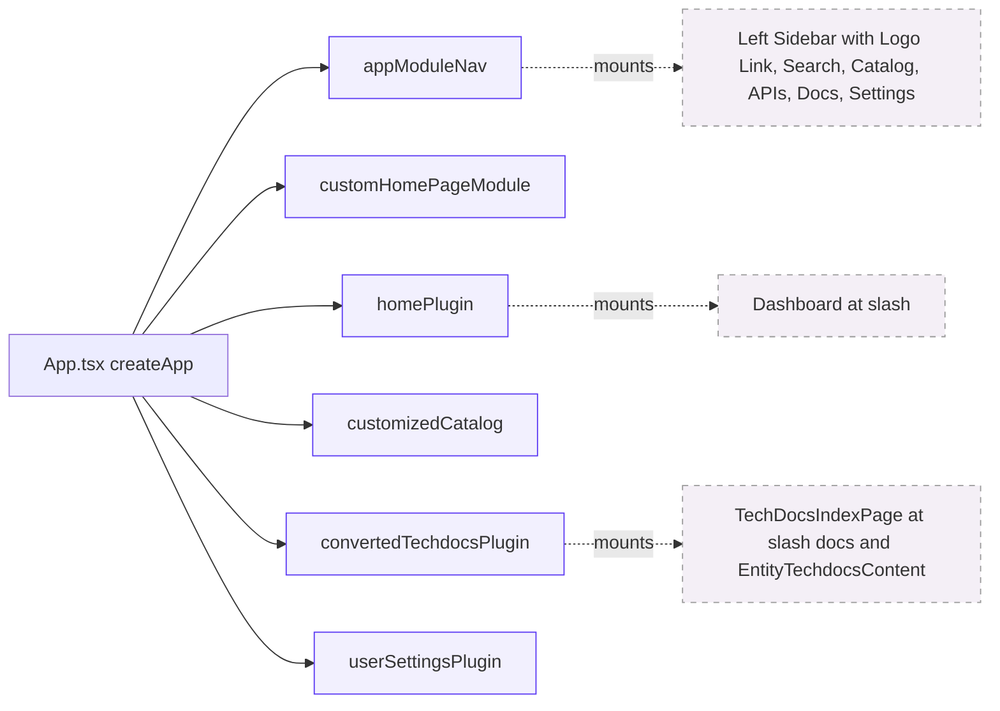
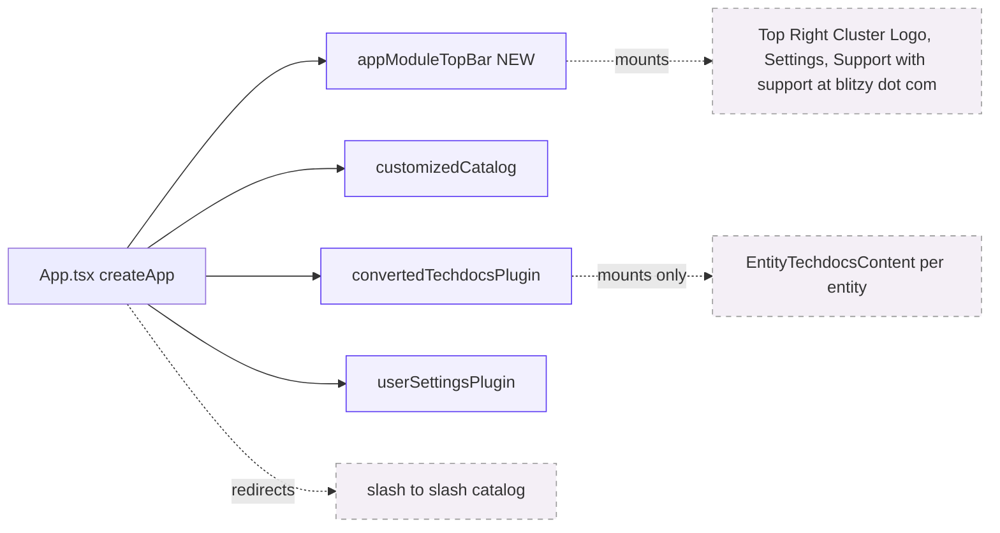
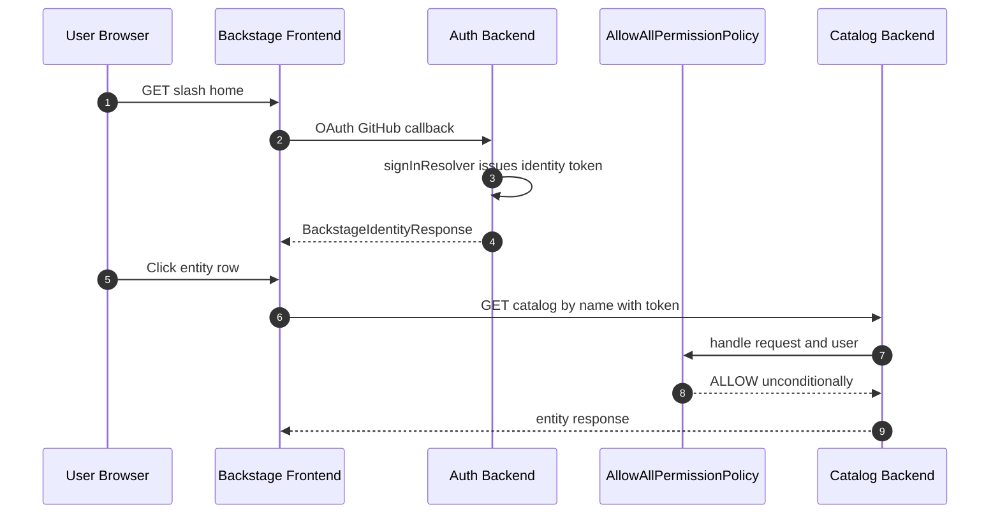
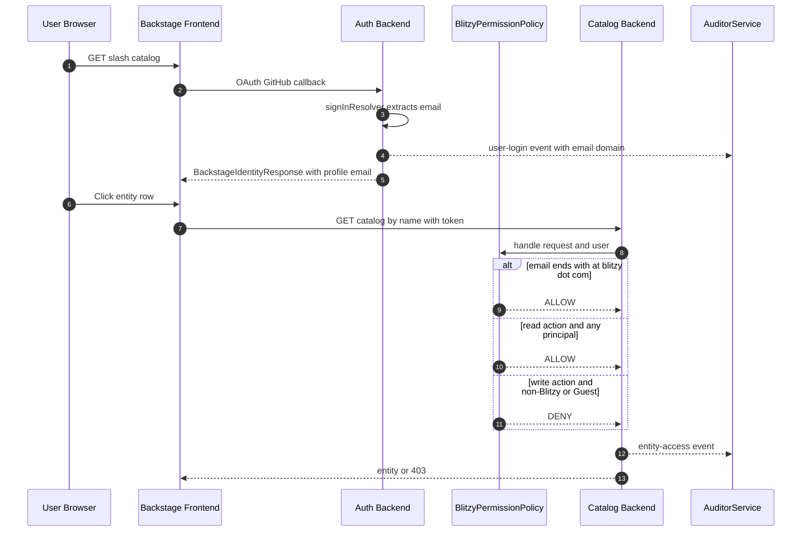
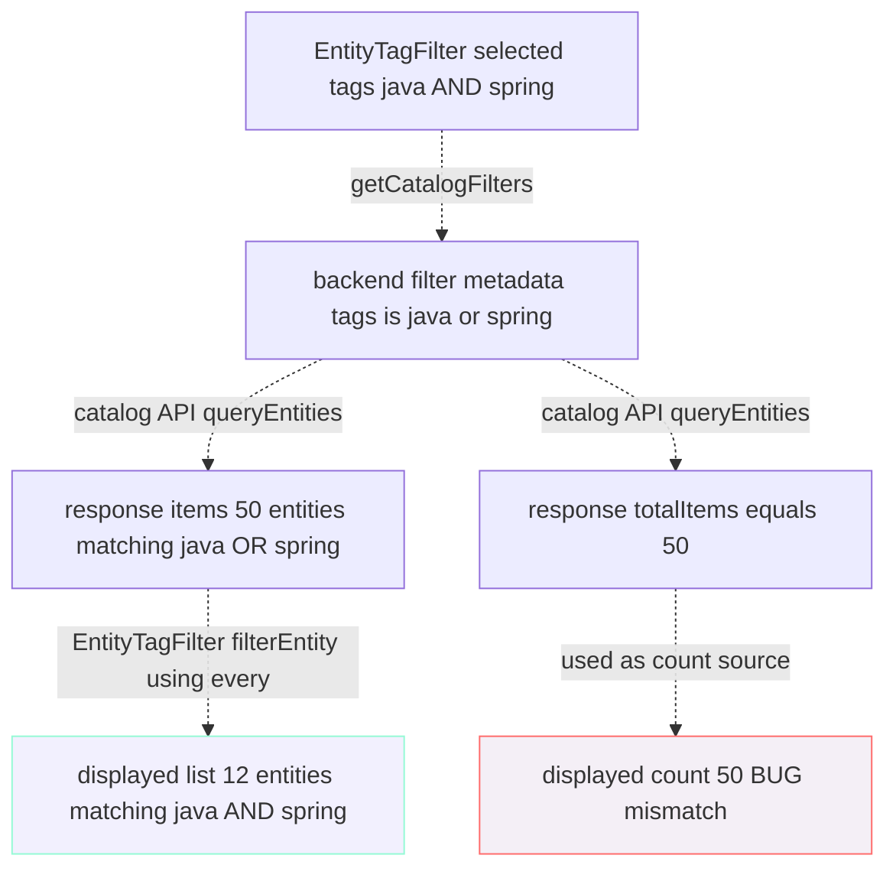
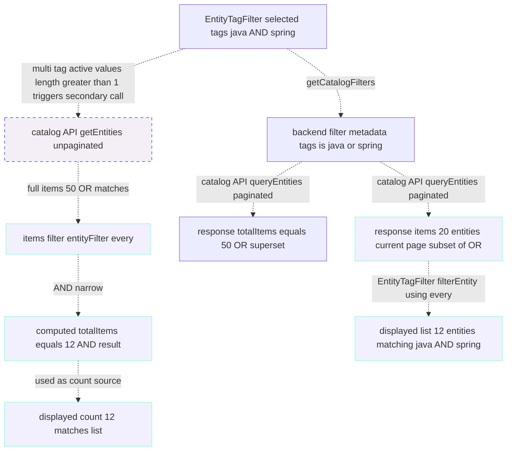

# Architecture: Before and After — Blitzy Sandbox Backstage Refactor

This document fulfills **Rule R4 (Visual Architecture Documentation)** of the Agent Action Plan. It contains Mermaid diagrams visualizing the architectural changes introduced by this refactor. Each diagram has a descriptive title and a legend. Diagrams render directly in GitHub, GitLab, and any Mermaid-aware Markdown previewer; they require no build step.

Three primary diagrams are required by the AAP §0.5.7:

1. **Frontend Composition — Before**
2. **Frontend Composition — After**
3. **Authorization and Audit — After** (sequence)

Three additional diagrams are included for fuller before/after coverage of the authorization and catalog count layers, as required by AAP §0.7.1.4 (R4): _"If the deliverable modifies an existing architecture, both states MUST be shown — never target-state alone."_

4. **Authorization and Audit — Before** (sequence, for contrast)
5. **Catalog Count — Before** (data flow)
6. **Catalog Count — After** (data flow)

The diagrams are reproduced (with the same titles and legends) in the executive presentation (`../../blitzy-deck/executive-summary.html`) so non-technical stakeholders see the same canonical visuals.

For the WHY behind each architectural choice, see [`decision-log.md`](decision-log.md). For the file-level mapping, see [`traceability-matrix.md`](traceability-matrix.md). For onboarding guidance referencing these diagrams, see [`onboarding-addendum.md`](onboarding-addendum.md).

---

## 1. Frontend Composition

The frontend composition diagrams show which frontend modules (`appModuleNav`, `appModuleTopBar`, `homePlugin`, `customizedCatalog`, `convertedTechdocsPlugin`, `userSettingsPlugin`, `customHomePageModule`) are registered in `packages/app/src/App.tsx`'s `features` array, and which chrome surfaces (sidebar, top-right cluster, dashboard, TechDocs pages) those modules mount. The "Before" state shows the source branch chrome with a left sidebar and a `BlitzySandboxWelcome` dashboard at `/`; the "After" state shows the refactored chrome with a top-right cluster and `/catalog` as the landing page.

### 1.1 Frontend Composition — Before

This is the chrome state in the source branch: a left sidebar with a clickable Logo and links for Search, Catalog, APIs, Docs, and Settings; a `BlitzySandboxWelcome` dashboard mounted at `/`; and a global `TechDocsIndexPage` mounted at `/docs`.

Legend: Solid box = frontend module / extension registered in `packages/app/src/App.tsx`. Dashed box = chrome surface mounted by the module. Solid arrow = registration. Dashed arrow = mount.

### 1.2 Frontend Composition — After

This is the chrome state after the refactor: no sidebar; a top-right cluster containing a non-clickable Logo, a Settings icon button linking to `/settings`, and a Support button that surfaces `support@blitzy.com`; no dashboard component; the bare `/` URL redirects to `/catalog`; and only the per-entity TechDocs content extension remains (the global `/docs` index page is gone).

Legend: Solid box = frontend module / extension registered in `packages/app/src/App.tsx`. Dashed box = chrome surface mounted by the module. Solid arrow = registration. Dashed arrow = mount or redirect.

---

## 2. Authorization and Audit

The authorization sequence diagrams show how a user request flows through the GitHub auth provider's `signInResolver`, the permission policy, the catalog backend, and the `AuditorService`. The "Before" diagram shows the source state (no audit emission, an unconditional allow-all policy). The "After" diagram shows the target state (per-event audit emission and a domain-aware `BlitzyPermissionPolicy`).

### 2.1 Authorization and Audit — Before

In the source branch, `AllowAllPermissionPolicy` is wired into the permission backend and unconditionally returns `ALLOW` for every permission request. The GitHub auth provider's `signInResolver` issues an identity token but emits no audit events. The catalog backend, likewise, emits no audit events on entity reads.

Legend: Solid arrow = synchronous call. Note that no dashed event-emission arrows appear in this diagram because the source branch emits no audit events.

### 2.2 Authorization and Audit — After

The refactor replaces `AllowAllPermissionPolicy` with `BlitzyPermissionPolicy`, which evaluates a three-branch decision tree based on action type, principal type, and email domain. The augmented `signInResolver` extracts the user's email and emits a `user-login` audit event; the catalog access middleware emits an `entity-access` audit event on every user-credentialed entity read. Write actions are denied for non-`@blitzy.com` principals and Guests; reads remain allowed for everyone.

Legend: Solid arrow = synchronous call. Dashed arrow = event emission via `AuditorService.createEvent(...).success(...)`. The `alt` block shows the three decision branches inside `BlitzyPermissionPolicy.handle()`.

---

## 3. Catalog Count

The catalog count diagrams visualize how the displayed count at the top of the catalog table relates to the displayed list of catalog rows when one or more tags are selected. The "Before" diagram shows the bug: the count is derived from a backend response that applies OR semantics to the selected tags, while the list is then narrowed by a frontend filter that applies AND semantics — producing a count that exceeds the row count. The "After" diagram shows the fix, which retains the OR-emitting wire shape (the wire format `EntityFilterQuery` has no path to AND across same-key values) and adds a React-layer AND-narrowing pass for both the rendered rows and the displayed total. The rendered rows are narrowed by `EntityTagFilter.filterEntity` using `Array.prototype.every`; the displayed total is narrowed by a secondary unpaginated `catalogApi.getEntities` request whose result is run through the same predicate, fired only when more than one tag value is selected.

### 3.1 Catalog Count — Before

In the source branch, `EntityTagFilter.getCatalogFilters()` emits `{ 'metadata.tags': [tag1, tag2] }`, which the catalog backend evaluates as OR. The frontend then applies `EntityTagFilter.filterEntity` using `every()` to narrow the displayed list to AND. The count source (`response.totalItems`) reflects the OR result (larger), while the list reflects the AND result (smaller) — hence the mismatch users observed.

Legend: Solid box = data source. Dashed arrow = transformation step. Teal-bordered box = correct behavior (AND-narrowed list). Red-bordered box = bug location (OR-derived count). Example values assume two tags selected, 50 entities match either, and 12 entities match both.

### 3.2 Catalog Count — After

After the refactor, `EntityTagFilter.getCatalogFilters()` still emits the wire-format-compatible OR-shape `{ 'metadata.tags': [tag1, tag2] }` (the catalog backend's filter parser deduplicates same-key values into a single `EntitiesSearchFilter` that is evaluated as OR — there is no wire-format path to AND across same-key values). The fix lives in `plugins/catalog-react/src/hooks/useEntityListProvider.tsx`: the rendered row list is AND-narrowed by `EntityTagFilter.filterEntity` (using `Array.prototype.every`), and the displayed total is AND-narrowed by the `computePaginatedTotalItems` helper, which issues a secondary unpaginated `catalogApi.getEntities` request and applies the same predicate to the unbounded result set. The secondary request only fires when more than one tag is selected; single-tag and tag-cleared interactions continue to use `response.totalItems` directly. If the secondary call fails, the hook falls back to `response.totalItems` (the OR-superset) so the UI is not blocked.

Legend: Same conventions as 3.1. Teal-bordered boxes show correct behavior; the dotted box visually distinguishes the secondary unpaginated call that activates only when multi-tag selection is active. Example values: two tags selected, 50 entities match either, 12 entities match both.

---

## 4. How to view these diagrams

The Mermaid diagrams in this document are rendered automatically by every major Markdown previewer. No build step is required.

- **GitHub / GitLab Markdown previewer** — renders Mermaid blocks automatically as of GitHub's 2022 rollout. Simply view this file in the repository's web UI and the diagrams appear inline.
- **VS Code** — install the "Markdown Preview Mermaid Support" extension and open this file with `Cmd+Shift+V` / `Ctrl+Shift+V`.
- **MkDocs / TechDocs** — rendered by the per-entity TechDocs viewer if this file is included in a TechDocs build. Ensure `mkdocs-material` (or equivalent) is installed with the `mermaid2` plugin or with `pymdownx.superfences` configured to recognize the `mermaid` lang.
- **Executive presentation** — the same diagrams appear in [`../../blitzy-deck/executive-summary.html`](../../blitzy-deck/executive-summary.html), rendered via Mermaid 11.4.0 (CDN-pinned per Rule R5).
- **Local CLI rendering** — to export to SVG/PNG for inclusion elsewhere, extract a single block to a `.mmd` file and run `npx -p @mermaid-js/mermaid-cli mmdc -i diagram.mmd -o diagram.svg`.

---

## 5. See also

- [`decision-log.md`](decision-log.md) — WHY behind each architectural choice depicted here (catalog count fix strategy, top-bar layout extension, audit middleware location, permission policy packaging, logo non-clickability mechanism, email source priority).
- [`traceability-matrix.md`](traceability-matrix.md) — Each file shown in the diagrams maps to a row in the bidirectional requirement-to-implementation matrix.
- [`onboarding-addendum.md`](onboarding-addendum.md) — Customization guide that references these diagrams (Section 5.3 Logo non-clickability cites diagram 1.2).
- [`next-tasks.md`](next-tasks.md) — Follow-on work, including the `entity-write` audit event addition (which would extend diagram 2.2).
- [`../observability/dashboards.md`](../observability/dashboards.md) — Observability docs that show how the `AuditorService` events in diagram 2.2 are surfaced in Grafana.
- [`../auth/identity-resolver.md`](../auth/identity-resolver.md) — Augmented `signInResolver` shown in diagram 2.2.
- [`../../blitzy-deck/executive-summary.html`](../../blitzy-deck/executive-summary.html) — The same six diagrams rendered in the R5 executive presentation for non-technical stakeholders.
